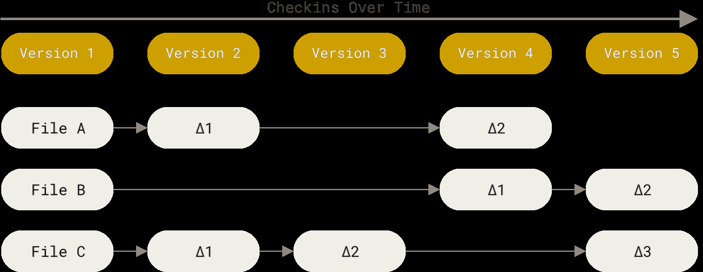
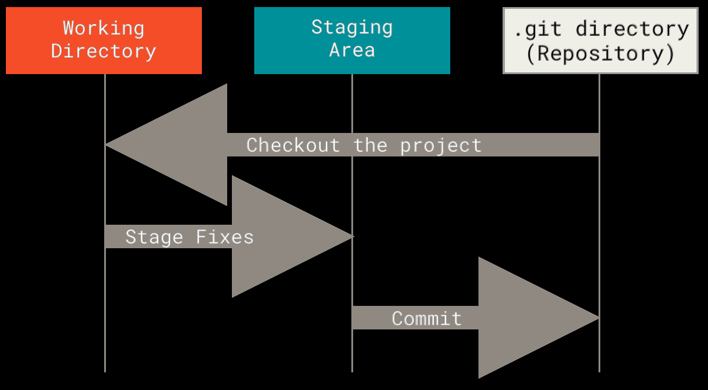
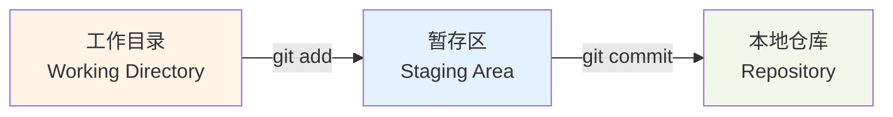
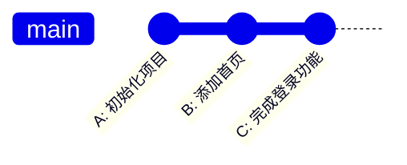
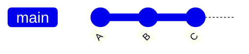
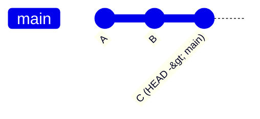
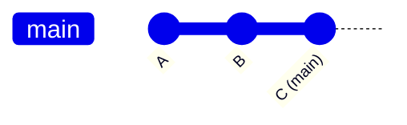
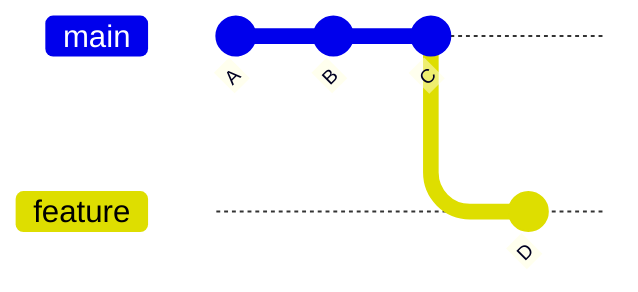

# Git 基础概念

这一章不急着背命令，先解决一个问题：

> Git 到底在帮我们管理什么？

如果一开始只记 `git add`、`git commit`，很容易变成"照着敲能用，出了问题就慌"。先把几个核心概念弄明白，后面学分支、合并、远程协作会轻松很多。

---

## 1. Git 是什么？

Git 和其他版本控制系统的一个重要区别是：**Git 是纯本地系统**。你不需要连接任何服务器就能使用 Git 的全部核心功能——所有的版本历史都保存在你自己电脑上。这一点在刚接触 Git 时很容易被忽略，因为它不需要服务器本身就是一种"隐形"的优点。

Git 是一个**版本控制系统**（Version Control System, VCS）。

通俗说，它像一个很认真、很可靠的项目存档工具：

- 你可以把某一刻的项目保存成一个版本
- 以后可以查看每个版本改了什么
- 也可以回到以前的版本
- 多个人可以各自修改，再把工作整合到一起

没有 Git 时，很多人会这样保存文件：

```text
论文.docx
论文-修改版.docx
论文-最终版.docx
论文-最终版2.docx
论文-真的最终版.docx
```

写代码也可能变成：

```text
project
project-backup
project-new
project-new-new
```

这很容易混乱：你不知道哪个版本能用，也不知道每次到底改了什么。


这张图里的三份页面副本都"看起来有道理"，但链接颜色已经不同了。真正麻烦的不只是颜色，而是你很难回答：谁改了什么？哪份来自哪份？最终应该以哪份为准？

Git 的做法是：

> 不复制一堆文件夹，而是在同一个项目里记录清楚每一次可靠的变化。

所以 Git 不只是"存档工具"，更像一套可信系统：只要你养成稳定提交的习惯，以后就能相信历史里真的保存了当时的状态，也能相信自己找得到那次变化的来龙去脉。

---

## 2. Git 记录的是快照，不只是差异

很多人以为 Git 只是记录"第几行改成第几行"。这样理解能看懂 `diff`，但不足以理解分支和恢复。

传统版本控制系统往往记录"基于某个基础版本的差异"：



而 Git 采用的是快照模型：



更准确地说：

> 每次 commit 都是项目在某一刻的快照。Git 会用高效方式复用没变的内容，但对你来说，可以先把提交理解成一个完整版本。

这有两个重要结果：

1. 你可以从任何提交恢复出当时的项目状态。
2. 分支只需要指向某个提交，就能代表一条历史线。

`git diff` 看到的是两个快照之间的差异；`git commit` 保存的是一次新的项目快照。

---

## 3. Git 和 GitHub 不是一回事

| 名称 | 它是什么 | 没有对方能不能用 |
|---|---|---|
| Git | 本地版本控制工具 | 可以。没有 GitHub 也能本地 commit、branch、merge |
| GitHub/GitLab/Gitee | 代码托管平台 | 需要 Git 或兼容工具来管理仓库历史 |

本教程先讲 Git，再讲远程平台。你在本地运行的 `git commit` 不会自动上传到 GitHub；上传需要 `git push`。

> 如果你要让非程序员朋友理解 Git 和 GitHub 的区别，一句话就够了：**Git 是照相馆（管理照片版本），GitHub 是一个在线相册展示厅（分享和协作）。** 没有相册你也可以拍照，Git 不需要 GitHub 就能用。

---

## 4. Git 解决哪些问题？

Git 不关心你的文件格式。无论是文本文件、Excel 表格、图片、音频文件、视频还是设计稿源文件，Git 都可以管理。只要文件在你的项目文件夹里，Git 就能帮你记录它的每一次变化。

| 场景 | 没有 Git | 有 Git |
|---|---|---|
| 想知道改了什么 | 靠记忆或手动对比 | 用 `git diff` 查看具体改动 |
| 想保存一个版本 | 复制整个文件夹 | 用 `git commit` 保存一次提交 |
| 写坏了想恢复 | 找备份，可能找不到 | 可以恢复到之前提交过的状态 |
| 多人同时开发 | 文件互相覆盖，靠聊天传来传去 | 用分支、合并、远程仓库协作 |
| 想知道谁改了什么 | 很难追踪 | 每次提交都有作者和说明 |

所以 Git 不只是程序员的"备份工具"。它更像一个项目历史管理系统。

---

## 5. Git 管的是"项目文件夹"

Git 一般不是只管理单个文件，而是管理一个**项目文件夹**。

这个被 Git 管理的项目文件夹，叫做**仓库**（repository，简称 repo）。

例如：

```text
my-website/
  ├── index.html
  ├── style.css
  ├── script.js
  └── .git/  ← 这个隐藏文件夹说明 my-website 是一个 Git 仓库
```

`.git` 文件夹是 Git 用来保存历史记录和配置的地方。你不需要手动改它，Git 会自己维护。删掉 `.git` 文件夹，项目文件本身还在，但历史记录就全没了。

---

## 6. Git 有三个区域

这是最容易被新手忽略，但学会后会让你少犯很多错的部分。

Git 不是"改一行就自动保存一个版本"。它让你自己决定什么时候保存、保存哪些改动。

### 三个区域



| 区域 | 英文 | 通俗理解 | 你能看到吗 |
|---|---|---|---|
| **工作目录** | Working Directory | 你正在编辑的文件 | 能，就是你打开的文件夹 |
| **暂存区** | Staging Area / Index | 下一次提交的"购物车" | 不能直接看，但 `git status` 会告诉你 |
| **本地仓库** | Repository | 正式历史记录 | 不能直接看，但 `git log` 可以查历史 |

### 为什么要有暂存区？

新手最容易问的问题：为什么不能直接从工作目录提交？

答案是：**暂存区让你可以选择这次提交哪些改动，不提交哪些。**

假设你改了两个文件：

- `login.js`：完成了登录功能
- `style.css`：随手改了个颜色，但不确定要不要留

如果没有暂存区，你只能：

- 要么两个文件一起提交
- 要么都不提交

有了暂存区，你可以：

```bash
git add login.js       # 只把登录功能加入暂存区
git commit -m "完成登录功能"  # 只提交登录功能
# style.css 还在工作目录，可以继续改或丢弃
```

### 常见状态转换

```text
编辑文件 → 工作目录有改动
git add → 改动进入暂存区
git commit → 改动变成正式提交
```

`git status` 会告诉你每个文件在哪个区域。

---

## 7. 什么是 commit？

**Commit** 是 Git 的核心概念，中文常说"提交"。

如果把 Git 比作照相馆，commit 就是一张正式照片。它不是草稿，不是临时备份，而是你认为"这个版本可以记录下来"时按下的快门。

一次 commit 可以理解为：

> 项目在某一刻的正式存档。

例如你依次做了三次提交：



每次提交通常包含：

| 内容 | 说明 |
|---|---|
| 文件快照 | 当时项目文件的状态 |
| 提交说明 | 这次改了什么，例如"添加首页" |
| 作者信息 | 谁提交的 |
| 时间 | 什么时候提交的 |
| 父提交 | 上一个版本是谁 |

---

## 8. 什么是父提交？

除了第一次提交，大多数提交都会记住它的上一个提交。



这里：

- `B` 的父提交是 `A`
- `C` 的父提交是 `B`

父提交把一个个版本串成了一条历史线。

后面学分支和合并时，这个概念非常重要：

- 分支就是指向某个提交的名字
- 合并时 Git 会根据提交之间的父子关系判断历史有没有分叉

---

## 9. 什么是 HEAD？

**HEAD** 是 Git 里的一个特殊指针，它告诉 Git："你现在在哪里"。

大多数时候，HEAD 指向当前分支，当前分支指向最新的提交：



当你切换分支时，HEAD 会跟着动。当你提交时，HEAD 指向的分支会前进一步。

现在先记住：

> HEAD 就是"你现在在哪个版本、哪个分支"的标记。

---

## 10. 一个最小工作流程

Git 的日常工作可以先记成四步：

```text
改文件 → 查看状态 → 加入暂存区 → 提交成版本
```

对应命令是：

```bash
git status                      # 查看当前状态
git add 文件名                   # 把改动加入暂存区
git commit -m "说明这次改了什么"  # 提交到本地仓库
git log --oneline               # 查看提交历史
```

每个命令的作用：

| 命令 | 作用 |
|---|---|
| `git status` | 看看当前有哪些变化 |
| `git add 文件名` | 选择哪些改动进入下一次提交 |
| `git commit -m "说明"` | 把暂存区内容保存成一次提交 |
| `git log --oneline` | 查看提交历史 |

这条线是后面所有内容的基础。

---

## 11. 分支先有个印象就好

分支会在第 4 章详细讲，这里先建立一个简单印象。

假设你现在有一条主线：



如果你要开发一个新功能，可以创建一个新分支：



这样你可以在 `feature` 上开发，不影响 `main`。

现在只需要记住：

> 分支让你可以同时维护多条工作线。

---

## 12. 远程仓库先有个印象就好

前几章主要讲本地仓库，也就是你电脑上的 Git 仓库。

多人协作时，还会有远程仓库：


远程仓库的作用是：

- 备份代码
- 让别人能获取你的提交
- 让多人通过同一个中心位置协作

不过从 Git 的技术模型看，你电脑上的仓库和服务器上的仓库都是 Git 仓库，并不是"本地仓库低一等、远程仓库高一等"。GitHub/GitLab/Gitee 通常被团队当作中心，只是一种协作约定。

这也是为什么一次正常的 `git clone` 不只是"下载当前文件"，还会拿到项目的提交历史。你可以离线查看历史、创建分支、提交新版本；等重新联网后，再通过 `fetch`、`pull`、`push` 和远程仓库交换提交。

这能解释两个常见现象：

| 现象 | 正确理解 |
|---|---|
| 断网时仍然可以 `git commit` | 提交发生在你的本地仓库，不依赖 GitHub 在线 |
| `git push` 被拒绝 | 远程仓库也有自己的历史，Git 不允许你随便覆盖它 |

远程协作会在第 6 章开始讲。

---

## 13. 本章总结

| 概念 | 通俗理解 |
|---|---|
| Git | 版本控制系统，记录项目变化 |
| 仓库 repository | 被 Git 管理的项目文件夹 |
| `.git` | Git 保存历史和配置的隐藏文件夹 |
| 工作目录 | 你正在编辑的文件区域 |
| 暂存区 | 下一次提交的准备区 |
| 本地仓库 | 保存正式历史记录的地方 |
| 远程仓库 | 另一个 Git 仓库，常被团队约定为同步中心 |
| commit | 一次正式存档 |
| 父提交 | 当前提交的上一个版本 |
| HEAD | 当前所在位置的指针 |
| 分支 | 指向提交的一条工作线 |

学完这一章，你不需要马上记住所有命令。只要先理解：

```text
工作目录 → 暂存区 → 本地仓库
```

下一章会带你安装 Git、配置身份，并创建第一个仓库。

---

**下一步**：[安装与初始化](./Git教程系列-02-安装与初始化.md)

---

**返回目录**：[README](./README.md)
