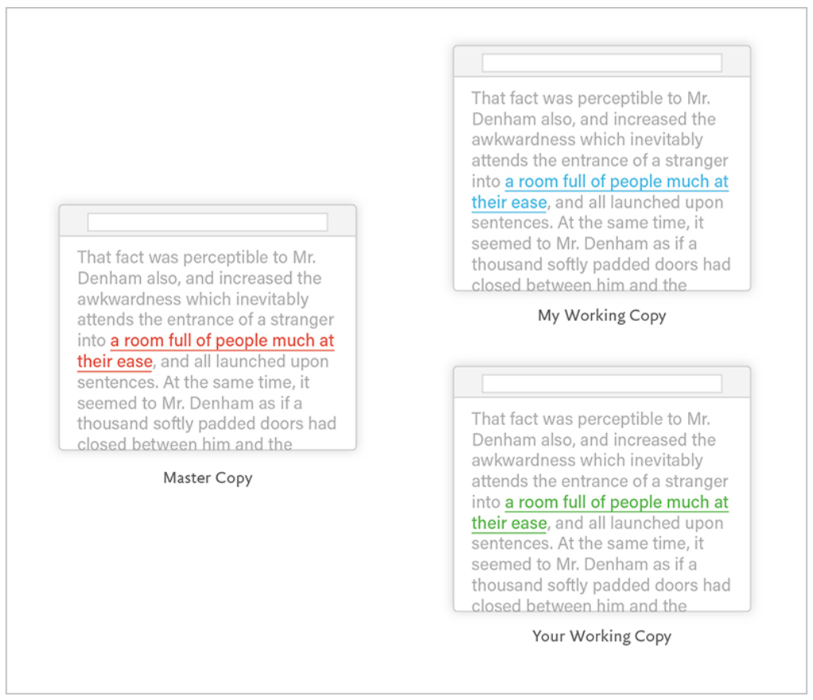

# Git 基础概念

这一章不急着背命令，先解决一个问题：

> Git 到底在帮我们管理什么？

如果一开始只记 `git add`、`git commit`，很容易变成"照着敲能用，出了问题就慌"。先把几个核心概念弄明白，后面学分支、合并、远程协作会轻松很多。

---

## 1. Git 是什么？

Git 和其他版本控制系统的一个重要区别是：**Git 是纯本地系统**。你不需要连接任何服务器就能使用 Git 的全部核心功能——所有的版本历史都保存在你自己电脑上。这一点在刚接触 Git 时很容易被忽略，因为它不需要服务器本身就是一种"隐形"的优点。

Git 是一个**版本控制系统**。

通俗说，它像一个很认真、很可靠的项目存档工具：

- 你可以把某一刻的项目保存成一个版本
- 以后可以查看每个版本改了什么
- 也可以回到以前的版本
- 多个人可以各自修改，再把工作整合到一起

没有 Git 时，很多人会这样保存文件：

```text
论文.docx
论文-修改版.docx
论文-最终版.docx
论文-最终版2.docx
论文-真的最终版.docx
```

写代码也可能变成：

```text
project
project-backup
project-new
project-new-new
```

这很容易混乱：你不知道哪个版本能用，也不知道每次到底改了什么。



这张图里的三份页面副本都"看起来有道理"，但链接颜色已经不同了。真正麻烦的不只是颜色，而是你很难回答：谁改了什么？哪份来自哪份？最终应该以哪份为准？

Git 的做法是：

> 不复制一堆文件夹，而是在同一个项目里记录清楚每一次可靠的变化。

所以 Git 不只是"存档工具"，更像一套可信系统：只要你养成稳定提交的习惯，以后就能相信历史里真的保存了当时的状态，也能相信自己找得到那次变化的来龙去脉。

---

## 2. Git 记录的是快照，不只是差异

很多人以为 Git 只是记录"第几行改成第几行"。这样理解能看懂 `diff`，但不足以理解分支和恢复。

更准确地说：

> 每次 commit 都是项目在某一刻的快照。Git 会用高效方式复用没变的内容，但对你来说，可以先把提交理解成一个完整版本。

这有两个重要结果：

1. 你可以从任何提交恢复出当时的项目状态。
2. 分支只需要指向某个提交，就能代表一条历史线。

`git diff` 看到的是两个快照之间的差异；`git commit` 保存的是一次新的项目快照。

---

## 3. Git 和 GitHub 不是一回事

| 名称 | 它是什么 | 没有对方能不能用 |
|---|---|---|
| Git | 本地版本控制工具 | 可以。没有 GitHub 也能本地 commit、branch、merge |
| GitHub/GitLab/Gitee | 代码托管平台 | 需要 Git 或兼容工具来管理仓库历史 |

本教程先讲 Git，再讲远程平台。你在本地运行的 `git commit` 不会自动上传到 GitHub；上传需要 `git push`。

---

> 如果你要让非程序员朋友理解 Git 和 GitHub 的区别，一句话就够了：**Git 是照相馆（管理照片版本），GitHub 是一个在线相册展示厅（分享和协作）。** 没有相册你也可以拍照，Git 不需要 GitHub 就能用。

---

## 4. Git 解决哪些问题？

另一个被低估的特点是：**Git 不关心你的文件格式**。无论是文本文件、Excel 表格、图片、音频文件、视频还是设计稿源文件，Git 都可以管理。只要文件在你的项目文件夹里，Git 就能帮你记录它的每一次变化。

| 场景 | 没有 Git | 有 Git |
|---|---|---|
| 想知道改了什么 | 靠记忆或手动对比 | 用 `git diff` 查看具体改动 |
| 想保存一个版本 | 复制整个文件夹 | 用 `git commit` 保存一次提交 |
| 写坏了想恢复 | 找备份，可能找不到 | 可以恢复到之前提交过的状态 |
| 多人同时开发 | 文件互相覆盖，靠聊天传来传去 | 用分支、合并、远程仓库协作 |
| 想知道谁改了什么 | 很难追踪 | 每次提交都有作者和说明 |

所以 Git 不只是程序员的"备份工具"。它更像一个项目历史管理系统。

---

## 5. Git 管的是"项目文件夹"

Git 一般不是只管理单个文件，而是管理一个**项目文件夹**。

这个被 Git 管理的项目文件夹，叫做**仓库**，英文是 repository，常简称 repo。

例如：

```text
my-website/
├── index.html
├── style.css
└── README.md
```

当你在 `my-website` 里启用 Git 后，这个文件夹就变成了一个 Git 仓库。

仓库里会有一个隐藏文件夹：

```text
.git/
```

`.git` 里面保存着 Git 需要的历史记录、分支信息和配置。

> 不要手动修改 `.git` 文件夹。平时通过 Git 命令操作就够了。

---

## 6. Git 最重要的三个区域

Git 日常操作围绕三个区域展开：

```text
工作目录  --git add-->  暂存区  --git commit-->  本地仓库
```

可以这样理解：

| 区域 | 英文 | 通俗理解 | 里面放什么 |
|---|---|---|---|
| 工作目录 | Working Directory | 你的工作桌面 | 你正在编辑的文件 |
| 暂存区 | Staging Area | 待归档盒 | 准备提交的改动 |
| 本地仓库 | Local Repository | 档案柜 | 已提交的正式版本 |

### 工作目录

工作目录就是你项目文件夹里当前所有的文件和目录。你编辑的任何文件都先在工作目录里发生变化。

### 暂存区

运行：

```bash
git add 文件名
```

意思不是"提交"，而是：

> 这部分改动我准备放进下一次提交。

为什么需要暂存区？因为你可能同时改了很多文件，但并不想一次全部提交。

### 本地仓库

本地仓库就是 `.git` 里面保存的历史记录。

当你运行：

```bash
git commit -m "说明"
```

Git 会把暂存区里的内容正式保存成一个版本。

这个版本就叫一次**提交**。

---

## 7. 什么是提交 commit？

更形象地说，**commit 就像给你的项目拍了一张快照**。Git 不像其他版本管理系统那样只记录文件的差异（diff），它会记住你按快门那一刻整个文件夹的完整状态。这也是为什么 Git 里切换分支或恢复历史几乎瞬间完成——它只是指向另一张快照而已。

一次 commit 可以理解为：

> 项目在某一刻的正式存档。

例如你依次做了三次提交：

```text
A --- B --- C
```

可以理解为：

| 提交 | 含义 |
|---|---|
| `A` | 第一次保存的版本 |
| `B` | 第二次保存的版本 |
| `C` | 第三次保存的版本 |

每次提交通常包含：

| 内容 | 说明 |
|---|---|
| 文件快照 | 当时项目文件的状态 |
| 提交说明 | 这次改了什么，例如"添加首页" |
| 作者信息 | 谁提交的 |
| 时间 | 什么时候提交的 |
| 父提交 | 上一个版本是谁 |

---

## 8. 什么是父提交？

除了第一次提交，大多数提交都会记住它的上一个提交。

```text
A --- B --- C
```

这里：

- `B` 的父提交是 `A`
- `C` 的父提交是 `B`

父提交把一个个版本串成了一条历史线。

后面学分支和合并时，这个概念非常重要：

- 分支就是指向某个提交的名字
- 合并时 Git 会根据提交之间的父子关系判断历史有没有分叉

现在先不用学内部细节，只要记住：

> Git 的历史不是一堆散乱版本，而是一条由父提交连接起来的链。

你以后看到 Git 历史图时，可能会发现箭头或连线看起来像是"往回指"。这是因为提交会记录自己的父提交：新提交知道它从哪里来，但旧提交并不知道未来会长出哪些新提交。先记住这一点，后面看 `git log --graph` 会少很多困惑。

---

## 9. 一个最小工作流程

Git 的日常工作可以先记成四步：

```text
改文件 → 查看状态 → 加入暂存区 → 提交成版本
```

对应命令是：

```bash
git status
git add 文件名
git commit -m "说明这次改了什么"
git log --oneline
```

每个命令的作用：

| 命令 | 作用 |
|---|---|
| `git status` | 看看当前有哪些变化 |
| `git add 文件名` | 选择哪些改动进入下一次提交 |
| `git commit -m "说明"` | 把暂存区内容保存成一次提交 |
| `git log --oneline` | 查看提交历史 |

这条线是后面所有内容的基础。

---

## 10. 分支先有个印象就好

分支会在第 4 章详细讲，这里先建立一个简单印象。

假设你现在有一条主线：

```text
A --- B --- C
            ↑
          main
```

`main` 是一个分支名，它指向当前主线的最新提交 `C`。

如果你要开发一个新功能，可以创建一个新分支：

```text
A --- B --- C
            ↑
          main
             \
              D
              ↑
            feature
```

这样你可以在 `feature` 上开发，不影响 `main`。

现在只需要记住：

> 分支让你可以同时维护多条工作线。

---

## 11. 远程仓库先有个印象就好

前几章主要讲本地仓库，也就是你电脑上的 Git 仓库。

多人协作时，还会有远程仓库：

```text
你的电脑上的仓库  ←→  GitHub/GitLab/Gitee 上的仓库
```

远程仓库的作用是：

- 备份代码
- 让别人能获取你的提交
- 让多人通过同一个中心位置协作

不过从 Git 的技术模型看，你电脑上的仓库和服务器上的仓库都是 Git 仓库，并不是"本地仓库低一等、远程仓库高一等"。GitHub/GitLab/Gitee 通常被团队当作中心，只是一种协作约定。

这能解释两个常见现象：

| 现象 | 正确理解 |
|---|---|
| 断网时仍然可以 `git commit` | 提交发生在你的本地仓库，不依赖 GitHub 在线 |
| `git push` 被拒绝 | 远程仓库也有自己的历史，Git 不允许你随便覆盖它 |

远程协作会在第 6 章开始讲。

---

## 12. 本章总结

| 概念 | 通俗理解 |
|---|---|
| Git | 版本控制系统，记录项目变化 |
| 仓库 repository | 被 Git 管理的项目文件夹 |
| `.git` | Git 保存历史和配置的隐藏文件夹 |
| 工作目录 | 你正在编辑的文件区域 |
| 暂存区 | 下一次提交的准备区 |
| 本地仓库 | 保存正式历史记录的地方 |
| 远程仓库 | 另一个 Git 仓库，常被团队约定为同步中心 |
| commit | 一次正式存档 |
| 父提交 | 当前提交的上一个版本 |
| 分支 | 指向提交的一条工作线 |

学完这一章，你不需要马上记住所有命令。只要先理解：

```text
工作目录 → 暂存区 → 本地仓库
```

下一章会带你安装 Git、配置身份，并创建第一个仓库。

---

**下一步**：[安装与初始化](./Git教程系列-02-安装与初始化.md)

---

**返回目录**：[README](./README.md)
