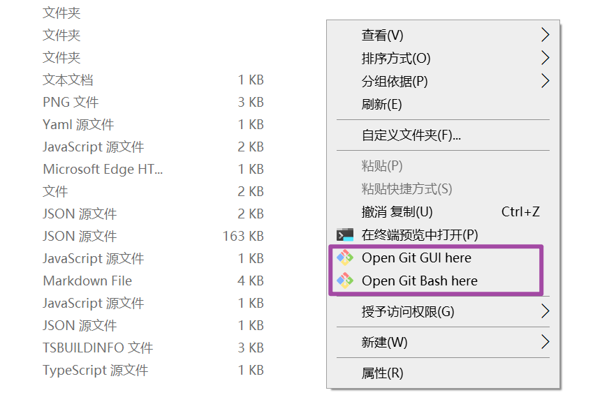
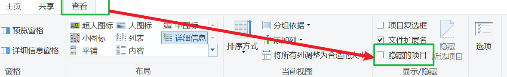
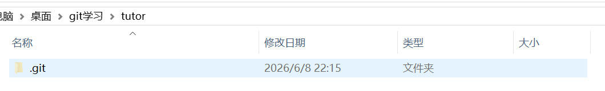

# Git 安装与初始化

上一章讲了 Git 的基本概念：工作目录、暂存区、本地仓库、提交。

这一章开始动手：安装 Git，配置身份，然后把一个普通文件夹变成 Git 仓库。

本章目标：

1. 确认电脑上能运行 Git
2. 配置提交时使用的用户名和邮箱
3. 理解 `git init` 做了什么
4. 创建第一个本地仓库
5. 会用几个最基本的命令行命令

---

## 1. 先理解：为什么要配置用户名和邮箱？

Git 会记录每一次提交是谁做的。

一次提交里通常包含：

```text
提交内容 + 提交说明 + 作者 + 时间
```

所以第一次使用 Git 前，需要告诉 Git：

```text
我是谁？
我的邮箱是什么？
```

这不是注册账号，也不是登录 GitHub。它只是写入你本机 Git 配置，用来标记提交作者。

---

## 2. Windows 安装 Git

Windows 上推荐安装 Git 官方安装包。

### 方式一：安装包安装

1. 打开 Git 官网下载页面：`https://git-scm.com/download/win`
2. 下载 `.exe` 安装包
3. 双击安装
4. 新手可以一路使用默认选项

安装完成后，右键菜单里通常会出现：

```text
Open Git Bash Here
Open Git GUI Here
```



本教程主要使用 **Git Bash**。它是一个命令行窗口，可以运行 Git 命令。

### 方式二：winget 安装

如果你熟悉 Windows 命令行，也可以用：

```bash
winget install Git.Git
```

新手如果不确定，就用安装包方式。

---

## 3. macOS 和 Linux 安装 Git

本教程主要照顾 Windows 新手，但 Git 在 macOS 和 Linux 上也很常见。

macOS 可以先检查是否已有 Git：

```bash
git --version
```

如果没有，系统可能会提示安装 Xcode Command Line Tools。也可以使用 Homebrew：

```bash
brew install git
```

Ubuntu/Debian 常用：

```bash
sudo apt update
sudo apt install git
```

Fedora 常用：

```bash
sudo dnf install git
```

不同系统安装方式不同，但安装后验证命令都一样：`git --version`。

---

## 4. 验证 Git 是否安装成功

打开 Git Bash，输入：

```bash
git --version
```

如果看到类似：

```text
git version 2.45.0
```

说明 Git 已经可以用了。

版本号不需要和这里完全一样。只要能显示 `git version ...` 就可以。

如果提示 `git: command not found` 或类似错误，说明 Git 没装好，或者当前命令行找不到 Git。优先重新安装 Git，并重新打开 Git Bash。

---

## 5. 配置用户名和邮箱

在 Git Bash 里运行：

```bash
git config --global user.name "张三"
git config --global user.email "zhangsan@example.com"
```

把 `张三` 和 `zhangsan@example.com` 换成你自己的名字和邮箱。

这里的 `--global` 表示：

> 这是一份全局配置。以后你电脑上的大多数 Git 项目都会默认使用这个身份。

如果将来某个项目要用另一套身份，也可以在那个项目里单独配置，不加 `--global` 即可。新手阶段先记全局配置就够了。

提交里的作者信息会跟着提交一起进入历史；如果你把提交推到公共仓库，别人也能看到这些信息。如果不想暴露私人邮箱，可以在 GitHub/GitLab/Gitee 里查看平台提供的 noreply 或隐私邮箱，再把 `user.email` 配成那个地址。

---

## 6. 查看配置是否成功

查看用户名：

```bash
git config user.name
```

查看邮箱：

```bash
git config user.email
```

查看所有配置：

```bash
git config --list
```

如果提交时看到这个错误：

```text
Please tell me who you are.
```

意思是 Git 不知道提交作者是谁。回到上面的 `user.name` 和 `user.email` 配置即可。

---

## 7. 命令行里要先知道“我在哪”

Git 命令通常要在项目目录里运行。

所以在学 `git init` 前，先认识几个命令行基础命令。

本教程默认使用 **Git Bash**。如果你用的是 Windows 自带的 **PowerShell** 或 **cmd**，Git 命令本身大多一样，例如 `git status`、`git init`、`git add` 都还是这样写；差别主要出现在 `pwd`、`ls`、`clear` 这类“命令行自己的命令”上。

一开始建议先跟着命令行走，不是因为 GUI 不专业，而是因为 Git 最重要的信息会通过命令输出告诉你：当前在哪个分支、哪些文件已暂存、远程是否落后。等你能读懂这些提示后，再配合 VS Code、GitHub Desktop 或其他图形工具看 diff，会更稳。

| 作用 | Git Bash | PowerShell | Windows cmd |
|---|---|---|---|
| 显示当前所在目录 | `pwd` | `pwd` | `cd` |
| 列出当前目录文件 | `ls` | `ls` | `dir` |
| 列出所有文件，包括隐藏文件 | `ls -a` | `dir -Force` | `dir /a` |
| 进入某个文件夹 | `cd 文件夹名` | `cd 文件夹名` | `cd 文件夹名` |
| 回到上一级目录 | `cd ..` | `cd ..` | `cd ..` |
| 创建文件夹 | `mkdir 文件夹名` | `mkdir 文件夹名` | `mkdir 文件夹名` |
| 清屏 | `clear` | `clear` | `cls` |

如果你跟着本教程操作，建议直接打开 Git Bash，然后运行下面这些命令：

```bash
pwd
ls
mkdir git-demo
cd git-demo
pwd
```

这几行的意思是：

1. 看当前位置
2. 看当前位置有哪些文件
3. 创建一个 `git-demo` 文件夹
4. 进入这个文件夹
5. 再确认自己已经进来了

如果你使用 PowerShell，可以把 `ls -a` 换成 `dir -Force`；如果你使用 cmd，可以把 `pwd` 换成 `cd`，把 `ls` 换成 `dir`，把 `clear` 换成 `cls`。

---

## 8. 什么是初始化仓库？

一个普通文件夹一开始不是 Git 仓库。

例如：

```text
git-demo/
└── hello.txt
```

Git 还没有管理它。你在里面改文件，Git 不会自动记录历史。

要让 Git 开始管理这个文件夹，需要执行：

```bash
git init
```

初始化之后，文件夹里会多出一个隐藏目录：

```text
.git/
```
另外值得注意的一点：**Git 不在乎你跟踪的文件是什么类型**。无论你是写代码、写文档、做设计还是管理配置文件，Git 都能胜任。


这个 `.git` 文件夹表示：

> 从现在开始，这个文件夹是一个 Git 仓库。

---

## 9. 创建你的第一个仓库

下面的命令在 Git Bash 里运行。

### 第一步：创建学习用文件夹

```bash
mkdir git-demo
cd git-demo
```

### 第二步：初始化 Git 仓库

```bash
git init
```

你可能会看到类似输出：

```text
Initialized empty Git repository in .../git-demo/.git/
```

这表示初始化成功。

### 第三步：查看隐藏文件夹

```bash
ls -a
```

你应该能看到：

```text
.  ..  .git
```

`.git` 就是 Git 仓库的核心。

如果你在 Windows 文件资源管理器里看不到 `.git`，需要先打开“隐藏的项目”：



开启后，项目文件夹里就能看到 `.git` 文件夹：



---

## 10. 默认分支名：main 和 master

初始化仓库后，Git 会有一个默认分支。

现在很多项目使用：

```text
main
```

老教程或老项目里也可能看到：

```text
master
```

它们本质上都只是分支名。

如果你想初始化时明确使用 `main`，可以运行：

```bash
git init -b main
```

如果仓库已经初始化好了，当前分支叫 `master`，想把它改成 `main`，可以在仓库目录里运行：

```bash
git branch -M main
```

这条命令的意思是：把**当前所在分支**重命名为 `main`。新手阶段可以先记住：想把当前默认分支改成 `main`，就用这条命令。

你也可能看到另一种写法：

```bash
git branch -m master main
```

这条命令的意思是：把名为 `master` 的分支重命名为 `main`。

两种写法的区别是：

| 命令 | 含义 | 适合场景 |
|---|---|---|
| `git branch -M main` | 把当前所在分支强制重命名为 `main` | 你现在就在 `master` 分支上 |
| `git branch -m master main` | 把指定的 `master` 分支重命名为 `main` | 你想明确写出旧分支名和新分支名 |

其中 `-m` 表示普通重命名，`-M` 表示强制重命名。如果目标分支名已经存在，`-m` 会失败，`-M` 会强制改名。新手练习时通常不会遇到目标分支已存在的情况。

如果你的 Git 版本较旧，不支持 `-b main`，也没关系。后面看到 `master` 时，先把它理解成“主分支”即可。

如果希望以后所有新仓库默认使用 `main`，可以配置：

```bash
git config --global init.defaultBranch main
```

---

## 11. Windows 换行符配置

Windows 和 macOS/Linux 使用的换行符可能不同。配置不当时，你可能只改了一行，Git 却显示整个文件都变了。

常见建议：

| 系统 | 命令 |
|---|---|
| Windows | `git config --global core.autocrlf true` |
| macOS/Linux | `git config --global core.autocrlf input` |

如果你所在团队已经有 `.gitattributes`，优先按团队配置来。
跨平台协作时，建议在仓库根目录放一个 `.gitattributes` 统一换行符与二进制文件处理，避免不同系统互相覆盖；写法见 [Git 配置与效率工具](./Git教程系列-15-Git配置与效率工具.md)，原理见 [Git 内部原理与仓库维护](./Git教程系列-16-Git内部原理与仓库维护.md)。

新手不需要一开始深究换行符，只要记住：如果 diff 出现大量莫名其妙的整文件变化，优先检查换行符配置。

---

## 12. `.git` 文件夹里大概有什么？

新手不需要深入研究 `.git`，但知道它的作用很有帮助。

可以把 `.git` 想成 Git 的档案室。

里面大概保存：

| 内容 | 作用 |
|---|---|
| 配置 | 这个仓库的设置 |
| 对象数据 | 文件内容和提交历史 |
| 分支引用 | 分支名指向哪个提交 |
| `HEAD` | 当前所在分支 |

重要提醒：

> 不要手动删除或修改 `.git`。如果删掉它，这个文件夹就不再是原来的 Git 仓库，历史记录也可能丢失。

---

## 13. 初始化后先看状态

在仓库里运行：

```bash
git status
```

如果是刚初始化的空仓库，你可能看到：

```text
On branch main

No commits yet

nothing to commit
```

这里有几个信息：

| 输出 | 含义 |
|---|---|
| `On branch main` | 你当前在 `main` 分支 |
| `No commits yet` | 这个仓库还没有任何提交 |
| `nothing to commit` | 现在没有需要提交的内容 |

下一章会从这里继续：创建文件、查看状态、加入暂存区、提交成第一个版本。

---

## 14. 本章常见问题

### Q1：为什么我看不到 `.git` 文件夹？

`.git` 是隐藏文件夹。

在命令行里可以用：

```bash
ls -a
```

在 Windows 文件资源管理器里，需要打开“显示隐藏的项目”。

### Q2：我应该在哪个目录运行 Git 命令？

通常在项目根目录运行，也就是有 `.git` 的那个文件夹。

如果你不确定当前目录是否是 Git 仓库，运行：

```bash
git status
```

如果提示不是 Git 仓库，说明你可能不在正确目录。

### Q3：我可以把任意文件夹变成 Git 仓库吗？

可以。进入那个文件夹后运行：

```bash
git init
```

但建议一开始用专门的练习文件夹，不要直接在重要目录里乱试。

---

## 15. 本章命令速查表

| 命令 | 作用 | 什么时候用 |
|---|---|---|
| `git --version` | 查看 Git 版本 | 验证安装是否成功 |
| `git config --global user.name "名字"` | 配置提交用户名 | 第一次使用 Git 时 |
| `git config --global user.email "邮箱"` | 配置提交邮箱 | 第一次使用 Git 时 |
| `git config --list` | 查看配置 | 检查配置是否生效 |
| `git config --global init.defaultBranch main` | 设置新仓库默认主分支名 | 希望以后 `git init` 默认使用 main 时 |
| `git config --global core.autocrlf true` | Windows 换行符常见配置 | Windows 用户减少换行符混乱时 |
| `git config --global core.autocrlf input` | macOS/Linux 换行符常见配置 | macOS/Linux 用户减少换行符混乱时 |
| `pwd` | 查看当前目录 | 不知道自己在哪时 |
| `ls -a` | 查看隐藏文件 | 想确认 `.git` 是否存在时 |
| `mkdir 文件夹` | 创建文件夹 | 创建练习项目时 |
| `cd 文件夹` | 进入文件夹 | 切换到项目目录时 |
| `git init` | 初始化 Git 仓库 | 让 Git 开始管理当前文件夹 |
| `git init -b main` | 初始化并指定默认分支为 main | 想明确使用 `main` 时 |
| `git status` | 查看仓库状态 | 初始化后、提交前都常用 |

---

## 16. 本章总结

这一章你完成了 Git 使用前的准备：

1. 安装并验证 Git
2. 配置提交作者身份
3. 学会几个必要的命令行操作
4. 用 `git init` 把普通文件夹变成 Git 仓库
5. 知道 `.git` 是 Git 保存历史的地方

下一章开始真正保存第一个版本。

---

**下一步**：[基础操作](./Git教程系列-03-基础操作.md)

---

**返回目录**：[README](./README.md)
