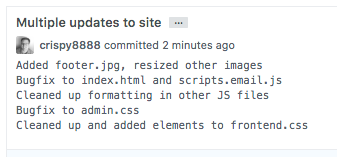
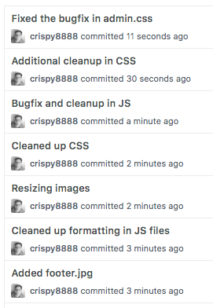

# Git 基础操作

上一章你已经创建了一个 Git 仓库。现在仓库还只是一个“空档案柜”，里面没有任何正式版本。

这一章要学习 Git 最常用的一条工作流：

```text
改文件 → 看状态 → 加入暂存区 → 提交成版本 → 查看历史
```

对应命令是：

```bash
git status
git add 文件名
git commit -m "说明"
git log --oneline
```

先记住一句话：

> Git 不会自动把你所有修改都保存成版本。你要先选择哪些改动进入暂存区，再提交成正式版本。

---

## 1. 先确认你在 Git 仓库里

本章命令都应该在 Git 仓库的项目目录里运行。

先运行：

```bash
git status
```

如果看到类似：

```text
On branch main
No commits yet
nothing to commit
```

说明你在一个 Git 仓库里。

如果看到：

```text
fatal: not a git repository
```

说明你当前不在 Git 仓库里。你需要 `cd` 到有 `.git` 的项目目录，或者先运行 `git init` 初始化仓库。

---

## 2. 创建一个文件，观察 Git 怎么看它

假设你在项目里新建一个文件：

```text
hello.txt
```

内容是：

```text
Hello Git
```

保存后运行：

```bash
git status
```

你可能看到：

```bash
On branch main

No commits yet

Untracked files:
  (use "git add <file>..." to include in what will be committed)
        hello.txt

nothing added to commit but untracked files present (use "git add" to track)
```

`Untracked files` 的意思是：

> 这个文件在文件夹里，但 Git 还没有把它纳入版本管理。

新文件默认不会自动进入 Git 历史。你要明确告诉 Git：这个文件我要管理。

---

## 3. 把文件加入暂存区：git add

运行：

```bash
git add hello.txt
```

这一步的意思不是“提交”，而是：

> 我准备把 `hello.txt` 放进下一次提交。

再看状态：

```bash
git status
```

你可能看到：

```text
On branch main

No commits yet

Changes to be committed:
  (use "git rm --cached <file>..." to unstage)
        new file:   hello.txt
```

这表示 `hello.txt` 已经进入暂存区，准备提交。

### 暂存区到底有什么用？

暂存区让你可以选择“这次提交要包含哪些改动”。

比如你同时改了三个文件：

| 文件 | 改动 | 是否适合放进同一次提交 |
|---|---|---|
| `login.html` | 登录页面 | 适合 |
| `login.css` | 登录样式 | 适合 |
| `README.md` | 顺手改错别字 | 不一定适合 |

你可以只提交登录相关文件：

```bash
git add login.html login.css
git commit -m "添加登录页面"
```

这样提交历史会更清楚。

真实开发经常不是“一次只改一个点”。你可能在同一轮工作里修了 CSS、改了图片、顺手调整了脚本，还改了文档。如果把这些全部塞进一个提交，历史以后会很难读：



暂存区的价值就在这里：它让你把一堆同时发生的文件变化，拆成几次更清楚的逻辑提交。比如先提交样式修复，再提交图片调整，最后提交脚本清理：



所以 `git add` 不只是“把文件交给 Git”。更准确地说，它是在回答一个问题：

> 下一次提交应该包含哪些改动？

如果你希望提交历史以后还能帮助自己和队友理解项目，就不要把 `git add .` 当成无脑默认动作。可以先用 `git diff` 看改动，再选择真正属于同一件事的文件进入暂存区。

如果一个文件里同时有两类改动，比如一部分是功能代码，另一部分只是顺手改格式，可以用按块暂存：

```bash
git add -p hello.txt
```

`-p` 是 patch 的意思。Git 会一段一段展示 diff，问你这一段要不要放进暂存区。常见选择先记两个：

| 选择 | 含义 |
|---|---|
| `y` | 暂存这一段 |
| `n` | 先不暂存这一段 |

新手不必一开始就熟练掌握 `git add -p`，但要知道暂存区不只按“文件”选择，也可以按“改动块”选择。它解决的问题是：同一个文件里有不该放进同一次提交的混杂改动。

`git add .` 和 `git add -A` 很高效，但也更容易把“顺手改动”一起扫进去。它们适合在你已经看过 `git status` 和 `git diff`，确认当前目录里的变化都属于同一件事时使用。否则，先明确写文件名，或者用 `git add -p` 逐块选择。

---

## 4. 提交成第一个版本：git commit

当暂存区准备好后，运行：

```bash
git commit -m "添加 hello 文件"
```

这里：

| 部分 | 含义 |
|---|---|
| `git commit` | 创建一次提交 |
| `-m` | message，表示后面写提交说明 |
| `"添加 hello 文件"` | 这次提交的说明 |

提交成功后，你可能看到类似：

```text
[main (root-commit) 5556dc3] 添加 hello 文件
 1 file changed, 1 insertion(+)
 create mode 100644 hello.txt
```

重点看：

| 输出 | 含义 |
|---|---|
| `main` | 这次提交发生在 main 分支上 |
| `root-commit` | 这是这个仓库历史里的第一次提交 |
| `5556dc3` | 提交编号的前几位，每个人电脑上看到的编号通常不一样 |
| `1 file changed` | 有 1 个文件变化 |
| `1 insertion(+)` | 新增了 1 行 |

`root-commit` 里的 `root` 可以理解成“根”。第一次提交之前没有任何提交，所以这次提交没有上一个版本可以连接，它就是整个提交历史的起点。

后面再提交时，通常不会再看到 `root-commit`。例如第二次提交的输出可能更像这样：

```text
[main 8f3a2b1] 修改 hello 文件
 1 file changed, 1 insertion(+)
```

提交编号也叫 commit hash。它是这次提交的“身份证号”。

---

## 5. 查看历史：git log

提交后，查看历史：

```bash
git log
```

完整输出比较长，新手更推荐：

```bash
git log --oneline
```

示例：

```text
a1b2c3d 添加 hello 文件
```

每一行就是一次提交。

| 内容 | 含义 |
|---|---|
| `a1b2c3d` | 提交编号的前几位 |
| `添加 hello 文件` | 提交说明 |

如果提交很多，可以用：

```bash
git log --oneline --graph --decorate
```

后面学习分支时，这个命令会更有用。

---

## 6. 再修改文件，理解 tracked 和 modified

现在 `hello.txt` 已经被提交过，所以 Git 已经认识它。

这种文件叫 tracked file，也就是**已跟踪文件**。

打开 `hello.txt`，改成：

```text
Hello Git
This is my second line.
```

保存后运行：

```bash
git status
```

你可能看到：

```bash
On branch main
Changes not staged for commit:
  (use "git add <file>..." to update what will be committed)
  (use "git restore <file>..." to discard changes in working directory)
        modified:   hello.txt

no changes added to commit (use "git add" and/or "git commit -a")
```

其中`Changes not staged for commit`意思是：`hello.txt` 是 Git 已经管理的文件，它被修改了，但这个修改还没进入暂存区。

文件常见状态可以这样理解：

| 状态 | 含义 | 下一步常见操作 |
|---|---|---|
| untracked | 新文件，Git 还没管理 | `git add 文件名` |
| modified | 已跟踪文件被修改 | `git diff` 或 `git add 文件名` |
| staged | 改动已进入暂存区 | `git commit -m "说明"` |
| clean | 没有未提交改动 | 可以继续开发 |

---

## 7. 查看具体改了什么：git diff

`git status` 告诉你“哪些文件变了”。

如果想看“具体哪一行变了”，用：

```bash
git diff
```

示例输出类似：

```diff
 Hello Git
+This is my second line.
```

`+` 表示新增的行。

常见符号：

| 符号 | 含义 |
|---|---|
| `+` | 新增的内容 |
| `-` | 删除的内容 |

如果只想看某个文件：

```bash
git diff hello.txt
```

注意：

> `git diff` 默认查看的是“工作目录里还没有 add 的改动”。

---

## 8. 查看已暂存的改动：git diff --staged

现在把修改加入暂存区：

```bash
git add hello.txt
```

再运行：

```bash
git diff
```

你可能发现什么都不显示了。

这不是改动消失了，而是因为改动已经进入暂存区。

要查看暂存区里的改动，用：

```bash
git diff --staged
```

只看某个已暂存文件：

```bash
git diff --staged hello.txt
```

可以这样记：

| 命令 | 看哪里 |
|---|---|
| `git diff` | 工作目录中还没 add 的改动 |
| `git diff --staged` | 已经 add、准备 commit 的改动 |

---

## 9. 再提交一次

暂存区确认无误后，提交：

```bash
git commit -m "更新 hello 内容"
```

再查看历史：

```bash
git log --oneline
```

可能看到：

```text
f2783f9 (HEAD -> main) 更新 hello 内容
5556dc3 添加 hello 文件
```

最新提交在上面。

你现在已经有两次提交了：

```text
5556dc3 --- f2783f9
```

这条提交链会成为第 4 章学习分支的基础。

---

## 10. 撤销还没 add 的修改：git restore

如果你改坏了文件，还没有 `git add`，可以恢复到上一次提交时的样子。

例如你把 `hello.txt` 改坏了。

先看状态：

```bash
git status
```

确认它还在：

```text
Changes not staged for commit
```

然后恢复：

```bash
git restore hello.txt
```

这个命令会丢掉 `hello.txt` 当前未提交的修改。

> 使用前确认这些改动真的不要了。

---

## 11. 撤销已经 add 的修改：git restore --staged

如果你已经运行了：

```bash
git add hello.txt
```

但后来发现不想把它放进这次提交，可以运行：

```bash
git restore --staged hello.txt
```

这一步不会删除工作目录里的文件内容。

更准确地说，`git restore --staged hello.txt` 做的是：取消暂存区里准备提交的那一版，让它重新变成“已修改，但还没准备提交”的状态。

可以这样理解：

```text
已经放进待归档盒 → 从待归档盒拿出来
```

有一个细节值得知道：同一个文件可能同时有“已暂存版本”和“工作目录版本”。例如你先修改到 B 并 `git add`，随后又继续改到 C。这时 `git status` 可能同时显示：

```text
Changes to be committed:
        modified:   hello.txt

Changes not staged for commit:
        modified:   hello.txt
```

意思是：如果现在提交，会提交暂存区里的旧版本 B；但工作目录里还有更新的 C 没有进入暂存区。

这时有两个常见选择：

| 你想做什么 | 命令 |
|---|---|
| 暂存区不要 B，只保留工作目录里的 C | `git restore --staged hello.txt` |
| 让暂存区也更新成 C | `git add hello.txt` |

所以 `git add` 不只是“第一次把文件放进暂存区”，也可以理解成：

> 用工作目录里的当前版本，更新暂存区里的待提交版本。

---

## 12. 修改最后一次提交说明：git commit --amend

如果刚提交完，发现提交说明写错了，可以修改最后一次提交说明：

```bash
git commit --amend -m "新的提交说明"
```

例如：

```bash
git commit --amend -m "更新 hello 文件内容"
```

注意：

> 如果这次提交已经推送到远程仓库，先不要随便 amend。因为它会改写提交历史。远程协作学完后再处理这种情况。

新手阶段，把 `--amend` 用在“刚刚本地提交，尚未推送”的情况最安全。

---

## 13. 忽略不该提交的文件：`.gitignore`

不是项目里的每个文件都应该进入 Git 历史。

常见不该提交的内容：

| 类型 | 示例 | 为什么不提交 |
|---|---|---|
| 依赖目录 | `node_modules/` | 体积大，可重新安装 |
| 构建产物 | `dist/`、`build/` | 可由源码生成 |
| 日志 | `*.log` | 临时运行记录 |
| 密钥配置 | `.env` | 可能泄露密码、token |
| 系统文件 | `.DS_Store` | 和项目无关 |

在项目根目录创建 `.gitignore`：

```text
node_modules/
dist/
*.log
.env
```

然后提交它：

```bash
git add .gitignore
git commit -m "添加 Git 忽略规则"
```

注意：`.gitignore` 只会影响尚未被 Git 跟踪的文件。如果某个文件已经提交过，后来再写进 `.gitignore`，Git 仍然会继续跟踪它。

如果你想让 Git 从此不再跟踪某个已经提交过的本地配置文件，但又想保留磁盘上的文件，用：

```bash
git rm --cached .env
git add .gitignore
git commit -m "停止跟踪本地环境配置"
```

这里的 `--cached` 表示“只从暂存区/索引里移除”，不会删除你工作目录里的 `.env`。如果误提交的是密码、token 或私钥，只停止跟踪还不够；历史里仍然可能找得到它，需要先轮换密钥，再看 [Git 内部原理与仓库维护](./Git教程系列-16-Git内部原理与仓库维护.md) 里的历史清理说明。

---

### 空目录不会被 Git 跟踪

Git 只跟踪文件，不跟踪空目录。如果你需要一个空目录作为占位（比如 `logs/`、`uploads/`），直接建空文件夹提交是没用的，`git status` 不会看到它。常见做法是在里面放一个占位文件：

```bash
mkdir logs
echo "" > logs/.gitkeep
git add logs/.gitkeep
```

`.gitkeep` 不是 Git 的特殊命令，只是一个约定俗成的占位文件名，让 Git 能把这个目录纳入版本管理。

---
## 14. 删除和移动文件：`git rm` 与 `git mv`

如果你想删除一个已经被 Git 管理的文件，可以直接删除文件后再 `git add`，也可以用：

```bash
rm old.txt
git add old.txt
git commit -m "删除 old 文件"
```

这里的 `git add old.txt` 不是“重新添加文件内容”，而是把“`old.txt` 已经被删除”这个变化放进暂存区。

可以把 Git 理解成在记录项目状态的变化：

| 你做了什么 | Git 看到的变化 | 需要暂存什么 |
|---|---|---|
| 修改文件内容 | 这个文件的内容变了 | 暂存“内容修改” |
| 新建文件 | 多了一个新文件 | 暂存“新增文件” |
| 删除文件 | 少了一个已跟踪文件 | 暂存“删除文件” |

所以，`git add` 不只用于添加新文件，也用于把某个文件的最新变化放进暂存区。这个“最新变化”可能是修改，也可能是删除。

如果你觉得 `git add old.txt` 用来暂存删除有点反直觉，可以改用下面这个命令：

```bash
git rm old.txt
git commit -m "删除 old 文件"
```

如果你想重命名或移动文件：

```bash
git mv old-name.txt new-name.txt
git commit -m "重命名说明文件"
```

`git mv` 本质上是“移动文件 + 把这个变化放进暂存区”。它不是必须用，但能让意图更清楚。

---

## 15. 查看某次提交：`git show`

`git log --oneline` 只能看到提交列表。如果你想看某次提交到底改了什么，用：

```bash
git show 提交哈希
```

例如：

```bash
git show c3d4e5f
```

它会显示提交作者、时间、说明和具体 diff。

如果只想看统计信息：

```bash
git show --stat c3d4e5f
```

---

## 16. 什么是一次好提交？

一次好提交应该是“一个清楚的小故事”：它解决一个具体问题，包含完整相关改动，并且说明能让以后的人看懂。

不要把提交只当成“今天的备份”。如果仓库里全是 `update`、`fix`、`改一下`，以后查看历史、做 code review、回滚某个功能、用 `cherry-pick` 搬运改动时都会很痛苦。Git 历史应该能回答：

| 问题 | 好提交应该提供的信息 |
|---|---|
| 这次改变解决了什么？ | 提交说明能看出目的或结果 |
| 改动范围是否清楚？ | 一个提交尽量只做一件事 |
| 这件事是否完整？ | 不把同一个逻辑改动拆得七零八落 |
| 以后能不能单独回退？ | 相关文件在同一次提交里，不相关改动分开 |

| 好提交 | 坏提交 |
|---|---|
| `添加登录表单校验` | `update` |
| `修复 README 链接错误` | `fix` |
| `删除废弃配置文件` | `改一下` |

提交说明也可以分两层：第一行写一句清楚的标题，空一行后再写更详细的原因、取舍或验证方式。小提交用 `git commit -m "说明"` 足够；如果这次改动需要解释背景，就直接运行 `git commit`，让 Git 打开编辑器写多行说明。

提交粒度建议：

1. 相关文件放在同一次提交。
2. 不相关改动分开提交。
3. 提交前先看 `git diff --staged`。
4. 提交说明写“这次改变的结果”，不要只写“修改”。

如果你发现自己改着改着把几件事混在一起了，先不要急着 `git add .`。可以按下面顺序整理：

```bash
git status
git diff
git add -p 文件名
git diff --staged
git commit -m "说明这一次完整改变"
```

`git add -p` 适合把同一个文件里的不同改动拆开。它不是为了炫技，而是为了把“修 bug”“顺手格式化”“补文档”这类不同目的分开保存。

提交说明可以先在心里写出来，再开始改代码。比如你准备写：

```text
添加登录失败提示
```

这句话会反过来提醒你：这次提交应该围绕“登录失败提示”展开，不要顺手把注册页样式、README 错别字和构建脚本也塞进去。

如果你只是需要临时离开、切分支处理别的事，未完成工作不一定要变成提交。更合适的选择通常是：

| 场景 | 更合适的做法 |
|---|---|
| 半成品还不适合进入历史 | `git stash push -m "说明"` |
| 工作已经有价值，但还没准备合并 | 创建临时分支并正常提交 |
| 已经形成完整逻辑改动 | 提交到当前功能分支 |

一句话：小而完整、说明清楚、范围单一，就是好提交。

---

## 17. 一个完整小流程

下面是一套完整流程：

```bash
# 1. 查看状态
git status

# 2. 新建或修改文件
# 这里用编辑器修改 hello.txt

# 3. 查看具体改动
git diff hello.txt

# 4. 加入暂存区
git add hello.txt

# 5. 查看暂存区改动
git diff --staged hello.txt

# 6. 提交
git commit -m "更新 hello 文件"

# 7. 查看历史
git log --oneline
```

这就是 Git 的基础闭环。

---

## 18. 常见误解

| 误解 | 正确理解 |
|---|---|
| `git add` 就是提交 | 不是。它只是把改动放进暂存区 |
| `git commit` 会提交所有文件 | 不是。只提交暂存区里的内容 |
| 新文件会自动被 Git 管理 | 不会。需要先 `git add` |
| `git diff` 没输出就表示没改动 | 不一定。可能改动已经被 add，要看 `git diff --staged` |
| `git restore 文件` 很安全 | 它会丢弃未提交修改，执行前要确认 |
| 提交信息随便写就行 | 不建议。清楚的提交信息能帮助以后看历史 |

---

## 19. 本章命令速查表

| 命令 | 作用 | 什么时候用 |
|---|---|---|
| `git status` | 查看当前状态 | 不知道下一步做什么时 |
| `git add 文件` | 把文件放进暂存区 | 准备提交某个文件时 |
| `git add 文件1 文件2` | 添加多个文件 | 一次提交包含多个相关文件时 |
| `git add .` | 添加当前目录所有改动 | 确认所有改动都要提交时 |
| `git add -A` | 暂存整个仓库里的新增、修改和删除 | 已确认全仓库改动都属于本次提交时 |
| `git add -p 文件` | 按改动块选择暂存 | 一个文件里混有多类改动时 |
| `git commit -m "说明"` | 提交成一个版本 | 暂存区准备好后 |
| `git commit` | 打开编辑器写多行提交说明 | 需要解释背景、原因或风险时 |
| `git log --oneline` | 查看历史提交 | 想看保存过哪些版本时 |
| `git diff` | 查看未暂存改动 | add 之前检查改了什么 |
| `git diff 文件` | 查看某个文件未暂存改动 | 只想检查单个文件时 |
| `git diff --staged` | 查看已暂存改动 | commit 之前检查将提交什么 |
| `git diff --staged 文件` | 查看某个文件已暂存改动 | 只想检查单个已 add 文件时 |
| `git restore 文件` | 撤销工作目录修改 | 文件改坏且还没 add 时 |
| `git restore --staged 文件` | 从暂存区撤出 | 不想把某个文件放进这次提交时 |
| `git commit --amend -m "说明"` | 修改最后一次提交说明 | 刚提交完且还没推送时 |
| `git rm 文件` | 删除已跟踪文件并暂存删除 | 确认文件不再需要时 |
| `git mv 旧名 新名` | 移动或重命名文件并暂存变化 | 文件改名或移动位置时 |
| `git show 提交哈希` | 查看某次提交详情 | 想知道某次提交具体改了什么时 |

---

## 20. 本章总结

这一章你学会了 Git 的基础工作流：

```text
工作目录修改 → git add 到暂存区 → git commit 保存到本地仓库
```

你还学会了：

- 用 `git status` 判断当前状态
- 用 `git diff` 查看具体改动
- 用 `git log --oneline` 查看历史
- 用 `git restore` 撤销小错误

到这里，你已经能在一条主线上保存版本了。

下一章开始学习分支：如何在不影响主线的情况下开发新功能。

---

**下一步**：[分支管理](./Git教程系列-04-分支管理.md)

---

**返回目录**：[README](./README.md)
