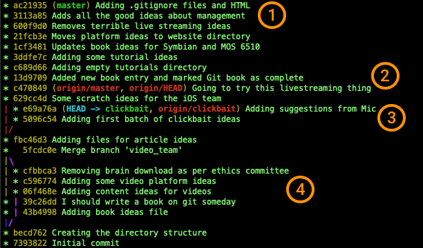

# Git 分支管理

这一章专门把 Git 分支讲清楚。

很多新手觉得分支难，是因为一开始就背命令：`git branch`、`git checkout`、`git merge`。但分支真正重要的不是命令，而是这三个问题：

1. **为什么要有分支？**
2. **分支到底指向什么？**
3. **切换分支时，文件为什么会变？**

本章先不急着合并分支。合并和冲突会放到下一章单独讲。本章的目标是：你能理解分支是什么，知道自己在哪个分支上，能创建分支、切换分支，并理解在不同分支上提交后会发生什么。

---

## 1. 为什么需要分支？

先想一个很普通的场景。

你的网站现在有一个稳定版本，用户可以正常使用。现在你想开发一个登录功能，但是登录功能还没写完，甚至可能会把页面弄坏。

如果你直接在主线版本上改，就会出现一个问题：

> 稳定版本和试验中的新功能混在一起了，以至于稳定版本变得不稳定，甚至直接运行不了。

分支就是为了解决这个问题的。

你可以把主线版本继续放在 `main` 分支上，然后新建一个 `feature-login` 分支，在里面放心开发登录功能。 

```text
main 分支：          A --- B
                           \
feature-login 分支：          C --- D
```

可以这样理解：

| 分支 | 通俗理解 | 适合放什么 |
|---|---|---|
| `main` | 正式主线、稳定版本 | 已经确认没问题的代码 |
| `feature-login` | 登录功能试验线 | 正在开发的新功能 |
| `fix-bug` | 修 bug 的临时线 | 针对某个问题的修复 |

分支让你可以：

- 在不影响主线的情况下开发新功能
- 同时尝试不同方案
- 多个人在同一个项目里各做各的事情
- 功能完成后，再把改动合回主线

> 分支不是 Git 的高级技巧，而是 Git 日常工作的核心。

---

## 2. 先建立一个正确的心智模型

很多人刚学分支时，会以为一个分支就是一整份项目副本：

```text
错误理解：
main 分支 = 一整个项目文件夹
feature 分支 = 复制出来的另一个项目文件夹
```

如果这样理解，分支就会显得很重：创建一个分支好像是在复制整个项目，合并分支好像是在合并两个文件夹。

但 Git 不是这样工作的。

先把“提交”理解清楚：

> **一次提交，就是项目在某个时刻的一份版本记录。**

你可以把它想成一次“存档”。这个存档能让 Git 知道：

- 当时项目里的文件是什么样子
- 这次提交是谁做的、什么时候做的
- 提交说明写了什么
- 上一次提交是哪一个

例如下面这条历史里，有三次提交：

```text
A --- B --- C
```

可以这样理解：

| 提交 | 通俗理解 |
|---|---|
| `A` | 第一次存档 |
| `B` | 在 `A` 的基础上又存了一次 |
| `C` | 在 `B` 的基础上又存了一次 |

所以，提交不是一句说明文字，也不是一个单独的文件改动。它更像一个可以被 Git 找回的“项目版本”。

理解了提交，再来看分支。

> **分支不是一整份项目副本，而是贴在某次提交上的名字。**

假设现在 `main` 指向提交 `C`：

```text
A --- B --- C
            ↑
          main
```

这表示：`main` 这个名字当前贴在 `C` 这次提交上。Git 看到 `main` 指向 `C`，就知道你在 `main` 上看到的是 `C` 这个版本的项目。

如果你现在创建一个新分支 `feature`，Git 不会复制一整份项目。它只是多贴了一个名字：

```text
A --- B --- C
            ↑
        main, feature
```

此时 `main` 和 `feature` 都指向同一次提交 `C`。它们不是两份项目，只是两个分支名暂时贴在同一个版本上。

当你切到 `feature` 并提交一次，才会出现分叉：

```text
A --- B --- C
            ↑
          main
             \
              D
              ↑
           feature
```

这表示：`feature` 往前走到了新提交 `D`，而 `main` 还停在 `C`。

所以先记住两句话：

> **提交是一份可以找回的项目版本。**
> **分支是一个会移动的名字，指向某一次提交。各分支独立维护一条提交路径**

你在哪个分支上提交，哪个分支的名字就会向前移动。

---

## 3. 提交之间也有关系：父提交

每次提交不是孤零零存在的。除了第一次提交外，每个提交都会记住它的上一个提交。

```text
A --- B --- C
```

可以理解为：

| 提交 | 它的父提交 |
|---|---|
| `A` | 没有，A 是第一次提交 |
| `B` | `A` |
| `C` | `B` |

这条链就是 Git 的历史。

分支指向的是这条历史链上的某一个提交。Git 通过“当前分支指向哪个提交”，知道你当前看到的是哪一个版本。

---

## 4. 查看当前有哪些分支

在项目目录里运行：

```bash
git branch
```

示例输出：

```text
* main
```

这里的 `*` 表示：你当前正在这个分支上。

如果看到：

```text
  feature-login
* main
```

意思是：

- 当前项目有两个分支：`main` 和 `feature-login`
- 你现在在 `main` 分支上

也可以用：

```bash
git status
```

它通常会在第一行告诉你当前分支：

```text
On branch main
```

新手阶段，不知道自己在哪个分支时，先运行 `git status` 或 `git branch`。

---

## 5. 创建分支：git branch

创建一个新分支：

```bash
git branch feature-login
```

注意：这个命令**只创建分支，不会自动切换过去**。

创建后再查看：

```bash
git branch
```

可能会看到：

```text
  feature-login
* main
```

这说明 `feature-login` 已经创建了，但你仍然在 `main` 上。

### 新分支会指向哪里？

新分支会指向你创建它时所在的那个提交。

假设现在是这样：

```text
A --- B --- C
            ↑
          main
```

你在 `main` 上执行：

```bash
git branch feature-login
```

就会变成：

```text
A --- B --- C
            ↑
          main
            ↑
      feature-login
```

也就是说，刚创建出来时，`main` 和 `feature-login` 指向同一个提交。

这也是为什么刚创建分支后，你看文件内容好像没变化：因为两个分支目前指向同一个版本。

---

## 6. HEAD 是什么？

理解分支时，经常会看到 `HEAD`。

例如运行：

```bash
git log --oneline --decorate
```

可能会看到类似输出：

```text
abc1234 (HEAD -> main) 添加 hello 文件
```

这里的意思是：

```text
HEAD -> main -> abc1234
```

可以这样理解：

| 名称 | 含义 |
|---|---|
| `main` | 一个分支，指向某次提交 |
| `HEAD` | 指向“你当前所在的分支” |

`HEAD` 不是分支。它更像一个“你现在站在哪里”的标记。

当你在 `main` 分支上时：

```text
HEAD -> main
```

当你切换到 `feature-login` 分支后：

```text
HEAD -> feature-login
```

所以：

> **HEAD 告诉 Git：当前正在操作哪个分支。**

当你提交时，Git 会让 `HEAD` 指向的那个分支向前移动。

---

## 7. 切换分支：git switch

创建分支后，如果你想到这个分支上工作，需要切换过去。

推荐新手使用：

```bash
git switch feature-login
```

切换成功后，Git 会提示：

```text
Switched to branch 'feature-login'
```

再运行：

```bash
git branch
```

你会看到：

```text
* feature-login
  main
```

`*` 已经移动到 `feature-login` 前面，说明你现在就在这个分支上。

### checkout 和 switch 有什么区别？

你可能在网上看到老教程写：

```bash
git checkout feature-login
```

它也可以切换分支。

但新手更推荐使用 `git switch`，因为它的含义更单一：就是切换分支。

| 命令 | 新手建议 | 说明 |
|---|---|---|
| `git switch 分支名` | 推荐 | 专门用于切换分支，顾名思义 |
| `git checkout 分支名` | 能看懂即可 | 老命令，功能更多，容易混淆 |

---

## 8. 创建并立即切换分支

实际开发中，经常会创建完分支马上切换过去。

可以一步完成：

```bash
git switch -c feature-login
```

它等价于这两步：

```bash
git branch feature-login
git switch feature-login
```

老写法是：

```bash
git checkout -b feature-login
```

新手优先记 `git switch -c 分支名`。

---

## 9. 在分支上提交：分支什么时候真正分开？

刚创建分支时，两个分支通常指向同一个提交：

```text
A --- B
      ↑
    main
      ↑
  feature-login
```

这时它们还没有真正分开。

当你切换到 `feature-login`，然后提交一次：

```bash
git switch feature-login
# 修改文件
git add 文件名
git commit -m "开发登录功能"
```

历史会变成：

```text
A --- B
      ↑
    main
       \
        C
        ↑
  feature-login
```

现在两个分支就分开了：

- `main` 还停在 `B`
- `feature-login` 前进到了 `C`
- 你当前在 `feature-login` 上，所以 `HEAD` 指向 `feature-login`

再强调一次：

> **你在哪个分支上提交，哪个分支就会向前移动。其他分支不会自动移动。**

---

## 10. 一个完整的动手例子

下面这个例子假设你已经在前面章节里创建过 Git 仓库，并且至少有一次提交。

如果你不确定当前是否干净，先运行：

```bash
git status
```

最好看到：

```text
nothing to commit, working tree clean
```

这表示当前没有未提交的改动，适合练习切换分支。

### 第一步：确认当前在 main 上

```bash
git branch
```

如果看到：

```text
* main
```

说明你现在在 `main` 分支上。

### 第二步：创建并切换到新分支

```bash
git switch -c feature-note
```

这条命令的意思是：

> 创建一个叫 `feature-note` 的分支，并立刻切换过去。

查看分支：

```bash
git branch
```

应该能看到：

```text
* feature-note
  main
```

### 第三步：在新分支上修改文件并提交

假设项目里有一个已经被 Git 管理的文件 `hello.txt`。

打开 `hello.txt`，加一行内容，例如：

```text
This line is written on feature-note.
```

保存文件后运行：

```bash
git status
```

你会看到 `hello.txt` 被修改了。

把它加入暂存区并提交：

```bash
git add hello.txt
git commit -m "在 feature-note 分支修改 hello 文件"
```

现在 `feature-note` 分支向前移动了一步。

### 第四步：查看分支图

运行：

```bash
git log --oneline --graph --all --decorate
```

你可能会看到类似这样的结构：

```text
* c3d4e5f (HEAD -> feature-note) 在 feature-note 分支修改 hello 文件
* a1b2c3d (main) 添加 hello 文件
```

这里最重要的是看括号：

- `HEAD -> feature-note`：你现在在 `feature-note` 上
- `main`：`main` 还停在旧提交上

### 第五步：切回 main 看看

```bash
git switch main
```

再打开 `hello.txt`，你可能会发现刚才新增的那一行不见了。

这不是 Git 把你的内容删了，而是因为：

> 你切回了 `main` 分支，而 `main` 指向的是还没有那行内容的旧版本。

再切回 `feature-note`：

```bash
git switch feature-note
```

那一行又会回来，很神奇吧。这个现象非常重要。它说明：

> **切换分支，不只是换了一个名字；Git 还会把工作目录更新成目标分支对应的文件状态。**

---

## 11. 切换分支时，Git 到底做了什么？

当你运行：

```bash
git switch feature-note
```

Git 大致做了三件事：

1. 把 `HEAD` 指向 `feature-note`
2. 找到 `feature-note` 指向的那次提交
3. 把工作目录里的文件更新成那次提交的样子

可以画成这样：

```text
切换前：
HEAD -> main -> B

切换后：
HEAD -> feature-note -> C
```

如果 `main` 和 `feature-note` 指向同一个提交，文件内容可能不会变化。

如果它们指向不同提交，工作目录里的文件就可能跟着变化。

所以，切换分支前最好先看状态：

```bash
git status
```

如果工作目录是干净的，切换分支会更安全、更容易理解。

---

## 12. Git 为什么有时不让你切换分支？

如果你修改了文件，但还没有提交，然后尝试切换分支，可能会看到类似错误：

```text
error: Your local changes to the following files would be overwritten by checkout
```

有些 Git 版本或命令会显示 `switch`，有些会显示 `checkout`，但意思是一样的。

意思是：

> 你当前的未提交改动，可能会被目标分支的文件状态覆盖。为了避免丢失内容，Git 阻止了这次切换。

这其实是在保护你。

常见处理方式：

| 你想做什么 | 可以怎么做 |
|---|---|
| 这些改动是有用的 | 先 `git add`，再 `git commit` |
| 这些改动不要了 | 用 `git restore 文件名` 丢弃修改 |
| 暂时不想提交，但想先切分支 | 后面可以学 `git stash` |

新手阶段，优先用前两种方式。`stash` 很有用，但可以等基础更稳之后再学。

---

## 13. detached HEAD 是什么？

新手先记住一句话：

> **detached HEAD 就是：你现在不在任何分支上，而是临时打开了某一次提交。**

它通常出现在你直接切到某个提交的时候：

```bash
git switch --detach a1b2c3d
```

或者你在老教程里看到这种写法：

```bash
git checkout a1b2c3d
```

这时 Git 可能提示：

```text
You are in 'detached HEAD' state
```

这不是报错，也不是仓库坏了。它的意思更接近：

> 你现在只是临时打开了一个旧版本，不是在某个分支上继续工作。

举个例子。假设项目历史是这样：

```text
A --- B --- C
            ↑
          main
```

现在 `main` 停在 `C`。你平时在 `main` 上工作，看到的就是 `C` 这个最新版本。

如果你直接切到旧提交 `B`：

```text
A --- B --- C
      ↑     ↑
   你在这里  main 还在这里
```

这就是 detached HEAD。

它要表达的不是“多了一个奇怪的 HEAD”，而是这件事：

| 位置 | 含义 |
|---|---|
| `main` 还在 `C` | 主分支没有回退，仍然停在最新版本 |
| 你临时站在 `B` | 当前工作区显示的是旧版本 `B` 的文件 |

所以 detached HEAD 最适合用来“看一眼旧版本”。例如：

- 看看某个文件以前是什么样
- 验证旧版本能不能运行
- 对比以前和现在的差异

看完以后，切回分支就行：

```bash
git switch main
```

真正需要小心的是：不要在 detached HEAD 状态下继续开发很久。

为什么？因为你不在任何分支上。正常在分支上提交时，分支会跟着新提交往前走；但 detached HEAD 状态下提交，没有分支名帮你记住这个新提交。

---

注意一个很容易误解的点：

> **在旧提交上继续提交，不会覆盖后面的提交记录，而是从旧提交旁边长出一条新路线。**

假设原来是这样：

```text
A --- B --- C
            ↑
          main
```

你临时切到旧提交 `B`，然后又提交了一次 `D`，会变成：

```text
A --- B --- C
      │     ↑
      │   main
      \
       D
       ↑
     HEAD
```

这表示：

| 提交 | 状态 |
|---|---|
| `C` | 还在，`main` 仍然指向它，没有被覆盖 |
| `D` | 你从旧提交 `B` 新做出来的提交 |
| `HEAD` | 当前临时停在 `D` 上，但还没有分支名保护它 |

所以，detached HEAD 下提交不是“把 `C` 改没了”，而是“从 `B` 另走了一条路”。

如果这时你运行：

```bash
git log --oneline --graph --decorate
```

你可能只看到 `D -> B -> A` 这条路线，看不到 `main` 上的 `C`。这不是 `C` 被覆盖了，而是因为 `git log` 默认只显示“从当前位置往回走能看到的历史”。

想把其他分支也一起画出来，要加 `--all`：

```bash
git log --oneline --graph --all --decorate
```

这样才能同时看到 `main`、其他分支，以及你从旧提交新长出来的路线。

如果你只是查看旧版本，不需要提交，直接切回 `main`。

如果你已经在 detached HEAD 状态下做了有用提交，就马上创建一个分支：

```bash
git switch -c rescue-work
```

这条命令的意思是：

> 给当前位置起一个分支名。比如当前停在 `D`，新分支就会指向 `D`。

创建后会变成：

```text
A --- B --- C
      │     ↑
      │   main
      \
       D
       ↑
   rescue-work
```

这样 `D` 就不会只是一个临时位置，而是被 `rescue-work` 这个分支保存下来了。

如果你没有创建分支，直接切回 `main` 会怎样？

```bash
git switch main
```

Git 通常会提醒你：你正在离开一个没有分支保存的提交。

这个提交不会马上消失，`main` 也不会被覆盖。但它会变成一个“没有名字的提交”：没有 `main`、`feature`、`rescue-work` 这样的分支指向它。

短时间内，你通常还能通过提交号或 `git reflog` 找回来；但长期来看，这种提交不安全，以后可能被 Git 清理掉。

所以新手可以这样记：

> **detached HEAD 里做了提交，切走前要么创建分支保存它，要么确认这次提交真的不要了。**

简单总结：

| 你想做什么 | 正确做法 |
|---|---|
| 只是看看旧版本 | detached HEAD 没问题，看完 `git switch main` |
| 想从旧版本继续开发 | 先创建分支：`git switch -c 新分支名` |
| 已经在 detached HEAD 里做了提交，而且想保留 | 立刻创建分支：`git switch -c rescue-work` |
| 已经在 detached HEAD 里做了提交，但不想保留 | 可以直接切回分支，看到提醒时确认自己不要这次提交 |

---

## 14. 从某个旧提交创建分支

如果你明确想从某个旧提交开始继续改，更推荐一开始就创建分支：

```bash
git switch -c experiment-old-version a1b2c3d
```

意思是：

> 从 `a1b2c3d` 这个提交创建一个新分支，并切换过去。

这和“先 detached HEAD 到旧提交、提交一次、再创建分支”最后可以得到类似的历史结构：都是从旧提交旁边长出一条新路线。

区别在于顺序：

| 做法 | 提交时有没有分支保护 | 新手建议 |
|---|---|---|
| 先 `git switch -c 新分支 旧提交`，再提交 | 有 | 推荐 |
| 先 detached HEAD，提交后再 `git switch -c 新分支` | 一开始没有，补建后才有 | 只适合救回已经做了的提交 |

所以，如果你还没开始改，优先用本节这种写法；如果你已经在 detached HEAD 里提交了，就用上一节的方式创建分支补救。

---

## 15. 重命名分支

如果分支名字起错了，或者后来想换成更清楚的名字，可以重命名分支。

最常见的情况是：你现在就在这个分支上，想给当前分支改名。

```bash
git branch -m 新分支名
```

例如，你现在在 `feature-note` 分支上，想把它改成 `feature/readme-note`：

```bash
git branch -m feature/readme-note
```

改完后运行：

```bash
git branch
```

你会看到旧名字不见了，新名字出现了，并且 `*` 仍然在这个分支前面：

```text
* feature/readme-note
  main
```

这件事可以这样理解：

> **重命名分支只是把贴在提交上的分支名换掉，不会改动提交内容，也不会改动文件内容。**

如果你不在那个分支上，也可以明确写出旧名字和新名字：

```bash
git branch -m 旧分支名 新分支名
```

例如：

```bash
git branch -m feature-note feature/readme-note
```

两种写法的区别是：

| 命令 | 含义 | 适合场景 |
|---|---|---|
| `git branch -m 新分支名` | 重命名当前分支 | 你已经在要改名的分支上 |
| `git branch -m 旧分支名 新分支名` | 重命名指定分支 | 你不想先切过去，或者想写得更明确 |

如果目标分支名已经存在，`-m` 会失败。这时先检查你是不是把名字写错了。不要急着用强制改名。

---

## 16. 删除分支

当一个功能分支已经完成、已经合并回主分支，并且以后不需要了，可以删除它。

删除分支通常发生在合并之后。现在先认识命令，下一章学完合并后，这个场景会更自然。

删除已经合并过的分支：

```bash
git branch -d feature-note
```

`-d` 是比较安全的删除方式。如果这个分支还有没合并的提交，Git 通常会阻止删除，避免你误删工作成果。

如果你确定这个分支不要了，可以强制删除：

```bash
git branch -D feature-note
```

但新手不要随便用 `-D`。

| 命令 | 含义 | 风险 |
|---|---|---|
| `git branch -d 分支名` | 删除已合并分支 | 较安全 |
| `git branch -D 分支名` | 强制删除分支 | 可能丢掉还没合并的提交 |

还有一个限制：你不能删除当前正在使用的分支。

如果你现在在 `feature-note` 上，想删除它，需要先切到别的分支：

```bash
git switch main
git branch -d feature-note
```

---

- 删除远程分支

上面的 `git branch -d` 和 `git branch -D` 删除的是**本地分支**。如果这个分支已经推送到远程仓库，还需要单独删除远程分支：

```bash
git push origin --delete feature-note
```

这条命令的意思是：请求 `origin` 这个远程仓库删除名为 `feature-note` 的远程分支。

删除远程分支前要先确认两个前提：

1. 这个分支已经不再需要了，例如功能已经合并完成。
2. 要删除的远程分支不是远程仓库的默认分支，例如不是 GitHub 项目设置里的默认分支。

默认分支通常不能直接删除。即使平台允许改动，也应该先在远程仓库设置里把默认分支切换到别的分支，再删除旧分支。

如果远程没有这个分支，你会看到类似错误：

```text
error: unable to delete 'feature-note': remote ref does not exist
```

这说明远程仓库里没有叫 `feature-note` 的分支，可能是它从来没推送过，或者已经被删掉了。可以先查看远程分支：

```bash
git branch -r
```

---

## 17. 分支命名建议

分支名最好能看出它是做什么的。

不推荐：

```bash
git switch -c test
git switch -c abc
git switch -c new
```

推荐：

```bash
git switch -c feature-login
git switch -c fix-header-style
git switch -c update-readme
```

常见命名方式：

| 前缀 | 用途 | 示例 |
|---|---|---|
| `feature/` | 新功能 | `feature/login-page` |
| `bugfix/` | 普通缺陷修复 | `bugfix/login-error` |
| `hotfix/` | 线上紧急修复 | `hotfix/payment-timeout` |
| `release/` | 发布准备 | `release/1.2.0` |
| `experiment/` | 试验方案 | `experiment/new-layout` |

个人练习时用 `feature-login` 也可以；团队项目更常见 `feature/login-page` 这种带斜杠的命名。分支名不能包含空格。多个单词之间通常用 `-` 连接。

---

## 18. main 和 master 是什么关系？

你可能会在不同教程里看到两个名字：

```text
main
master
```

它们本质上都只是分支名。

很多 Git 仓库默认使用 `master` 作为第一个分支，也有用 `main` 的。总之每个项目通常会有一个主要分支，它可能叫 `main`，也可能叫 `master`，还可能叫别的名字。

---

## 19. 查看分支历史图

只用 `git log --oneline` 时，分支关系有时不够直观。

可以用：

```bash
git log --oneline --graph --all --decorate
```

真实项目里的输出可能像这样：



各参数含义：

| 参数 | 作用 |
|---|---|
| `--oneline` | 每次提交只显示一行 |
| `--graph` | 用线条画出分支结构 |
| `--all` | 显示所有分支 |
| `--decorate` | 显示分支名、HEAD 等标记 |

示例：

```text
* d4e5f6a (HEAD -> feature-login) 添加登录按钮
* c3d4e5f 添加登录页面
| * b2c3d4e (main) 更新首页文案
|/
* a1b2c3d 初始化项目
```

不用一开始就看懂每个符号。先重点看：

- `HEAD -> 分支名`：你当前在哪个分支
- `main` 在哪里
- 你的功能分支在哪里
- 两条线有没有分开
- `origin/main` 这类名字在哪里：它表示你本地记录的远程分支位置，远程协作章节会详细讲

---

## 20. 常见误解

| 误解 | 正确理解 |
|---|---|
| 分支是一整份项目副本 | 分支是指向提交的可移动指针 |
| 创建分支后会自动切过去 | 不会。`git branch 名` 只创建，不切换 |
| `HEAD` 是一个分支 | 不是。`HEAD` 指向当前所在的分支 |
| 所有分支都会随着提交一起前进 | 不会。只有当前分支会前进 |
| 切换分支只是换个名字 | 不只是。工作目录也可能变成另一个版本的文件状态 |
| `main` 这个名字有特殊魔法 | 没有。它只是常用的主分支名字 |
| 删除分支就是删除所有代码 | 不一定。分支只是指针；但强制删除未合并分支可能让提交难找回 |

---

## 21. 本章命令速查表

| 命令 | 作用 | 什么时候用 |
|---|---|---|
| `git branch` | 查看本地分支 | 想知道有哪些分支、当前在哪个分支时 |
| `git branch 分支名` | 创建分支 | 只想创建，还不切换时 |
| `git switch 分支名` | 切换分支 | 到另一个已有分支上工作时 |
| `git switch -c 分支名` | 创建并切换分支 | 开始一个新功能或新任务时 |
| `git switch -c 分支名 提交哈希` | 从某个提交创建分支 | 想从旧版本开始试验或救回提交时 |
| `git branch -m 新分支名` | 重命名当前分支 | 当前分支名字起错了或想改得更清楚时 |
| `git branch -m 旧分支名 新分支名` | 重命名指定分支 | 不想先切过去，或者想明确写出旧名字时 |
| `git switch --detach 提交哈希` | 直接查看某个历史提交 | 只想临时看旧版本时 |
| `git checkout 分支名` | 切换分支的老写法 | 看老教程或老项目时需要认识 |
| `git checkout -b 分支名` | 创建并切换的老写法 | 看老教程或老项目时需要认识 |
| `git status` | 查看当前状态和当前分支 | 不确定能不能切分支时 |
| `git log --oneline --graph --all --decorate` | 查看分支历史图 | 想看分支是否分开、各自指向哪里时 |
| `git branch -d 分支名` | 删除已合并分支 | 功能分支完成后清理 |
| `git branch -D 分支名` | 强制删除本地分支 | 确认本地分支不要了，且知道风险时 |
| `git push origin --delete 分支名` | 删除远程分支 | 远程分支不再需要，且它不是默认分支时 |

---

## 22. 本章总结

这一章最重要的不是背命令，而是理解这几句话：

1. 分支是一条工作线，但在 Git 内部它只是一个**指向提交的可移动指针**。
2. `HEAD` 表示你当前站在哪个分支上。
3. 你在哪个分支上提交，哪个分支就会向前移动。
4. 创建分支不会自动切换，切换分支要用 `git switch`。
5. 切换分支时，工作目录里的文件可能会变成另一个版本的样子。
6. 功能分支完成后，通常要合并回主分支；合并和冲突是下一章的重点。

学会分支之后，Git 就不再只是“保存版本”的工具，而是可以同时管理多条开发路线的工具。

---

**下一步**：[合并与冲突](./Git教程系列-05-合并与冲突.md)

---

**返回目录**：[README](./README.md)
