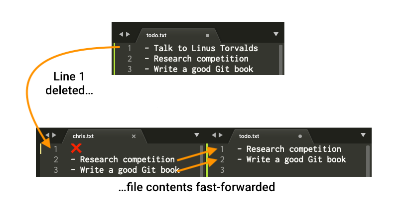
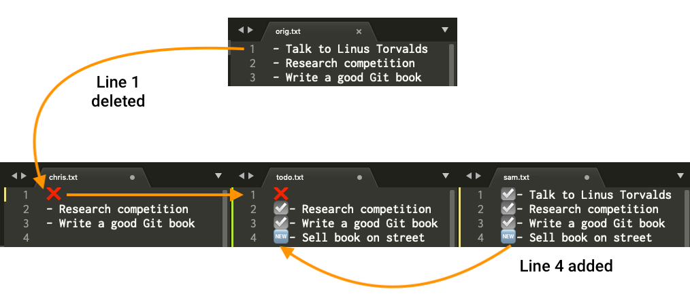

# Git 合并与冲突

上一章讲了分支：分支可以让你在不同工作线上开发，互不干扰。

但分支不是为了永远分开。你在功能分支上完成工作后，通常要把它整合回主分支。这一步就叫**合并**。

这一章要讲清楚四件事：

1. 合并到底是把谁合到谁
2. 什么是快进合并
3. 什么是三方合并
4. 遇到冲突时，应该怎么看、怎么改、怎么完成合并

分支难，合并更容易让人紧张。你先记住一句话：

> 合并不是灾难。冲突也不是错误。它只是 Git 需要你做一次人工判断。

如果你是第一次学合并，本章最小掌握路径是：

```text
1. 合并前先站到目标分支
2. 执行 git merge 源分支
3. 如果冲突：编辑文件 → 删除冲突标记 → git add → git commit
```

后面的快进合并、三方合并，是为了帮你理解 Git 为什么会这样做。

---

## 1. 合并解决什么问题？

假设你现在有两个分支：

```text
main：稳定主线
feature-login：登录功能分支
```

你在 `feature-login` 上完成了登录功能：

```text
A --- B
      ↑
    main
       \
        C --- D
              ↑
        feature-login
```

现在问题来了：

> 登录功能在 `feature-login` 上，`main` 上还没有。怎么把登录功能放回 `main`？

这就是合并要做的事。

合并的意思是：

> **把一个分支上的改动，整合到另一个分支里。**

---

## 2. 先分清楚：源分支和目标分支

合并最容易错的地方，不是命令本身，而是方向。

一次合并里有两个角色：

| 角色 | 英文 | 含义 |
|---|---|---|
| 源分支 | source branch | 提供改动的分支 |
| 目标分支 | target branch | 接收改动的分支 |

如果你想把 `feature-login` 合并进 `main`：

```text
源分支：feature-login
目标分支：main
```

操作顺序是：

```bash
git switch main
git merge feature-login
```

这两行非常重要：

1. 先切换到**目标分支**：`main`
2. 再合并**源分支**：`feature-login`

可以把它读成一句话：

```bash
git switch main              # 我要让 main 接收改动
git merge feature-login      # 把 feature-login 的改动合进来
```

> 你当前所在的分支，就是这次合并的目标分支。

---

## 3. 合并前先确认工作目录干净

合并会修改当前分支的文件状态。为了避免把未提交改动和合并混在一起，合并前先运行：

```bash
git status
```

最好看到：

```text
nothing to commit, working tree clean
```

这表示当前工作目录是干净的，适合进行合并。

如果你看到有修改还没提交，例如：

```text
Changes not staged for commit
```

先决定这些修改怎么办：

| 情况 | 建议 |
|---|---|
| 这些改动是有用的 | 先 `git add`，再 `git commit` |
| 这些改动不要了 | 用 `git restore 文件名` 撤销 |
| 只是临时改动，暂时不想提交 | 后面可以学 `git stash` |

新手阶段，建议先保持工作目录干净，再做合并。

---

## 4. Git 有两种常见合并方式

Git 合并时，常见结果有两种：

| 合并方式 | 什么时候发生 | 会不会创建新提交 |
|---|---|---|
| 快进合并 Fast-forward merge | 目标分支没有新的独立提交，只是落后于源分支 | 通常不会 |
| 三方合并 Three-way merge | 两个分支各自都有新的提交，历史已经分叉 | 会，创建一个合并提交 |

判断依据是：

> 两个分支的历史有没有分叉。

下面分别讲。

---

## 5. 快进合并：只是把指针往前移动

先看最简单的情况。

合并前：

```text
A --- B
      ↑
    main
       \
        C --- D
              ↑
        feature-login
```

这里 `main` 停在 `B`，`feature-login` 从 `B` 往前走到了 `D`。

关键是：

> `main` 自从创建 `feature-login` 之后，自己没有产生新的提交。

所以 Git 可以很轻松地把 `main` 指针直接移动到 `D`：

```text
A --- B --- C --- D
                  ↑
                main
                  ↑
          feature-login
```

这就叫**快进合并**。



为什么叫快进？

这种合并不会创建新提交，`main` 分支指针直接从原节点 `B` 移动到 `feature-login` 的最新节点 `D`。由于目标分支 `main` 在分支拆分后**无新提交**，两条分支提交线没有分叉，合并过程不会出现冲突，执行效率极高。

---

## 6. 动手理解快进合并

假设你现在有一个 `main` 分支，并且工作目录是干净的。

### 第一步：创建并切换到功能分支

```bash
git switch -c feature-note
```

意思是：创建 `feature-note` 分支，并切换过去。

### 第二步：修改文件并提交

假设你修改了 `hello.txt`，然后提交：

```bash
git add hello.txt
git commit -m "在 feature-note 分支修改 hello 文件"
```

现在历史大概是：

```text
A --- B
      ↑
    main
       \
        C
        ↑
  feature-note
```

### 第三步：切回 main

```bash
git switch main
```

注意：切回 `main` 后，工作目录里的文件可能会变回 `main` 对应的版本。

这是正常的。因为你现在看到的是 `main` 指向的提交。

### 第四步：把 feature-note 合并进 main

```bash
git merge feature-note
```

如果是快进合并，你可能会看到类似输出：

```text
Updating a1b2c3d..c3d4e5f
Fast-forward
 hello.txt | 1 +
 1 file changed, 1 insertion(+)
```

其中 `Fast-forward` 就是在告诉你：这次合并是快进合并。

合并后，`main` 会指向 `feature-note` 的最新提交。

### 第五步：查看历史图

```bash
git log --oneline --graph --all --decorate
```

可能看到：

```text
* c3d4e5f (HEAD -> main, feature-note) 在 feature-note 分支修改 hello 文件
* a1b2c3d 添加 hello 文件
```

重点看括号：

```text
(HEAD -> main, feature-note)
```

这表示：

- 你当前在 `main` 上
- `main` 和 `feature-note` 指向同一个提交
- 功能分支的改动已经进入 `main`

---

## 7. 快进合并后要不要删除功能分支？

如果这个功能已经完成，并且已经合并进 `main`，功能分支通常就可以删除。

先确认你不在要删除的分支上：

```bash
git switch main
```

然后删除：

```bash
git branch -d feature-note
```

`-d` 是安全删除。如果 Git 发现这个分支还没有被合并，通常会拒绝删除。

不要一上来就用：

```bash
git branch -D feature-note
```

`-D` 是强制删除，可能让未合并的提交变得难找回。

---

## 8. 三方合并：两条线都往前走了

现在看更真实的情况。

你从 `main` 创建了 `feature-login`，然后你在 `feature-login` 上提交了登录功能。

与此同时，`main` 上也有人提交了首页文案修改。

合并前：

```text
        C --- D
       /      ↑
A --- B       feature-login
       \
        E
        ↑
      main
```

这时两个分支都从 `B` 出发，但后来各自往前走了：

- `feature-login` 有 `C`、`D`
- `main` 有 `E`

这叫历史已经**分叉**。

此时 Git 不能只把 `main` 指针往前移动，因为 `main` 上的 `E` 也不能丢。

所以 Git 会创建一个新的提交，把两条线连起来：

```text
        C --- D
       /      \
A --- B        M
       \      /
        E ---
               ↑
              main
```

这个 `M` 就叫**合并提交**。

合并提交有一个特殊点：

> 普通提交通常只有一个父提交；合并提交通常有两个父提交。

这里的 `M` 同时记住：

- `D`：功能分支的最新提交
- `E`：主分支合并前的最新提交

这就是**三方合并**。

---

## 9. 为什么叫“三方”合并？

三方合并不是指三个分支，而是 Git 会参考三个提交：

| 角色 | 在图中的例子 | 含义 |
|---|---|---|
| 共同祖先 | `B` | 两个分支分开前的共同提交 |
| 目标分支最新提交 | `E` | 当前分支，也就是接收改动的分支 |
| 源分支最新提交 | `D` | 被合并进来的分支 |

Git 会比较：

```text
B -> E：目标分支改了什么
B -> D：源分支改了什么
```

然后尽量自动把两边改动整合起来。



如果两边改的是不同文件，或者同一文件的不同位置，Git 通常能自动合并。

如果两边改的是同一文件的同一位置，Git 可能就不知道该保留哪边，于是产生冲突。

---

## 10. 动手理解三方合并

假设历史现在是这样：

```text
A --- B
      ↑
    main
```

### 第一步：创建功能分支

```bash
git switch -c feature-login
```

修改 `login.txt`，然后提交：

```bash
git add login.txt
git commit -m "添加登录说明"
```

现在：

```text
A --- B
      ↑
    main
       \
        C
        ↑
  feature-login
```

### 第二步：让 main 也产生一个新提交

切回 `main`：

```bash
git switch main
```

修改另一个文件，比如 `README.md`，然后提交：

```bash
git add README.md
git commit -m "更新 README 文案"
```

现在历史分叉了：

```text
        C
        ↑
  feature-login
       /
A --- B --- E
            ↑
          main
```

其中 `feature-login` 指向 `C`，`main` 指向 `E`。

### 第三步：把 feature-login 合进 main

确认你在目标分支 `main` 上：

```bash
git branch
```

应该看到：

```text
* main
  feature-login
```

执行合并：

```bash
git merge feature-login
```

如果没有冲突，Git 会创建一个合并提交。

你可能会看到类似输出：

```text
Merge made by the 'ort' strategy.
 login.txt | 1 +
 1 file changed, 1 insertion(+)
```

有些版本或配置会打开编辑器，让你确认合并提交信息。默认信息通常类似：

```text
Merge branch 'feature-login'
```

如果你不熟悉编辑器，不要慌。保存并退出后，Git 会完成合并提交。

合并后的历史类似：

```text
        C ------
       /        \
A --- B --- E --- M
                ↑
              main
```

---

## 11. 快进合并和三方合并的区别

| 对比项 | 快进合并 | 三方合并 |
|---|---|---|
| 分支历史是否分叉 | 没有分叉 | 已经分叉 |
| Git 怎么合并 | 移动目标分支指针 | 创建一个合并提交 |
| 是否有新的合并提交 | 通常没有 | 有 |
| 是否可能冲突 | 一般不会在合并提交阶段出现冲突 | 可能出现冲突 |
| 常见场景 | 你从 `main` 拉出分支后，`main` 没有新提交 | 你开发功能时，`main` 也有人继续提交 |

一句话总结：

> 快进合并是“目标分支直接追上源分支”；三方合并是“两个分支都前进了，所以 Git 新建一个提交把它们接起来”。

---

## 12. 其他常见合并方式

到了 GitHub、GitLab 这类平台上，你会看到几种合并按钮，例如 **Create a merge commit**、**Squash and merge**、**Rebase and merge**。

### no-ff merge：即使能快进，也不要快进

`no-ff` 的完整意思是 **no fast-forward**：不要快进。

命令是：

```bash
git merge --no-ff feature
```

它真正有区别的地方，是前面“本来可以快进”的情况。

同样是这个合并前状态：

```text
A --- B                  main
       \
        C --- D          feature
```

普通 merge 会变成一条直线：

```text
A --- B --- C --- D      main, feature
```

但 `--no-ff` 会强制创建一个合并提交 `M`：

```text
A --- B ------- M        main
       \       /
        C --- D          feature
```

所以普通 merge 和 no-ff 的区别是：

| 合并前状态 | 普通 `git merge feature` | `git merge --no-ff feature` |
|---|---|---|
| `main` 没有新提交，本来能快进 | 直接快进，没有合并提交 | 不快进，强制创建合并提交 `M` |
| `main` 也有新提交，已经分叉 | 创建合并提交 `M` | 也是创建合并提交 `M`，结果看起来差不多 |

也就是说：

> **no-ff 主要是在“本来可以快进”的时候，故意留下一个合并提交。**

这里说的“留下合并记录”，不是说普通快进没有提交记录。普通快进当然有 `C`、`D`。区别只是：no-ff 会额外留下一个 `M`，让人从历史图上看出“这里曾经做过一次合并”。

### squash merge：不要分支里的多个提交，只要最终结果

假设 `feature` 里有两个提交：

```text
C：写登录页面
D：修登录页面的小 bug
```

`squash merge` 会把 `C`、`D` 的最终文件变化压成一个新提交 `S` 放到 `main` 上：

```text
A --- B --- S            main
       \
        C --- D          feature
```

它不是把 `C`、`D` 原样接到 `main`，而是新做了一个提交 `S`，这个提交`S`将`C`，`D`这两个提交做成了1个，让人看起来这些变化其实是一次提交完成的。

适合的场景是：功能分支里提交很乱，比如“试一下”“修一下”“再修一下”，但主线只想看到一个清楚的提交。

### rebase merge：把分支里的提交重新排到 main 后面

合并前：

```text
A --- B --- E            main
       \
        C --- D          feature
```

rebase merge 会把 `feature` 里的改动重新放到 `E` 后面：

```text
A --- B --- E --- C' --- D'      main
```

这里是 `C'`、`D'`，不是原来的 `C`、`D`。因为 Git 不是把原提交搬过去，而是在 `E` 后面重新做出内容相同的新提交。

它的结果是：主线历史看起来像一条直线，没有合并提交 `M`。

简单对比：

| 合并方式 | 你会在 `main` 上看到什么 | 新手怎么理解 |
|---|---|---|
| fast-forward | `main` 直接走到 `D` | 直接追上功能分支 |
| 普通 merge | 能快进就快进；不能快进就创建 `M` | Git 自动选择最自然的方式 |
| no-ff merge | 强制创建 `M` | 即使能直接追上，也要留下一个合并节点 |
| squash merge | 一个新提交 `S` | 不保留分支里的零散提交，只保留最终结果 |
| rebase merge | `C'`、`D'` 排到 `main` 后面 | 保留多个提交，但把历史整理成直线 |

新手阶段先掌握普通 merge。其他方式先知道它们会改变历史形状即可，真正项目里按团队约定来。

---

## 13. 什么是合并冲突？

合并冲突不是 Git 坏了，也不是你一定做错了。

冲突的意思是：

> Git 发现两边都改了同一个地方，它无法判断最终应该保留哪一种内容。

最常见的冲突场景：

| 场景 | 为什么会冲突 |
|---|---|
| 两个分支修改了同一文件的同一行 | Git 不知道该保留哪边 |
| 一个分支修改了某个文件，另一个分支删除了这个文件 | Git 不知道该保留修改后的文件，还是删除它 |
| 两边都新增了同名文件 | Git 不知道最终应该用哪一份 |
| 一边重命名文件，另一边删除文件 | Git 不知道重命名是否还成立 |
| 二进制文件两边都改了 | Git 无法像文本一样插入冲突标记 |
| 两边都改了同一段内容，但改法不同 | Git 需要人工判断最终文本 |

例如：

```text
main 分支把这一行改成：
登录按钮颜色改为蓝色

feature-login 分支把同一行改成：
登录按钮颜色改为绿色
```

Git 没法替你决定蓝色还是绿色，因为这是业务判断，不是技术判断。

---

## 14. 冲突长什么样？

当合并发生冲突时，Git 会停下来，并在冲突文件里插入特殊标记。

你可能会看到：

```text
<<<<<<< HEAD
登录按钮颜色改为蓝色
=======
登录按钮颜色改为绿色
>>>>>>> feature-login
```

这些标记叫**冲突标记**。

它们的含义是：

| 标记 | 含义 |
|---|---|
| `<<<<<<< HEAD` | 当前分支，也就是目标分支的内容开始 |
| `=======` | 上下两部分的分隔线 |
| `>>>>>>> feature-login` | 源分支的内容结束 |

如果你是在 `main` 上执行：

```bash
git merge feature-login
```

那么：

- `HEAD` 通常代表当前的 `main`
- `feature-login` 代表被合并进来的分支

冲突文件不是最终文件。它只是 Git 把两边内容都摆出来，让你决定最终应该是什么。

---

## 15. 解决冲突的核心流程

解决冲突只有两大步：

```text
第一步：编辑冲突文件，决定最终内容，删除冲突标记
第二步：git add 标记冲突已解决，然后 git commit 完成合并
```

不要把它想复杂。

Git 不是要你选择“左边”或“右边”之一。你可以：

- 只保留当前分支内容
- 只保留源分支内容
- 两边都保留
- 两边都不要，改成第三种写法

关键是：

> 最终文件里不能再有 `<<<<<<<`、`=======`、`>>>>>>>` 这些冲突标记。

---

## 16. 动手理解冲突解决

假设你现在在 `main` 上，执行：

```bash
git merge feature-login
```

Git 提示：

```text
Auto-merging hello.txt
CONFLICT (content): Merge conflict in hello.txt
Automatic merge failed; fix conflicts and then commit the result.
```

意思是：

- Git 尝试自动合并 `hello.txt`
- 但发现内容冲突
- 自动合并失败
- 你需要修好冲突，然后提交结果

### 第一步：先看状态

```bash
git status
```

你可能会看到：

```text
You have unmerged paths.
  (fix conflicts and run "git commit")
  (use "git merge --abort" to abort the merge)

Unmerged paths:
  both modified:   hello.txt
```

重点看这一行：

```text
both modified:   hello.txt
```

意思是：两个分支都修改了 `hello.txt`，而且产生了冲突。

### 第二步：打开冲突文件

打开 `hello.txt`，可能看到：

```text
Hello Git
<<<<<<< HEAD
This line is from main.
=======
This line is from feature-login.
>>>>>>> feature-login
```

现在你要决定最终文件应该是什么。

比如你决定两边都保留，并整理成：

```text
Hello Git
This line is from main.
This line is from feature-login.
```

注意：冲突标记已经全部删掉了。

保存文件。

### 第三步：标记冲突已解决

```bash
git add hello.txt
```

这里的 `git add` 不只是“加入暂存区”，还有一层意思：

> 告诉 Git：这个文件的冲突我已经解决好了。

再看状态：

```bash
git status
```

如果解决完成，可能看到：

```text
All conflicts fixed but you are still merging.
  (use "git commit" to conclude merge)
```

意思是：

> 冲突都解决了，但合并还没结束。还需要提交一次。

### 第四步：完成合并提交

```bash
git commit -m "解决冲突并合并 feature-login"
```

提交后，合并才真正完成。

查看历史：

```bash
git log --oneline --graph --all --decorate
```

你会看到一个新的合并提交，它把两条分支线连在一起。

---

## 17. 如果冲突很多，应该怎么处理？

真实项目里可能不止一个文件冲突。

这时不要急着乱改，按这个顺序来：

```text
1. git status 看哪些文件冲突
2. 一次打开一个冲突文件
3. 搜索 <<<<<<< 找到冲突位置
4. 决定最终内容
5. 删除冲突标记
6. 保存文件
7. git add 这个文件
8. 继续处理下一个冲突文件
9. 所有冲突解决后 git commit
```

可以用表格理解每一步的目的：

| 步骤 | 命令或动作 | 目的 |
|---|---|---|
| 查看冲突 | `git status` | 知道哪些文件需要处理 |
| 找冲突位置 | 搜索 `<<<<<<<` | 定位冲突内容 |
| 编辑文件 | 手动保留最终内容 | 做业务判断 |
| 标记解决 | `git add 文件名` | 告诉 Git 这个文件处理完了 |
| 完成合并 | `git commit` | 创建合并提交 |

---

## 18. 不想继续合并怎么办？

如果你合并到一半，发现情况比想象中复杂，暂时不想处理，可以取消合并：

```bash
git merge --abort
```

它的作用是：

> 放弃这次合并，让文件回到合并之前的状态。

适合这些情况：

- 冲突太多，想先停下来
- 合错了分支
- 发现自己应该先更新代码或先提交本地改动
- 不确定应该怎么解决，想先回到安全状态

执行后再看：

```bash
git status
```

确认工作目录是否回到了合并前的状态。

---

## 19. 合并时最常犯的错误

### 错误一：站错分支

想把 `feature-login` 合进 `main`，却忘了先切到 `main`。

错误操作可能是：

```bash
git switch feature-login
git merge main
```

这表示把 `main` 合进 `feature-login`，方向反了。

正确操作是：

```bash
git switch main
git merge feature-login
```

记住：

> 当前分支是接收改动的一方。

### 错误二：冲突文件里留下冲突标记

解决冲突后，文件里不应该再出现：

```text
<<<<<<<
=======
>>>>>>>
```

如果这些标记还在，说明冲突没有真正整理干净。

### 错误三：编辑了冲突文件，但忘记 git add

解决冲突后必须运行：

```bash
git add 文件名
```

否则 Git 不知道你已经处理完了。

### 错误四：以为冲突只能二选一

冲突不是选择题。你可以把两边内容重新组织成第三种最终结果。

例如冲突是：

```text
<<<<<<< HEAD
按钮颜色：蓝色
=======
按钮颜色：绿色
>>>>>>> feature-login
```

最终可以改成：

```text
按钮颜色：蓝绿色
```

只要这是你想要的最终内容即可。

---

## 20. 如何减少冲突？

冲突不能完全避免，但可以减少。

| 做法 | 为什么有用 |
|---|---|
| 开始新分支前，先让 `main` 保持最新 | 分支起点越新，后面偏离越少 |
| 小步提交、小步合并 | 改动越小，冲突越容易处理 |
| 不要多人长期改同一个大文件 | 同一位置改动越多，冲突概率越高 |
| 合并前先 `git status` | 避免未提交改动干扰合并 |
| 看到冲突先读内容，不要急着乱删 | 冲突本质是内容判断，不是命令问题 |

如果将来学习远程协作，还会经常遇到：

```bash
git pull
```

它背后也可能触发合并，也可能遇到冲突。到那时你会发现，本章学的冲突解决流程仍然适用。

如果你发现同一种冲突反复出现（比如长期并行维护两条分支），可以了解 `git rerere`（reuse recorded resolution）。开启后，Git 会记住你解决冲突的方式，下次遇到相同冲突时自动套用同样的解决方案。它属于进阶功能，新手阶段了解即可，不必急于启

---

## 21. 使用图形化合并工具：mergetool 和 difftool

Git 的命令行 diff 和冲突标记虽然功能完整，但面对大量冲突时，用图形化工具查看会更加直观。Git 支持配置第三方的图形化 diff 和 merge 工具。

### 配置 difftool

```bash
# 查看当前配置的 diff 工具
git config --global diff.tool

# 设置为 VS Code（推荐）
git config --global diff.tool vscode
git config --global difftool.vscode.cmd 'code --wait --diff "$LOCAL" "$REMOTE"'

# 或设置为 Beyond Compare、Kaleidoscope 等
```

配置后，可以用 `git difftool` 代替 `git diff`，它会在图形工具中打开文件对比：

```bash
# 对比工作目录和暂存区
git difftool 文件名

# 对比两个提交之间的差异
git difftool 提交A 提交B -- 文件名
```

### 配置 mergetool

```bash
# 设置合并工具
git config --global merge.tool vscode
git config --global mergetool.vscode.cmd 'code --wait --merge "$REMOTE" "$LOCAL" "$BASE" "$MERGED"'
```

当出现合并冲突时，运行：

```bash
git mergetool
```

Git 会逐个打开冲突文件，你可以在图形界面中看到三个版本：

- **本地版本（LOCAL）**：当前分支的内容
- **远程版本（REMOTE）**：要合并进来的分支的内容
- **共同祖先（BASE）**：两个分支分叉前的版本
- **合并结果（MERGED）**：最终要保存的文件

在图形工具中解决冲突后，保存文件即可。Git 会自动标记为已解决。

常用图形化工具有 VS Code、Beyond Compare、Kaleidoscope（macOS）、Meld（Linux）等。选一个你觉得顺手的配置好就行，Git 的命令行工作流不变。

---
用。

---

## 22. 合并前后检查清单

合并前：

- [ ] 我站在目标分支上
- [ ] `git status` 显示工作目录干净
- [ ] 我知道源分支是什么
- [ ] 我看过最近的分支图
- [ ] 如果是团队项目，我知道这次合并是否应该走 PR

合并后：

- [ ] 没有冲突标记残留：`<<<<<<<`、`=======`、`>>>>>>>`
- [ ] `git status` 没有未完成的 merge 状态
- [ ] 关键功能或文件检查过
- [ ] 分支图符合预期
- [ ] 已合并功能分支可以清理

---

## 23. 本章命令速查表

| 命令 | 作用 | 什么时候用 |
|---|---|---|
| `git status` | 查看当前状态 | 合并前、冲突中、解决后都要常用 |
| `git switch 目标分支` | 切换到接收改动的分支 | 合并前第一步 |
| `git merge 源分支` | 把源分支合并进当前分支 | 合并前确认自己站在目标分支上 |
| `git log --oneline --graph --all --decorate` | 查看分支和合并历史图 | 想看合并结果时 |
| `git add 冲突文件` | 标记冲突已解决 | 手动编辑并保存冲突文件后 |
| `git commit` | 完成合并提交 | 解决冲突并 add 后 |
| `git commit -m "说明"` | 用指定说明完成提交 | 想自己写合并提交信息时 |
| `git merge --abort` | 取消当前合并 | 合并到一半不想继续时 |
| `git branch -d 分支名` | 删除已合并分支 | 功能分支合并完成后清理 |

---

## 24. 本章总结

这一章最重要的是理解合并的方向和冲突的处理流程：

1. 合并是把一个分支的改动整合到另一个分支。
2. 当前所在分支是目标分支，也就是接收改动的一方。
3. `git merge feature-login` 的意思是：把 `feature-login` 合进当前分支。
4. 快进合并只是移动目标分支指针。
5. 三方合并会创建一个合并提交，把两条历史线连起来。
6. 冲突表示 Git 无法自动判断最终内容，需要你手动编辑。
7. 解决冲突的流程是：编辑文件 → 删除冲突标记 → `git add` → `git commit`。
8. 如果合并过程不想继续，可以用 `git merge --abort` 回到合并前。

学到这里，你已经掌握了 Git 最核心的一组能力：

```text
用分支分开工作，用合并整合工作，用冲突解决人工判断。
```

---

**下一步**：[远程协作](./Git教程系列-06-远程协作.md)

---

**返回目录**：[README](./README.md)
