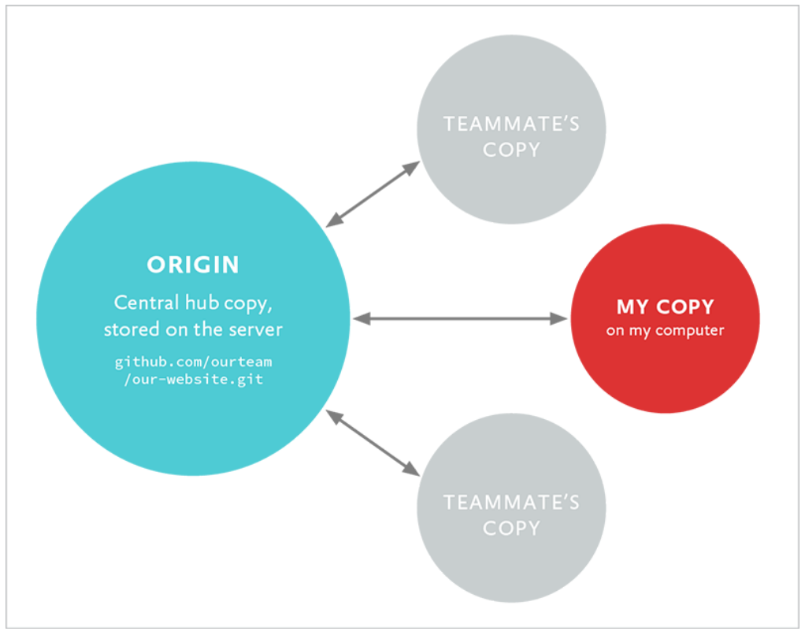

# Git 远程协作

前面 1–5 章都在讲本地仓库：你的提交、分支、合并都发生在自己电脑上。

但真实协作时，代码通常还会放在一个服务器上的仓库里，例如 GitHub、GitLab、Gitee。

这一章开始讲远程协作。

本章目标：

1. 理解本地仓库和远程仓库的关系
2. 理解 `origin` 是什么
3. 学会 `clone`、`remote`、`push`、`fetch`、`pull`
4. 理解远程跟踪分支，例如 `origin/main`
5. 知道推送被拒绝时应该先同步，而不是强推

---

## 1. 为什么需要远程仓库？

本地仓库只在你的电脑上。

```text
你的电脑
└── my-project/.git
```

如果只有本地仓库，会有几个问题：

| 问题 | 后果 |
|---|---|
| 电脑坏了 | 提交历史可能丢失 |
| 想和别人协作 | 别人拿不到你的提交 |
| 想在另一台电脑继续写 | 没有统一同步位置 |

远程仓库就是放在服务器上的 Git 仓库：

```text
你的电脑上的本地仓库  ←→  GitHub/GitLab/Gitee 上的远程仓库
```

它的作用是：

- 备份项目历史
- 让别人下载项目
- 让多人把各自的提交同步到同一个地方
- 支持 Pull Request / Merge Request 代码审查

---

## 2. 本地仓库和远程仓库不是同一个东西

这是新手必须分清楚的一点。

| 仓库 | 在哪里 | 你怎么操作它 |
|---|---|---|
| 本地仓库 | 你的电脑 | `git commit`、`git branch`、`git merge` |
| 远程仓库 | GitHub/GitLab/Gitee 等服务器 | `git push`、`git fetch`、`git pull` |

`git commit` 只是在本地保存提交。

它不会自动上传到 GitHub。

更准确地说：远程仓库不是你本地仓库的“主机文件夹”，而是另一个 Git 仓库。团队通常把 GitHub/GitLab/Gitee 上的仓库约定为同步中心，但从 Git 的角度看，两个仓库都保存自己的提交历史。

这就是为什么 Git 远程协作不是“上传文件”这么简单，而是在不同仓库之间交换提交。



上图里的 `origin` 是团队约定的中心副本。日常协作时，大家通常先把自己的提交推到这个中心，再从中心获取别人的提交，而不是互相拷贝项目文件夹。注意：这是协作习惯上的“中心”，不是说你的本地仓库不完整；每个正常克隆下来的仓库仍然带着完整提交历史。

如果想把本地提交上传到远程仓库，需要：

```bash
git push
```

如果想把远程仓库的新提交下载到本地，需要：

```bash
git fetch
```

或：

```bash
git pull
```

---

## 3. origin 是什么？

当你克隆一个远程仓库时：

```bash
git clone https://github.com/user/project.git
```

Git 会自动给这个远程仓库起一个默认名字：

```text
origin
```

所以 `origin` 不是神秘命令，也不是分支名。

它只是一个远程仓库的别名。

可以这样理解：

```text
origin = 我这个本地仓库连接的那个远程仓库地址
```

查看当前远程仓库：

```bash
git remote -v
```

示例输出：

```text
origin  https://github.com/user/project.git (fetch)
origin  https://github.com/user/project.git (push)
```

这里的两行分别表示：

| 标记 | 含义 |
|---|---|
| `(fetch)` | 从这个地址下载更新 |
| `(push)` | 向这个地址上传提交 |

大多数项目里，远程仓库别名都叫 `origin`。

---

## 4. 两种开始远程项目的方式

开始一个带远程仓库的项目，通常有两种方式。

### 方式一：克隆已有远程仓库

别人已经在 GitHub 上有仓库，你把它下载到本地：

```bash
git clone https://github.com/user/project.git
```

这会创建一个 `project` 文件夹，里面已经是 Git 仓库。

克隆会做几件事：

1. 下载项目文件
2. 下载提交历史
3. 自动设置远程别名 `origin`
4. 自动创建本地默认分支
5. 建立本地分支和远程分支的追踪关系

### 方式二：本地已有仓库，再连接远程仓库

你已经在本地写了项目，也已经 `git init`，现在想连接到 GitHub 上的新仓库。

通常流程是：

```bash
git remote add origin https://github.com/user/project.git
git push -u origin main
```

第一行：添加远程仓库地址，并命名为 `origin`。

第二行：把本地 `main` 推送到远程 `origin`。其中 `-u` 是 `--set-upstream` 的缩写，作用是建立本地 `main` 和远程 `origin/main` 的追踪关系。

设置追踪关系后，以后在 `main` 分支上推送或拉取时，就可以直接写：

```bash
git push
git pull
```

不用每次都写完整的 `git push origin main` 或 `git pull origin main`。

---

## 5. 克隆仓库：git clone

克隆仓库的命令是：

```bash
git clone 仓库地址
```

例如：

```bash
git clone https://github.com/user/project.git
```

也可以指定本地文件夹名：

```bash
git clone https://github.com/user/project.git my-native-folder
```

克隆完成后进入项目：

```bash
cd project
```

查看状态：

```bash
git status
```

通常会看到类似：

```text
On branch main
Your branch is up to date with 'origin/main'.
nothing to commit, working tree clean
```

这里的 `origin/main` 很重要，下一节讲。

---

## 6. origin/main 是什么？

`origin/main` 不是你能直接工作的普通本地分支。

它表示：

> 你本地记录的“远程 origin 上 main 分支当前在哪里”。

可以这样看：

```text
远程仓库：
origin 上真正的 main
        ↓ git fetch 下载远程状态
本地记录：
origin/main
        ↓ git merge origin/main 合进当前分支
本地分支：
main
```

也就是说：

- `git fetch` 更新的是你本地记录里的 `origin/main`
- `git merge origin/main` 才会让你的本地 `main` 接收这些更新

`origin/main` 叫**远程跟踪分支**。

对比一下：

| 名称 | 含义 | 能不能直接在上面日常开发 |
|---|---|---|
| `main` | 你的本地 main 分支 | 可以 |
| `origin/main` | 本地记录的远程 main 状态 | 不建议直接开发 |
| `origin` | 远程仓库别名 | 不是分支 |

不要把 `origin/main` 当作日常工作分支直接切过去。老教程里如果运行：

```bash
git checkout origin/main
```

Git 往往会让你进入 detached HEAD 状态，也就是只是临时查看远程分支指向的那次提交。想基于远程分支继续工作，应该创建本地分支：

```bash
git switch -c my-work origin/main
```

如果远程已经有一个功能分支，想在本地创建同名分支并建立追踪关系，可以用：

```bash
git fetch origin
git switch --track origin/feature-cart
```

运行：

```bash
git branch -a
```

可能看到：

```text
* main
  remotes/origin/main
```

这里的 `remotes/origin/main` 就是远程跟踪分支。

一个很实用的观察命令是：

```bash
git branch -vv
```

它会告诉你当前本地分支正在跟踪哪个远程分支，以及本地比远程 ahead 或 behind 多少个提交。遇到 push/pull 困惑时，先看它，比猜命令可靠。

---

## 7. HTTPS、SSH 和 upstream

克隆或添加远程仓库时，你会看到两类地址。

HTTPS：

```text
https://github.com/user/project.git
```

SSH：

```text
git@github.com:user/project.git
```

| 方式 | 适合 | 注意 |
|---|---|---|
| HTTPS | 快速 clone、临时学习 | 推送时通常需要 token 或凭据管理器 |
| SSH | 长期开发、频繁 push | 需要生成 SSH key 并添加到平台账号 |

你还可能在老资料或公司内网里看到其他远程地址形式：

| 地址形式 | 示例 | 现在怎么判断 |
|---|---|---|
| 本地路径 | `/opt/git/project.git`、`../project.git` | 适合本机或共享磁盘里的练习/中转仓库，不适合互联网协作 |
| SSH | `git@server:team/project.git` | 最常见的长期开发方式之一，权限由账号和 SSH key 控制 |
| HTTPS | `https://server/team/project.git` | 最容易穿过公司网络，推送通常依赖 token 或凭据管理器 |
| Git 协议 | `git://server/project.git` | 老资料里常见，缺少身份认证和加密；新项目通常不要选它 |

新手不需要背协议细节。判断顺序可以更实际一点：平台给你 HTTPS 和 SSH 两个按钮时，临时 clone 用 HTTPS 没问题；长期 push 的项目优先配置 SSH；看到 `git://` 时先把它当作历史遗留或只读镜像，不要拿它做团队写入通道。

开源 fork 工作流里，还常见 `upstream`：

| 远程名 | 含义 |
|---|---|
| `origin` | 你自己的远程仓库，通常是 fork 后的仓库 |
| `upstream` | 原作者或主项目仓库 |

添加 upstream：

```bash
git remote add upstream 原项目URL
```

查看所有远程：

```bash
git remote -v
```

一个典型的 fork 工作流可以这样读：

| 你要做什么 | 常用命令 | 操作对象 |
|---|---|---|
| 从原项目拿最新变化 | `git fetch upstream` | 原作者仓库 |
| 把原项目变化合进本地 main | `git merge upstream/main` | 本地 `main` |
| 把自己的功能分支推上去 | `git push -u origin feature-cart` | 你的 fork |
| 在平台上发 PR | GitHub/GitLab/Gitee 页面操作 | 从你的 fork 请求合并到原项目 |

这里最容易混的是方向：

```text
upstream/main  --同步到-->  本地 main
本地 feature  --推送到-->  origin/feature
origin/feature --发 PR 到--> upstream/main
```

如果你只是克隆自己的项目，通常只有 `origin` 就够了。只有在 fork 别人的项目、同时要跟原项目保持同步时，才需要额外添加 `upstream`。

---

## 8. 推送提交：git push

你在本地提交后，远程仓库不会自动更新。

本地提交：

```bash
git add hello.txt
git commit -m "更新 hello 文件"
```

上传到远程：

```bash
git push
```

如果本地分支还没有设置上游关系，第一次推送常用：

```bash
git push -u origin main
```

含义是：

| 部分 | 含义 |
|---|---|
| `git push` | 推送本地提交 |
| `origin` | 推送到哪个远程仓库 |
| `main` | 推送哪个分支 |
| `-u` | 设置上游关系，以后可以直接 `git push` |

设置过上游关系后，以后在 `main` 上可以直接：

```bash
git push
```

推送前可以先做三项检查：

| 检查 | 命令 | 看什么 |
|---|---|---|
| 当前在哪个分支 | `git status` | 不要把提交推到错分支 |
| 本地分支跟踪谁 | `git branch -vv` | 确认上游是期望的远程分支 |
| 本地和远程差几步 | `git log --oneline --graph --decorate --all -10` | 是否已经落后远程 |

`git push` 改变的是远程仓库里的分支指针和提交对象，不会改变你工作目录里的文件。

---

## 9. 获取远程更新：git fetch

如果别人把新提交推送到了远程仓库，你的本地仓库不会自动知道。

你可以运行：

```bash
git fetch origin
```

`fetch` 的作用是：

> 下载远程仓库的新信息，更新本地的远程跟踪分支，但不改你的当前工作分支。

例如远程 `main` 有了新提交，执行 `git fetch origin` 后：

```text
origin/main 更新了
main 不会自动改变
工作目录文件也不会自动改变
```

这就是 `fetch` 安全的地方：它只“拿消息”，不直接“替你合并”。

fetch 后可以查看所有分支历史：

```bash
git log --oneline --graph --all --decorate
```

如果你看到 `origin/main` 比 `main` 更新，说明远程有你本地还没有的提交。

---

## 10. 把远程更新合进本地：fetch + merge

`fetch` 只是下载远程信息。如果想把远程更新合进当前分支，需要再 merge。

比如你在本地 `main` 上：

```bash
git switch main
git fetch origin
git merge origin/main
```

这三步可以读成：

1. 我站在本地 `main` 上
2. 我先从远程 `origin` 下载最新信息
3. 我把 `origin/main` 合进本地 `main`

这和第 5 章的合并是一回事。

`origin/main` 是源分支，本地 `main` 是目标分支。

---

## 11. 拉取更新：git pull

`git pull` 可以理解为：

```text
git pull = git fetch + git merge
```

常用：

```bash
git pull
```

或明确写出远程和分支：

```bash
git pull origin main
```

它会先下载远程更新，再尝试合并到当前分支。

所以 `pull` 可能会：

- 快进合并
- 三方合并
- 产生冲突

如果你刚学远程协作，建议先理解 `fetch + merge`，再使用 `pull`。因为 `pull` 一步做两件事，出问题时不如拆开好理解。

团队里还常用一种更保守的拉取方式：

```bash
git pull --ff-only
```

它的意思是：只有能快进时才更新；如果需要创建合并提交，它会停下来。这样可以避免你在不知情的情况下因为 pull 产生一个合并提交。

---

## 12. fetch 和 pull 的区别

| 对比项 | `git fetch` | `git pull` |
|---|---|---|
| 是否下载远程更新 | 会 | 会 |
| 是否自动合并到当前分支 | 不会 | 会 |
| 是否改变工作目录 | 通常不会 | 可能会 |
| 是否可能产生冲突 | 不会直接产生合并冲突 | 可能产生冲突 |
| 新手理解难度 | 更清楚 | 更快但更容易困惑 |

推荐学习阶段使用：

```bash
git fetch origin
git log --oneline --graph --all --decorate
git merge origin/main
```

等理解后，再用：

```bash
git pull
```

---

## 13. 推送被拒绝怎么办？

有时你运行：

```bash
git push
```

会看到类似：

```text
! [rejected] main -> main (fetch first)
```

意思是：

> 远程 main 上有你本地没有的提交。你不能直接把自己的提交推上去覆盖它。

正确思路是先同步远程更新。

比较清楚的做法：

```bash
git fetch origin
git merge origin/main
git push
```

不要机械照着错误提示立刻 `git pull`。先回答三个问题：

| 问题 | 命令 | 目的 |
|---|---|---|
| 我现在站在哪个分支？ | `git status` | 防止在错误分支上合并 |
| 远程分支现在在哪里？ | `git fetch origin` 后看 `git log --graph --all --decorate` | 看清本地和远程是否分叉 |
| 我这次应该保留真实分叉，还是整理自己的功能分支？ | merge 或 rebase | 根据团队规则选择 |

如果你在共享分支 `main` 上，通常用 `fetch + merge` 或 `pull --ff-only` 更稳。如果你在自己的功能分支上，并且团队允许线性历史，可以在理解第 7 章后使用 `fetch + rebase`。

如果合并时有冲突，就按第 5 章的方法解决：

```text
编辑冲突文件 → git add → git commit → git push
```

不要一看到推送失败就使用：

```bash
git push --force
```

强制推送可能覆盖远程历史，影响别人工作。新手阶段不要把它当成常规解决方案。

网上有时还会把下面这种操作叫作“force pull”：

```bash
git fetch origin
git reset --hard origin/main
```

它不是 `git pull` 的安全替代品，而是把当前分支强行对齐到远程 `origin/main`。这会丢掉当前分支上没有保存好的工作区修改，也会让本地独有提交暂时从分支历史上消失。除非你明确回答了“本地这些改动和提交我都不要了”，否则不要用它解决推送失败。

如果确实只是想把练习仓库恢复到远程状态，至少先做三件事：

1. `git status` 确认当前分支和工作区状态。
2. 用 `git stash`、临时提交或复制文件保存仍然可能需要的改动。
3. 把命令里的 `origin/main` 换成你真正想对齐的远程分支。

---

## 14. 一个完整协作流程

假设你克隆了团队项目，要开发一个购物车功能。

### 第一步：克隆仓库

```bash
git clone https://github.com/team/project.git
cd project
```

### 第二步：确认当前状态

```bash
git status
```

确认工作目录干净。

### 第三步：创建功能分支

```bash
git switch -c feature-cart
```

### 第四步：开发并提交

```bash
git add cart.html cart.css
git commit -m "添加购物车页面"
```

### 第五步：推送功能分支

```bash
git push -u origin feature-cart
```

接下来通常会进入第 8 章要讲的 Pull Request 流程。

如果你是直接在 `main` 上工作，推送前建议先同步：

```bash
git switch main
git fetch origin
git merge origin/main
git push
```

不过团队项目里通常不建议直接往 `main` 推送，而是通过功能分支和 PR。

---

## 15. 删除远程分支

功能分支合并后，远程分支通常可以删除。

删除远程分支：

```bash
git push origin -d feature-cart
```

删除本地分支：

```bash
git branch -d feature-cart
```

如果远程分支已经被别人删除，你本地还看得到旧的 `origin/feature-cart`，可以清理远程跟踪分支：

```bash
git fetch -p
```

`-p` 是 prune，表示清理已经不存在的远程分支引用。

---

## 16. 常见误解

| 误解 | 正确理解 |
|---|---|
| `git commit` 后 GitHub 就会更新 | 不会。还需要 `git push` |
| `origin` 是分支 | 不是。它是远程仓库别名，不是分支 |
| `origin/main` 是远程仓库本身 | 不是。它是本地记录的远程 main 状态，相当于远程仓库主分支 |
| `git fetch` 会改我的代码 | 通常不会。它只下载信息并更新远程跟踪分支 |
| `git pull` 很安全，因为它只是下载 | 不只是下载。它还会合并，可能冲突 |
| 推送被拒绝就强推 | 不要。通常应先 fetch/merge，同步后再 push |
| 远程仓库才是真正仓库，本地只是副本 | 不准确。本地也是完整 Git 仓库，只是团队通常约定远程为协作中心 |

---

## 17. 本章命令速查表

| 命令 | 作用 | 什么时候用 |
|---|---|---|
| `git clone URL` | 克隆远程仓库 | 从已有远程项目开始工作时 |
| `git remote -v` | 查看远程仓库地址 | 不确定 origin 指向哪里时 |
| `git remote add origin URL` | 添加远程仓库 | 本地仓库要连接远程时 |
| `git remote add upstream URL` | 添加原项目远程 | fork 工作流中同步原项目时 |
| `git branch -vv` | 查看本地分支上游关系 | 不确定 push/pull 对应哪个远程分支时 |
| `git switch --track origin/分支` | 从远程跟踪分支创建本地分支 | 参与别人已经推到远程的功能分支时 |
| `git push -u origin 分支` | 首次推送并设置上游 | 第一次推送某个本地分支时 |
| `git push` | 推送当前分支提交 | 上游关系已设置后 |
| `git fetch origin` | 下载远程更新 | 想先看看远程有什么变化时 |
| `git merge origin/main` | 把远程 main 的更新合进当前分支 | fetch 后同步本地 main 时 |
| `git pull` | 下载并合并 | 已理解 fetch + merge 后使用 |
| `git pull --ff-only` | 只允许快进拉取 | 不想让 pull 自动创建合并提交时 |
| `git branch -a` | 查看本地和远程跟踪分支 | 想看所有分支时 |
| `git fetch -p` | 清理已删除的远程分支引用 | 远程分支删了但本地还显示时 |
| `git push origin -d 分支` | 删除远程分支 | 功能分支合并后清理 |

---

## 18. 本章总结

这一章把 Git 从“本地版本管理”扩展到了“远程协作”：

1. 本地仓库在你的电脑上，远程仓库在服务器上。
2. `origin` 通常是远程仓库的默认别名。
3. `origin/main` 是本地记录的远程 `main` 状态。
4. `git push` 把本地提交上传到远程。
5. `git fetch` 下载远程更新，但不自动合并。
6. `git pull` 等于下载再合并，可能产生冲突。
7. 推送被拒绝时，通常要先同步远程更新，再推送。

下一章会讲 rebase。它也是一种整合提交的方法，但会改写提交历史，所以必须更谨慎。

---

**下一步**：[变基](./Git教程系列-07-变基.md)

---

**返回目录**：[README](./README.md)
