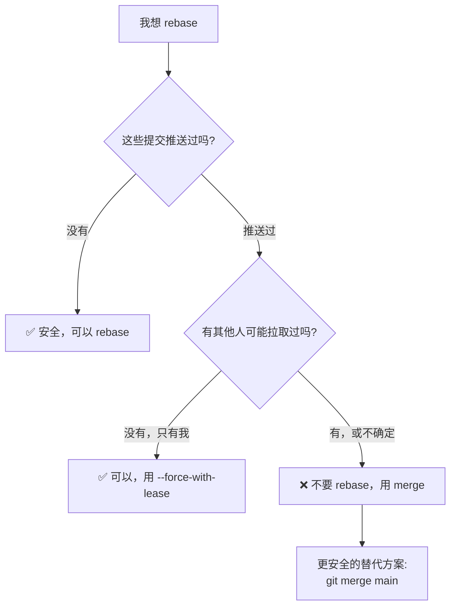
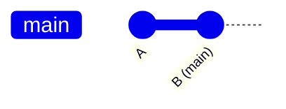
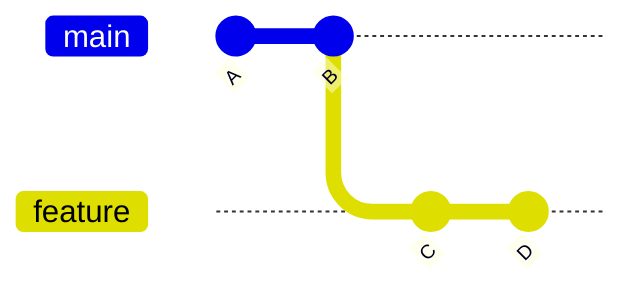
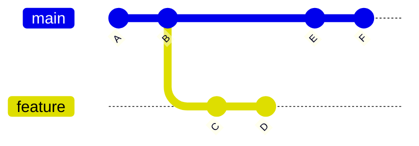
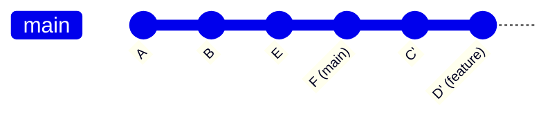
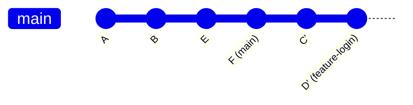
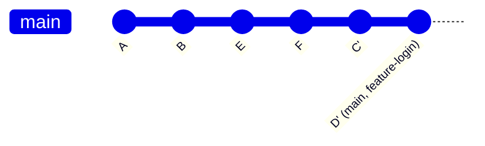

# Git 变基（Rebase）

第 5 章讲了 merge，第 6 章讲了远程协作。这一章讲另一种整合改动的方法：rebase，中文常叫**变基**。

变基比合并更容易让新手困惑，因为它不只是“把代码合起来”，还会改变提交历史的形状。

如果你是第一次学 Git，可以先读懂第 8 章 Pull Request 的基本流程，再回头细学本章。rebase 属于进阶协作知识，不必第一次就完全掌握。

本章目标：

1. 理解 rebase 解决什么问题
2. 看懂 merge 和 rebase 的区别
3. 知道 rebase 的基本使用方式
4. 理解为什么 rebase 会重写历史
5. 记住变基的黄金法则
6. 知道遇到 rebase 冲突时怎么继续或取消

先记住一句话：

> merge 是把两条历史线接起来；rebase 是把一串提交搬到新的起点后重新应用。

---


---

## ⚠️ Rebase 的黄金法则

**永远不要 rebase 已经推送到公共分支的提交。**

这是使用 rebase 最重要的规则。违反它会导致团队协作混乱。

### 什么是"公共分支"？

| 分支类型 | 能否 rebase | 说明 |
|---------|------------|------|
| 你的个人功能分支（只有你在用） | ✅ 可以 | 前提：没有其他人基于它开发 |
| `main` / `master` 主分支 | ❌ 不要 | 这是团队共享的稳定分支 |
| 团队共同开发的分支 | ❌ 不要 | 多人协作的分支不能随意改历史 |
| 已经有 PR 的分支 | ⚠️ 谨慎 | 除非团队约定允许，否则不建议 |
| 已推送但只有你在用的分支 | ✅ 可以 | 使用 `--force-with-lease` |

### 为什么不能 rebase 公共分支？

Rebase 会**重写提交历史**（改变提交的 SHA-1 哈希值）。

如果别人基于旧的提交开发，你 rebase 后强推，会导致：
- 他们的历史和你的历史分叉
- 合并时产生重复的提交
- 团队成员需要手动修复各自的分支
- 协作陷入混乱

**简单记忆：**
> 一旦提交被推送到了别人可能拉取的地方，就不要再 rebase 它。

### 安全的 rebase 场景示例

```bash
# ✅ 场景1：整理自己的功能分支后推送
git switch feature-mine
git rebase main                              # 让功能分支基于最新 main
git push --force-with-lease origin feature-mine

# ✅ 场景2：本地整理提交，还没推送
git rebase -i HEAD~3                        # 合并、调整提交顺序
git push                                     # 第一次推送，没问题

# ✅ 场景3：个人分支同步主分支更新
git switch feature-mine
git fetch origin
git rebase origin/main                      # 保持功能分支跟上主线
```

### 危险的 rebase 场景（不要这样做！）

```bash
# ❌ 场景1：永远不要 rebase 主分支
git switch main
git rebase feature-something               # 错误！不要 rebase main
git push --force                           # 更错误！强推主分支

# ❌ 场景2：不要 rebase 已经被别人拉取的分支
git switch shared-feature                  # 团队共同开发的分支
git rebase main                            # 错误！别人可能已经基于旧历史
git push --force                           # 会破坏别人的工作

# ❌ 场景3：不要 rebase 已发布的版本
git switch release-v1.0
git rebase main                            # 错误！发布分支不应改变
```

### 记住这个决策流程



**当不确定时，用 `merge` 而不是 `rebase`。**

Merge 不会改变已有提交的历史，总是安全的。

---
## 1. 为什么已经有 merge，还要有 rebase？

假设你从 `main` 创建了一个功能分支：



你在功能分支上提交了两次：



与此同时，`main` 上也有了新提交：



现在你想让 `feature` 基于最新的 `main` 继续开发。

一种办法是 merge：

```bash
git switch feature
git merge main
```

结果会产生一个合并提交：

```text
        C --- D --- M
       /         \  ↑
A --- B           \ feature
       \           \
        E --- F ----
              ↑
            main
```

另一种办法是 rebase：

```bash
git switch feature
git rebase main
```

结果看起来像这样：



`feature` 的改动还在，但变成了新的提交 `C'`、`D'`，接在最新的 `main` 后面。

这就是 rebase 的用途：

> 让你的分支看起来像是从最新的目标分支上开始开发的。

---

## 2. rebase 这个名字怎么理解？

`base` 是“基底、基础”的意思。

你的功能分支原来基于 `B`：

```text
A --- B
      \
       C --- D
```

后来 `main` 走到了 `F`：

```text
A --- B --- E --- F
      \
       C --- D
```

`rebase main` 的意思是：

> 把当前分支的基底，从旧的 `B` 换到新的 `F`。

所以叫 re-base：重新选择基底。

---

## 3. rebase 实际做了什么？

假设你在 `feature` 分支上运行：

```bash
git rebase main
```

Git 大致做三件事：

1. 找到 `feature` 和 `main` 的共同祖先
2. 找出 `feature` 上独有的提交，例如 `C`、`D`
3. 把这些提交按顺序重新应用到 `main` 的最新提交后面

你也可以把第 3 步理解成：Git 把这些提交代表的改动按顺序拿出来，再在新的基底上重新做一遍。它不是把旧提交对象搬家，而是创建一串新的提交对象。

图示：

**变基前：**


**变基后：**


为什么是 `C'`、`D'`，不是原来的 `C`、`D`？

因为 Git 不是把原提交原封不动挪过去，而是在新位置重新创建内容相同或相近的新提交。

所以：

> rebase 会改写提交历史。

这是它强大的地方，也是它危险的地方。

原来的 `C`、`D` 通常不会马上从仓库里物理消失。短时间内，你可能还能在 reflog 里找到它们；但如果没有分支、标签或 reflog 继续指向它们，后续垃圾回收可能会清理这些无人可达的对象。所以 rebase 后如果发现不对，第一反应应该是先看 `git reflog`，而不是继续乱试。

---

## 4. merge 和 rebase 的区别

| 对比项 | merge | rebase |
|---|---|---|
| 中文 | 合并 | 变基 |
| 做法 | 创建合并提交，把两条线接起来 | 把当前分支提交重新应用到新基底上 |
| 历史形状 | 保留分叉和合并记录 | 更像一条直线 |
| 是否改写已有提交 | 通常不改写 | 会创建新提交，改写历史 |
| 优点 | 历史真实，安全 | 历史更整洁、线性 |
| 风险 | 历史可能有较多合并提交 | 乱用会影响别人基于旧提交的工作 |
| 新手建议 | 公共分支优先 merge | 只在自己的本地分支谨慎使用 |

一句话：

> merge 保留“事情真实发生过的分叉”；rebase 整理成“像是按顺序发生的直线”。

---

## 5. 最基本的 rebase 用法

假设你当前在 `feature-login` 分支上，想让它基于最新的 `main`。

先看清楚现在的历史形状：

```bash
git status
git log --oneline --graph --decorate --all -12
```

`git status` 最好显示工作目录干净。`git log --graph` 用来确认：当前分支确实是你想整理的功能分支，目标分支也确实在你想要的新基底上。

先切到功能分支：

```bash
git switch feature-login
```

确认当前分支：

```bash
git branch
```

然后执行：

```bash
git rebase main
```

意思是：

> 把当前分支 `feature-login` 上独有的提交，重新应用到 `main` 的最新提交后面。

注意命令里的 `main` 不是“把 main 变基到 feature-login”。

当前分支才是被变基的分支。

```bash
git switch feature-login
git rebase main
```

读成一句话：

```text
把 feature-login 重新放到 main 的最新位置后面。
```

如果命令输出提示 `Successfully rebased and updated refs/heads/feature-login.`，表示当前分支指针已经指向 rebase 后的新提交。接下来可以再次运行 `git log --oneline --graph --decorate --all -12`，确认历史形状符合预期。

---

## 6. rebase 后通常还会做什么？

变基后，如果你想把功能分支合回 `main`，通常会这样：

```bash
git switch main
git merge feature-login
```

因为 `feature-login` 已经接在最新 `main` 后面，这次合并很可能是快进合并。

图示：

**rebase 后：**



**merge 后：**



也就是说，rebase 常用于整理功能分支，让最后合并更像直线。

---

## 7. rebase 冲突怎么办？

rebase 也可能遇到冲突。

原因和 merge 冲突类似：两边都改了同一个地方，Git 不知道最终该怎么保留。

当 rebase 冲突时，Git 可能提示你：

```text
CONFLICT (content): Merge conflict in hello.txt
error: could not apply a1b2c3d... 修改 hello 文件
```

处理流程是：

```text
1. git status 看 Git 正在等你处理哪些文件
2. 打开冲突文件
3. 决定最终内容
4. 删除冲突标记
5. 保存文件
6. git add 文件
7. git rebase --continue
```

命令示例：

```bash
git status
# 编辑 hello.txt，解决冲突后
git add hello.txt
git rebase --continue
```

注意这里 `add` 后，不要另起一次普通 `git commit`。`git rebase --continue` 会让 Git 继续完成当前正在重放的那次提交；有时会打开提交信息编辑器，有时会直接继续。

merge 冲突解决后通常用：

```bash
git commit
```

rebase 冲突解决后用：

```bash
git rebase --continue
```

因为 rebase 是一个“逐个重新应用提交”的过程，你是在告诉 Git：

> 这个提交的冲突解决好了，继续应用下一个提交。

### rebase 冲突里，`HEAD` 指的是谁？

这是 rebase 最容易让人看反的地方。

在普通 merge 里，`HEAD` 通常是你当前分支原来的位置。但在 rebase 过程中，Git 会先把 `HEAD` 移到新的基底上，再按顺序重放你的旧提交。于是冲突文件里的“当前版本”往往代表新基底那边的内容，而正在被应用的那次提交，才是你原功能分支里的某个旧提交。

所以遇到 rebase 冲突时，不要只凭 `<<<<<<< HEAD` 猜“这一定是我的改动”。更稳的做法是：

```bash
git status
git show --stat
git log --oneline --graph --decorate --all -12
```

先看 Git 正在应用哪一个提交，再决定最终内容。复杂冲突里，也可以配置 diff3 样式，让冲突块显示共同祖先，帮助你判断两边各自改了什么：

```bash
git config --global merge.conflictStyle diff3
```

这不是必须配置，但它能减少“把对方改动误删掉”的概率。

---

## 8. 不想继续 rebase 怎么办？

如果 rebase 到一半，发现冲突太复杂，或者发现自己操作错了，可以取消：

```bash
git rebase --abort
```

它会尽量把分支恢复到 rebase 开始前的状态。

常用在这些情况：

- 发现自己站错分支
- 冲突太多，想先停下来
- 不确定应该怎么解决
- 想回到 rebase 前重新规划

你也可能看到 Git 提示：

```bash
git rebase --skip
```

它的意思是：跳过当前正在重放的这个提交。这个命令不是“跳过冲突继续保留改动”，而是放弃当前这个提交带来的改动。只有当你确认这次提交已经不需要，或者它的改动已经被新基底包含时，才考虑使用。

---

## 9. 变基的黄金法则

这是本章最重要的规则：

> **不要 rebase 已经推送出去、并且别人可能已经基于它工作的提交。**

更通俗地说：

> 只 rebase 你自己的、本地的、还没被别人依赖的提交。

为什么？

因为 rebase 会创建新的提交。

原来是：

```text
A --- B --- C
```

rebase 后可能变成：

```text
A --- B --- C'
```

`C` 和 `C'` 看起来内容类似，但它们是不同提交，提交编号也不同。

如果别人已经基于旧的 `C` 开发，你把历史改成 `C'`，对方的历史就会和你对不上。

所以新手可以先遵守这个安全规则：

| 场景 | 是否适合 rebase |
|---|---|
| 自己本地新建的功能分支，还没推送 | 可以 |
| 自己推送了分支，但确认没人用 | 谨慎 |
| 团队共享的 `main` 分支 | 不要 |
| 别人也在基于这个分支开发 | 不要 |
| Pull Request 已经有人在审查 | 先问团队规则 |

---

## 10. fetch + rebase 是什么？

在远程协作中，你可能会看到：

```bash
git fetch origin
git rebase origin/main
```

这表示：

1. 先下载远程最新状态
2. 把当前分支重新放到 `origin/main` 后面

常见于个人功能分支：

```bash
git switch feature-login
git fetch origin
git rebase origin/main
```

意思是：

> 让我的功能分支基于远程 main 的最新状态继续开发。

但如果你刚开始学协作，不必马上把它作为默认流程。先掌握第 6 章的 `fetch + merge` 更容易理解。

---

## 11. git pull --rebase 是什么？

`git pull` 默认可以理解为：

```text
fetch + merge
```

而：

```bash
git pull --rebase
```

可以理解为：

```text
fetch + rebase
```

它会先下载远程更新，然后把你的本地提交重新应用到远程最新提交后面。

这个命令在团队中很常见，但新手不要只背它。

你应该先知道：

- 它会 rebase
- rebase 会重写本地提交
- 遇到冲突时要用 `git rebase --continue`
- 不确定团队规则时，不要乱用在公共分支上

---

## 12. 交互式变基：整理自己的提交

这里的“整理提交”，不是整理文件夹，也不是整理分支名字。

它指的是：**在当前分支上，把最近几个提交重新组织一下，让提交历史更清楚。**

例如你在 `feature-login` 分支上连续提交了 3 次：

```text
main
  |
  A
  |
  B  添加登录页面
  |
  C  调整登录样式
  |
  D  修复按钮文案  ← feature-login 当前在这里
```

这 3 个提交都在你自己的功能分支上，还没有合进团队主分支。你可能觉得：

- `B`、`C`、`D` 其实都属于“添加登录页面”这一件事
- `C`、`D` 只是中途修修补补，不值得单独留在历史里
- `B` 的提交说明写得不够清楚，想改一下

这时可以用交互式变基整理最近 3 个提交：

```bash
git rebase -i HEAD~3
```

这条命令可以拆开看：

| 部分 | 含义 |
|---|---|
| `git rebase` | 执行变基 |
| `-i` | interactive，交互式：让你手动决定每个提交怎么处理 |
| `HEAD` | 当前分支现在指向的提交，也就是上图里的 `D` |
| `HEAD~3` | 从当前提交往前数 3 个提交之前的位置，也就是 `A` |

所以 `git rebase -i HEAD~3` 的意思是：

> 从 `A` 后面开始，把当前分支最近的 `B`、`C`、`D` 这 3 个提交拿出来，让你决定它们是保留、改说明、合并，还是删除。

打开后通常会看到类似内容：

```text
pick b2c3d4e 添加登录页面
pick c3d4e5f 调整登录样式
pick d4e5f6g 修复按钮文案
```

每一行代表一个将要被重新处理的提交。

你可以把每行前面的 `pick` 改成其他动作：

| 动作 | 含义 | 常见用途 |
|---|---|---|
| `pick` | 保留这个提交 | 默认动作 |
| `reword` | 保留改动，但修改提交说明 | 提交信息写错 |
| `squash` | 合并到上一个提交，并编辑说明 | 多个小提交整理成一个 |
| `fixup` | 合并到上一个提交，丢弃当前说明 | 修补型提交 |
| `drop` | 删除这个提交 | 确认这次改动不要了 |

例如：把后两个提交合进第一个提交：

```text
pick b2c3d4e 添加登录页面
squash c3d4e5f 调整登录样式
fixup d4e5f6g 修复按钮文案
```

完成后，原来的 3 个提交会被 Git 重新生成成新的提交。历史可能变成：

```text
main
  |
  A
  |
  E  添加登录页面  ← feature-login 当前在这里
```

这里的 `E` 是新提交，不是原来的 `B`。这就是为什么说交互式变基会改写提交历史。

新手可以先记住一条规则：

> 交互式变基只用来整理“还没有被别人依赖的提交”，通常是你自己的功能分支；不要拿它去整理 `main`，也不要整理别人已经基于它继续开发的公共分支。

---

## 13. rebase 后怎么推送？

如果你 rebase 的分支从未推送过，正常推送即可：

```bash
git push -u origin feature-login
```

如果这个分支已经推送过，rebase 后本地历史和远程历史会不一样，普通 `git push` 可能被拒绝。

这时有些团队会允许在自己的功能分支上使用：

```bash
git push --force-with-lease
```

它比 `git push --force` 更安全，因为它会先确认远程分支没有被别人更新过。如果别人已经推了新提交，它会拒绝覆盖。

使用前至少先看：

```bash
git status
git branch -vv
git log --oneline --graph --decorate --all -12
```

确认三件事：

1. 当前分支是自己的功能分支。
2. 上游远程分支是这条功能分支，不是 `main`。
3. 这次 rebase 改写的是你自己的提交，没有包含别人新推的工作。

但安全不等于可以乱用：

| 命令 | 风险 |
|---|---|
| `git push --force` | 直接强制覆盖远程历史，可能抹掉别人提交 |
| `git push --force-with-lease` | 会检查远程是否被别人更新，仍然是在改写远程历史 |

团队里使用前先确认规则。

如果你不确定为什么 push 被拒绝，不要直接强推。先回到第 6 章的诊断流程：`fetch`、看分支图、确认本地和远程到底在哪里分叉。

---

## 14. rebase 后如何恢复？

rebase 出问题分两种情况：

1. rebase 还在进行中，命令行还提示你解决冲突
2. rebase 已经结束了，但你发现提交历史不是你想要的样子

### 情况一：rebase 还没结束

如果 rebase 还在进行中，你想放弃这次 rebase，优先用：

```bash
git rebase --abort
```

它的意思是：取消当前这次 rebase，让当前分支回到 rebase 开始之前的状态。

这时主语是“当前分支”。例如你在 `feature-login` 上执行 rebase，`--abort` 恢复的就是 `feature-login`。

### 情况二：rebase 已经结束，但结果不对

如果 rebase 已经结束了，`git rebase --abort` 通常就不能用了。

这时不要继续乱试，先看 reflog：

```bash
git reflog
```

`reflog` 记录的是：**你本地的 `HEAD` 曾经移动到过哪些提交。**

你可以把 `HEAD` 理解成“我当前站在哪个提交上”。所以 `git reflog` 不是看远程仓库，也不是看别人电脑上的历史，而是看你自己本地最近站过哪些提交。

可能看到类似输出：

```text
9f8e7d6 HEAD@{0}: rebase (finish): returning to refs/heads/feature-login
9f8e7d6 HEAD@{1}: rebase (pick): 添加登录页面
3c2b1a0 HEAD@{2}: rebase (start): checkout main
d4e5f6 HEAD@{3}: commit: 修复按钮文案
c3d4e5 HEAD@{4}: commit: 调整登录样式
b2c3d4 HEAD@{5}: commit: 添加登录页面
```

这里的关键是找“rebase 开始前，当前分支原来指向哪个提交”。

在这个例子里：

```text
d4e5f6 HEAD@{3}: commit: 修复按钮文案
```

就是 rebase 前 `feature-login` 原来所在的位置。因为它出现在 `rebase (start)` 之前，而且是当时功能分支最后一个提交。

找到这个提交哈希后，先不要急着把当前分支改回去。更安全的做法是创建一个救援分支：

```bash
git switch -c before-bad-rebase d4e5f6
```

这条命令可以拆开看：

| 部分 | 含义 |
|---|---|
| `git switch` | 切换分支 |
| `-c before-bad-rebase` | 创建一个新分支，名字叫 `before-bad-rebase` |
| `d4e5f6` | 让这个新分支指向这个提交 |

“救援分支”不是 Git 的特殊分支类型，只是一个普通分支。它的作用是：**先给 rebase 前的旧提交起一个名字，防止它变成没人指向的提交。**

创建后大概是这样：

```text
rebase 后的 feature-login
  |
  9f8e7d6  ← feature-login

rebase 前的位置
  |
  d4e5f6  ← before-bad-rebase
```

这样你就同时保住了两份历史：

- `feature-login`：rebase 后的结果
- `before-bad-rebase`：rebase 前的旧状态

注意：执行 `git switch -c before-bad-rebase d4e5f6` 后，你已经切到了新建的 `before-bad-rebase` 分支。原来的 `feature-login` 分支还在，它仍然指向 rebase 后的 `9f8e7d6`，不会因为创建救援分支而自动变回去。

接下来有几种选择。

### 选择一：rebase 后的结果其实可以用

那就切回原来的功能分支继续：

```bash
git switch feature-login
```

这时 `before-bad-rebase` 只是一个备份，确认不需要后再删除也可以。

### 选择二：想先在旧状态上继续改

那就留在救援分支上继续提交：

```bash
git status
```

确认当前分支是 `before-bad-rebase` 后，就可以继续修改、提交。这样不会影响 rebase 后的 `feature-login`。

### 选择三：确定要让原来的功能分支回到 rebase 前

这一步会改变 `feature-login` 指向哪里，新手不要急着做。更稳妥的做法是先请团队成员确认。

确认后，可以让 `feature-login` 指回救援分支所在的提交：

```bash
git switch feature-login
git reset --hard before-bad-rebase
```

这两行的主语都是本地的 `feature-login` 分支：

1. 先切回 `feature-login`
2. 再让 `feature-login` 回到 `before-bad-rebase` 指向的提交

执行后大概变成：

```text
rebase 前的位置
  |
  d4e5f6  ← feature-login, before-bad-rebase
```

`reset --hard` 会让当前分支和工作目录都回到指定提交。如果你还有没提交的文件修改，它们会被丢弃，所以执行前一定先确认 `git status` 是干净的。

新手阶段可以先记住：

> `git switch -c before-bad-rebase 提交哈希` 只是先保存旧位置；保存之后，原来的 rebase 分支不会自动恢复，要不要恢复，需要你再明确决定。

---

## 15. 什么时候用 merge，什么时候用 rebase？

| 场景 | 建议 |
|---|---|
| 把功能分支合进主分支 | 通常用 merge，尤其团队协作时 |
| 想保留真实分叉历史 | merge |
| 想让自己的本地功能分支基于最新 main | 可以 rebase |
| 想保持提交历史更线性 | 可以 rebase，但遵守团队规则 |
| 分支已经被别人使用 | 不要随便 rebase |
| 不确定该用哪个 | 先用 merge，更安全 |

新手判断原则：

> merge 更安全，rebase 更整洁；不确定时优先安全。

---

## 16. 常见误解

| 误解 | 正确理解 |
|---|---|
| rebase 比 merge 高级，所以应该总用 rebase | 不是。它们适合不同场景 |
| rebase 只是换个位置，不影响历史 | 不对。rebase 会创建新提交，改写历史 |
| rebase 后原提交编号还一样 | 不一样。新提交会有新的 hash |
| rebase 冲突后用 `git commit` 完成 | 通常不是。应该 `git add` 后 `git rebase --continue` |
| 公共分支 rebase 一下也没事 | 可能影响别人，除非团队明确这样做 |

---

## 17. 本章命令速查表

| 命令 | 作用 | 什么时候用 |
|---|---|---|
| `git rebase main` | 把当前分支变基到 `main` 后面 | 当前在功能分支上，想基于最新 main |
| `git fetch origin` | 下载远程更新 | rebase 到远程最新状态前 |
| `git rebase origin/main` | 把当前分支变基到远程 main 后面 | 更新个人功能分支时 |
| `git rebase --continue` | 解决冲突后继续 rebase | rebase 中遇到冲突并处理完后 |
| `git rebase --abort` | 取消 rebase | rebase 过程想放弃时 |
| `git rebase --skip` | 跳过当前正在重放的提交 | 确认该提交不再需要时 |
| `git pull --rebase` | 下载远程更新并 rebase | 理解 fetch + rebase 后再使用 |
| `git rebase -i HEAD~3` | 交互式整理最近 3 个提交 | 进阶整理自己的提交历史时 |
| `git push --force-with-lease` | 更安全地更新已 rebase 的远程分支 | 团队允许且确认是自己的功能分支时 |
| `git reflog` | 查看 HEAD 移动记录 | rebase 后想找回旧提交时 |

---

## 18. 动手练习

在练习目录里完成下面三个任务，体会 rebase 与 merge 的差别，以及公共分支不能 rebase 的边界。

1. 基于 `main` 开 `feature` 分支，做两次提交；回到 `main` 也做一次提交，再切回 `feature` 执行 `git rebase main`。用 `git log --oneline --graph --all` 观察历史变成线性。预期：`feature` 的两次提交被重放到 `main` 顶端，提交哈希发生变化。
2. 在上一步基础上，对 `feature` 再做一次提交，然后 `git rebase -i HEAD~3` 把三个提交合并成一个。预期：历史里 `feature` 只剩一个提交，提交说明可重写。
3. 故意制造一次 rebase 冲突：`main` 和 `feature` 改同一行，rebase 时按提示解决冲突、`git add` 后 `git rebase --continue`；再用 `git rebase --abort` 练习放弃。预期：能区分 `continue` 与 `abort` 的适用场景。

---

## 19. 本章总结

这一章最重要的是理解：

1. rebase 是另一种整合改动的方式。
2. merge 会保留分叉历史，rebase 会把当前分支提交重新应用到新基底上。
3. rebase 后提交编号会变，因为 Git 创建了新提交，旧提交可能只剩 reflog 线索。
4. rebase 冲突解决后，用 `git rebase --continue`。
5. 不想继续时，用 `git rebase --abort`。
6. `git rebase --skip` 会放弃当前提交，不是普通的“下一步”。
7. 不要随便 rebase 公共历史。

如果你现在觉得 rebase 比 merge 难，这是正常的。先会用 merge 完成协作，再逐步理解 rebase，会更稳。

下一章讲 Pull Request：真实团队里，功能分支通常不是直接合进 `main`，而是先发起 PR，让别人审查后再合并。

---

**下一步**：[拉取请求](./Git教程系列-08-拉取请求.md)

---

**返回目录**：[README](./README.md)


