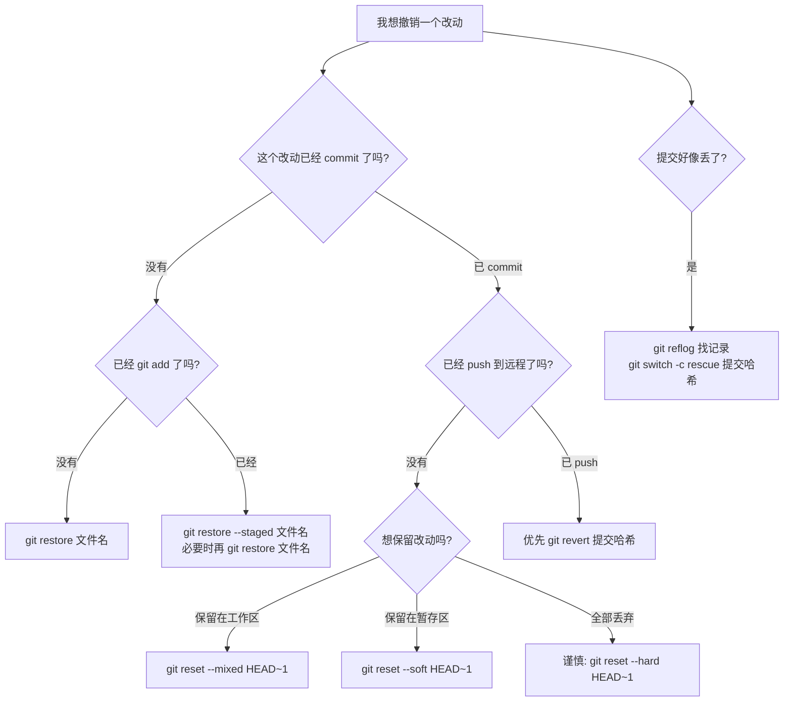

# Git 撤销与恢复

前面章节教你如何提交、分支、合并和推送。这一章专门讲 Git 里最重要的安全能力：出错后怎么撤销、怎么恢复、怎么判断哪条命令能用。

本章目标：

1. 区分未暂存、已暂存、已提交、已推送四种场景
2. 学会 `restore`、`reset`、`revert`、`reflog` 的适用边界
3. 知道哪些命令会丢改动，哪些命令只是移动指针
4. 遇到误删提交时，能先用 `reflog` 找回线索

先记住一句话：

> 撤销前先判断“改动现在在哪一层”：工作目录、暂存区、本地提交，还是已经推送到远程。

---

## 1. 撤销决策树



这张图比背命令重要。Git 撤销最怕的不是不会命令，而是在错误场景用了破坏性命令。

---

## 2. 撤销未暂存修改：`git restore`

场景：你改了文件，但还没有 `git add`，现在想把文件恢复到最近一次提交的状态。

先看状态：

```bash
git status
```

如果看到：

```text
Changes not staged for commit:
  modified:   hello.txt
```

说明改动还在工作目录，没有进入暂存区。

撤销：

```bash
git restore hello.txt
```

这会丢弃 `hello.txt` 里未暂存的修改。

注意：这不是“放进回收站”。如果这些修改没有提交、没有 stash、没有其他备份，执行后通常很难找回。

---

## 3. 从暂存区撤回：`git restore --staged`

场景：你已经运行了：

```bash
git add hello.txt
```

但发现这次不想提交它。

状态可能是：

```text
Changes to be committed:
  modified:   hello.txt
```

从暂存区撤回：

```bash
git restore --staged hello.txt
```

这一步只是不让它进入下一次提交，文件内容仍然保留在工作目录。

如果你接下来连文件修改也不要了，再运行：

```bash
git restore hello.txt
```

可以这样记：

| 命令 | 改哪里 | 文件内容还在吗 |
|---|---|---|
| `git restore --staged 文件` | 暂存区 | 还在工作目录 |
| `git restore 文件` | 工作目录 | 不在，改动被丢弃 |

---

## 4. 撤销最近一次未推送提交：`reset --soft` 与 `reset --mixed`

场景：你刚 commit，发现提交信息写错、文件放错、或者想重新拆分提交。这个提交还没有 push。

先看历史：

```bash
git log --oneline -3
```

假设最近一次提交是：

```text
c3d4e5f 添加登录页面
```

### 想撤销提交，但保留改动在暂存区

```bash
git reset --soft HEAD~1
```

结果：

- 最近一次提交被撤掉
- 改动仍在暂存区
- 适合马上重新 commit

### 想撤销提交，并把改动放回工作目录

```bash
git reset --mixed HEAD~1
```

`--mixed` 是默认模式，也可以写成：

```bash
git reset HEAD~1
```

结果：

- 最近一次提交被撤掉
- 改动回到工作目录
- 适合重新选择哪些文件进入下一次提交

| 命令 | 提交还在分支上吗 | 改动在哪里 |
|---|---|---|
| `git reset --soft HEAD~1` | 不在 | 暂存区 |
| `git reset --mixed HEAD~1` | 不在 | 工作目录 |

---

## 5. 危险撤销：`reset --hard`

`git reset --hard` 会同时移动分支、重置暂存区、重置工作目录。

例如：

```bash
git reset --hard HEAD~1
```

意思是：让当前分支回到上一个提交，并丢弃当前工作目录和暂存区里对应的改动。

使用前至少检查：

```bash
git status
git log --oneline -5
```

如果只是想撤销 commit，但保留改动，不要用 `--hard`，用 `--soft` 或 `--mixed`。

| 场景 | 建议 |
|---|---|
| 想重新提交，但文件内容还要 | `reset --mixed` 或 `reset --soft` |
| 改动确定不要了，且没影响别人 | 才考虑 `reset --hard` |
| 提交已经推送到公共分支 | 不要用 reset 改历史，优先 `revert` |

---

## 6. 撤销已推送提交：`git revert`

场景：某次提交已经推送到远程，别人可能已经基于它继续工作。此时不要用 reset 改公共历史。

更安全的做法是创建一个反向提交：

```bash
git revert 提交哈希
```

例如：

```bash
git revert c3d4e5f
```

`revert` 的特点：

| 特点 | 说明 |
|---|---|
| 不删除原提交 | 历史里仍能看到原提交 |
| 新增反向提交 | 用一个新提交抵消原提交的改动 |
| 适合公共分支 | 不会让别人本地历史突然对不上 |

如果要撤销的是合并提交，情况更复杂，需要指定主线父提交，例如：

```bash
git revert -m 1 合并提交哈希
```

新手遇到合并提交 revert，建议先找团队成员确认，因为 `-m 1` 选错会撤销错误方向。

---

## 7. 找回看似丢失的提交：`git reflog`

Git 本地会记录 `HEAD` 和分支指针的移动历史。这个记录叫 reflog。

查看：

```bash
git reflog
```

你可能看到：

```text
a1b2c3d HEAD@{0}: reset: moving to HEAD~1
c3d4e5f HEAD@{1}: commit: 添加登录页面
```

如果你刚才 reset 错了，发现 `c3d4e5f` 是要找回的提交，可以创建一个救援分支：

```bash
git switch -c rescue-login c3d4e5f
```

这样即使原分支不再指向它，你也重新给它一个分支名保护起来。

reflog 是本地记录，不等于远程备份。换一台电脑不一定有同样记录，所以不要把它当长期保险箱。

---

## 8. 常见场景怎么选

| 你遇到的情况 | 推荐命令 |
|---|---|
| 文件改坏了，还没 add | `git restore 文件名` |
| add 错文件了 | `git restore --staged 文件名` |
| commit 错了，但没 push，想重新组织 | `git reset --mixed HEAD~1` |
| commit 错了，但没 push，只想改提交说明 | `git commit --amend` |
| commit 已 push 到公共分支 | `git revert 提交哈希` |
| reset 后发现提交没了 | `git reflog`，再 `git switch -c rescue 哈希` |
| rebase 做乱了但还没结束 | `git rebase --abort` |
| merge 做乱了但还没结束 | `git merge --abort` |

---

## 9. 本章检查点

学完这一章，你应该能回答：

1. `restore` 和 `reset` 的区别是什么？
2. 为什么已推送提交优先用 `revert`？
3. `reset --soft` 和 `reset --mixed` 分别把改动放在哪里？
4. `reset --hard` 为什么危险？
5. `reflog` 能帮你找回什么？

---

**下一步**：[暂存与保存现场](./Git教程系列-10-暂存与保存现场.md)

---

**返回目录**：[README](./README.md)
