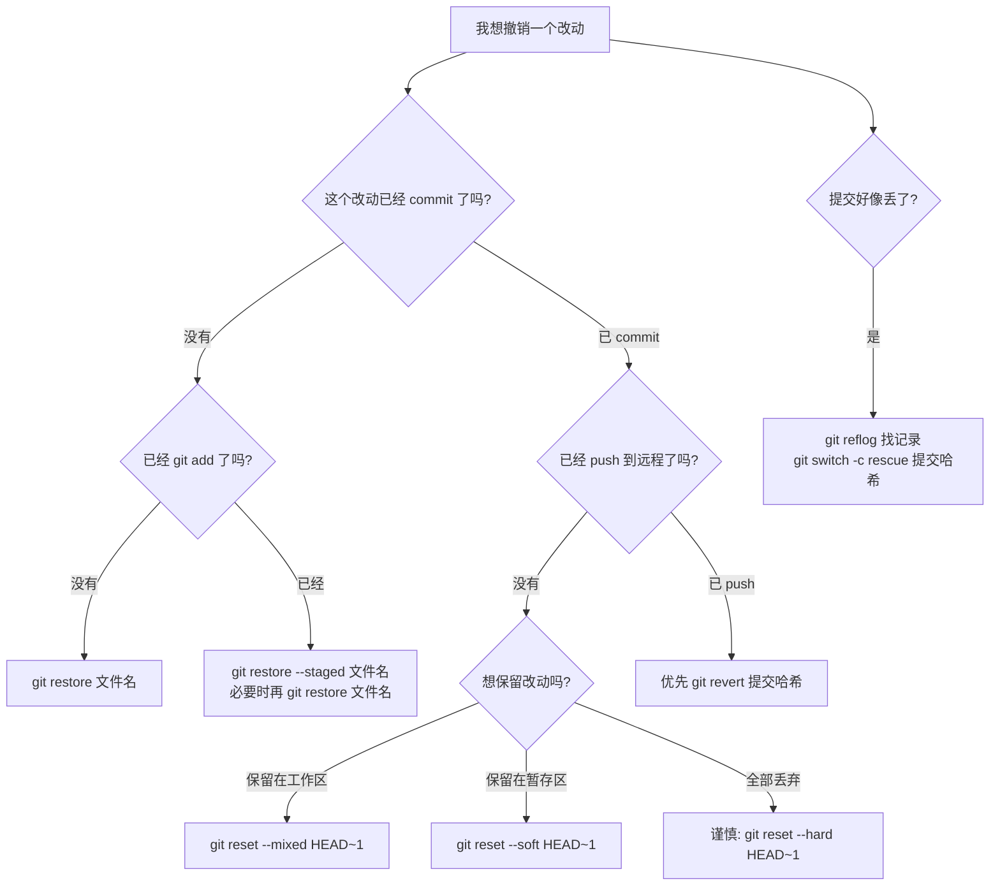

# Git 撤销与恢复

前面章节教你如何提交、分支、合并和推送。这一章专门讲 Git 里最重要的安全能力：出错后怎么撤销、怎么恢复、怎么判断哪条命令能用。

本章目标：

1. 区分未暂存、已暂存、已提交、已推送四种场景
2. 学会 `restore`、`reset`、`revert`、`reflog` 的适用边界
3. 知道哪些命令会丢改动，哪些命令只是移动指针
4. 遇到误删提交时，能先用 `reflog` 找回线索

先记住一句话：

> 撤销前先判断“改动现在在哪一层”：工作目录、暂存区、本地提交，还是已经推送到远程。

如果你已经慌了，先别急着试命令。先执行这组只读检查：

```bash
git status
git log --oneline --graph --decorate -8
git reflog -8
```

它们分别回答：

| 命令 | 回答的问题 |
|---|---|
| `git status` | 工作目录和暂存区现在有没有未提交改动 |
| `git log --graph` | 当前分支历史长什么样 |
| `git reflog` | 最近 HEAD 和分支指针移动过哪些位置 |

救援时最稳的第一步通常不是 reset，而是先给可疑提交起一个临时分支名：

```bash
git switch -c rescue-你的说明 提交哈希
```

这样你先把线索固定住，再决定要不要让原分支回退。

---

## 1. 撤销决策树



这张图比背命令重要。Git 撤销最怕的不是不会命令，而是在错误场景用了破坏性命令。

---

## 2. 撤销未暂存修改：`git restore`

场景：你改了文件，但还没有 `git add`，现在想把文件恢复到最近一次提交的状态。

先看状态：

```bash
git status
```

如果看到：

```text
Changes not staged for commit:
  modified:   hello.txt
```

说明改动还在工作目录，没有进入暂存区。

撤销：

```bash
git restore hello.txt
```

这会丢弃 `hello.txt` 里未暂存的修改。

注意：这不是“放进回收站”。如果这些修改没有提交、没有 stash、没有其他备份，执行后通常很难找回。

---

## 3. 从暂存区撤回：`git restore --staged`

场景：你已经运行了：

```bash
git add hello.txt
```

但发现这次不想提交它。

状态可能是：

```text
Changes to be committed:
  modified:   hello.txt
```

从暂存区撤回：

```bash
git restore --staged hello.txt
```

这一步只是不让它进入下一次提交，文件内容仍然保留在工作目录。

如果你接下来连文件修改也不要了，再运行：

```bash
git restore hello.txt
```

可以这样记：

| 命令 | 改哪里 | 文件内容还在吗 |
|---|---|---|
| `git restore --staged 文件` | 暂存区 | 还在工作目录 |
| `git restore 文件` | 工作目录 | 不在，改动被丢弃 |

---

## 4. 撤销最近一次未推送提交：`reset --soft` 与 `reset --mixed`

场景：你刚 commit，发现提交信息写错、文件放错、或者想重新拆分提交。这个提交还没有 push。

先看历史：

```bash
git log --oneline -3
```

假设最近一次提交是：

```text
c3d4e5f 添加登录页面
```

### 想撤销提交，但保留改动在暂存区

```bash
git reset --soft HEAD~1
```

结果：

- 最近一次提交被撤掉
- 改动仍在暂存区
- 适合马上重新 commit

### 想撤销提交，并把改动放回工作目录

```bash
git reset --mixed HEAD~1
```

`--mixed` 是默认模式，也可以写成：

```bash
git reset HEAD~1
```

结果：

- 最近一次提交被撤掉
- 改动回到工作目录
- 适合重新选择哪些文件进入下一次提交

| 命令 | 提交还在分支上吗 | 改动在哪里 |
|---|---|---|
| `git reset --soft HEAD~1` | 不在 | 暂存区 |
| `git reset --mixed HEAD~1` | 不在 | 工作目录 |


### reset 三种模式的准确行为对比

为了彻底理解 reset，我们需要明确它对三个区域的影响：

| reset 模式 | HEAD 和分支 | 暂存区（Index） | 工作目录 | 适用场景 |
|-----------|------------|---------------|---------|---------|
| `--soft` | ✅ 移动 | ❌ 不变 | ❌ 不变 | 只想撤销提交，马上重新提交 |
| `--mixed`（默认）| ✅ 移动 | ✅ 重置 | ❌ 不变 | 想重新选择暂存哪些文件 |
| `--hard` | ✅ 移动 | ✅ 重置 | ✅ 重置 | 想完全回退，丢弃所有改动 |

#### 准确理解 --mixed 的行为

很多人误以为 `git reset --mixed` 会"把改动从暂存区移回工作目录"。这个说法容易引起误解。

**准确的理解**：

1. `git reset --mixed HEAD~1` 执行时：
   - ✅ 移动 HEAD 和当前分支指针到 `HEAD~1`
   - ✅ 重置暂存区，使其内容匹配 `HEAD~1`
   - ❌ **不改变工作目录**（你的文件内容保持不变）

2. **结果**：
   - 因为暂存区被重置为 `HEAD~1`（旧版本）
   - 而工作目录还保留着你的修改（新内容）
   - Git 比较后发现：工作目录比暂存区"更新"
   - 所以这些改动表现为"未暂存的修改"（Changes not staged for commit）

#### 实例演示

假设你的状态是：

```bash
# 提交历史
A --- B --- C (HEAD -> main)

# 你在 C 提交中修改了 file.txt，内容是 "version C"
```

现在执行 `git reset --mixed HEAD~1`：

**步骤分解**：

| 时刻 | HEAD | 暂存区内容 | 工作目录内容 | Git 看到的状态 |
|-----|------|----------|------------|--------------|
| reset 前 | C | file.txt = "version C" | file.txt = "version C" | 干净 |
| reset 后 | B | file.txt = "version B" | file.txt = "version C" | 未暂存的修改 |

工作目录的 `file.txt` 仍然是 "version C"（没有被 reset 修改），但暂存区现在匹配 B 提交（"version B"），所以 Git 认为你的工作目录有未暂存的修改。

**这就是为什么 --mixed 看起来"保留了改动"**——不是因为它主动把改动移回工作目录，而是因为它**不碰工作目录**。

#### 三种模式的典型使用场景

**场景1：只想改提交信息**
```bash
git reset --soft HEAD~1
# 改动还在暂存区，可以直接重新提交
git commit -m "更好的提交信息"
```

**场景2：想重新选择暂存哪些文件**
```bash
git reset --mixed HEAD~1
# 或者 git reset HEAD~1

# 改动在工作目录，可以重新选择
git add file1.txt
git add file2.txt
git commit -m "只提交部分文件"
```

**场景3：完全回退，放弃这次提交的所有改动**
```bash
# ⚠️ 危险操作！先确认 git status
git reset --hard HEAD~1
```

#### 安全检查清单

在执行 `git reset` 前，建议检查：

```bash
# 1. 看看要回退到哪里
git log --oneline -5

# 2. 看看当前有没有未提交的改动
git status

# 3. 如果有未保存的改动，考虑先 stash 或 commit
git stash push -m "临时保存"

# 4. 确认后再 reset
git reset --mixed HEAD~1
```

#### 对比记忆法

可以这样记忆：

- `--soft`：只动"提交历史"（最温柔）
- `--mixed`：动"提交历史 + 暂存区"（默认）
- `--hard`：动"提交历史 + 暂存区 + 工作目录"（最危险）

**向右越多，改变越大，越危险。**


---

## 5. 危险撤销：`reset --hard`

`git reset --hard` 会同时移动分支、重置暂存区、重置工作目录。

例如：

```bash
git reset --hard HEAD~1
```

意思是：让当前分支回到上一个提交，并丢弃当前工作目录和暂存区里对应的改动。

使用前至少检查：

```bash
git status
git log --oneline -5
```

可以把 reset 的三个常见模式放在一起看：

| 命令 | 分支指针 | 暂存区 | 工作目录 |
|---|---|---|---|
| `git reset --soft 目标提交` | 移到目标提交 | 保留当前改动 | 保留当前改动 |
| `git reset --mixed 目标提交` | 移到目标提交 | 重置 | 保留当前改动 |
| `git reset --hard 目标提交` | 移到目标提交 | 重置 | 重置并丢弃改动 |

最危险的是最后一列：`--hard` 会动工作目录。只要你还想保留文件内容，就不要用它。

如果只是想撤销 commit，但保留改动，不要用 `--hard`，用 `--soft` 或 `--mixed`。

| 场景 | 建议 |
|---|---|
| 想重新提交，但文件内容还要 | `reset --mixed` 或 `reset --soft` |
| 改动确定不要了，且没影响别人 | 才考虑 `reset --hard` |
| 提交已经推送到公共分支 | 不要用 reset 改历史，优先 `revert` |

---

## 6. 清理未跟踪文件：`git clean`

前面几个命令处理的都是“已经被 Git 跟踪”的改动。但有时你的工作目录里堆了一堆未跟踪文件：编译产物、临时脚本、解压出来的目录。`git restore` 和 `git reset` 都不会动它们，这时需要 `git clean`。

`git clean` 删除的是未跟踪文件，**不可恢复**，所以永远先预览：

```bash
git clean -nd         # 预览将要删除什么，n=dry run，d=包含目录
```

确认无误后再真正执行：

```bash
git clean -fd         # 删除未跟踪文件和目录
```

常用选项：

| 选项 | 作用 |
|---|---|
| `-n` | 预演，只显示会删什么，不真删 |
| `-f` | 真正删除（Git 默认不允许不带 -f 的 clean） |
| `-d` | 连未跟踪目录一起删 |
| `-x` | 连 `.gitignore` 忽略的文件也删（慎用，会删掉 node_modules 等） |
| `-i` | 交互式逐个确认 |

`git clean` 和 `git reset --hard` 经常配合：`reset --hard` 把已跟踪文件恢复到某个提交，`clean -fd` 把多余的未跟踪文件清掉，两者一起才能得到一个“干净如刚 clone”的工作目录。但正因为彻底，执行前一定要确认没有需要保留的文件。

---

## 7. 撤销已推送提交：`git revert`

场景：某次提交已经推送到远程，别人可能已经基于它继续工作。此时不要用 reset 改公共历史。

更安全的做法是创建一个反向提交：

```bash
git revert 提交哈希
```

例如：

```bash
git revert c3d4e5f
```

`revert` 的特点：

| 特点 | 说明 |
|---|---|
| 不删除原提交 | 历史里仍能看到原提交 |
| 新增反向提交 | 用一个新提交抵消原提交的改动 |
| 适合公共分支 | 不会让别人本地历史突然对不上 |

如果要撤销的是合并提交，情况更复杂，需要指定主线父提交，例如：

```bash
git revert -m 1 合并提交哈希
```

新手遇到合并提交 revert，建议先找团队成员确认，因为 `-m 1` 选错会撤销错误方向。

---

## 8. 找回看似丢失的提交：`git reflog`

Git 本地会记录 `HEAD` 和分支指针的移动历史。这个记录叫 reflog。

查看：

```bash
git reflog
```

你可能看到：

```text
a1b2c3d HEAD@{0}: reset: moving to HEAD~1
c3d4e5f HEAD@{1}: commit: 添加登录页面
```

如果你刚才 reset 错了，发现 `c3d4e5f` 是要找回的提交，可以创建一个救援分支：

```bash
git switch -c rescue-login c3d4e5f
```

这样即使原分支不再指向它，你也重新给它一个分支名保护起来。

`reflog` 的输出按时间倒序排列，`HEAD@{0}` 是最近的位置，`HEAD@{1}` 是再上一次。看 reflog 时不要只找提交说明，也要看动作描述，例如 `reset: moving to ...`、`rebase (start)`、`checkout`。这些动作能帮助你判断“出错前”的位置在哪里。

reflog 是本地记录，不等于远程备份。换一台电脑不一定有同样记录，所以不要把它当长期保险箱。

---

## 9. 常见场景怎么选

| 你遇到的情况 | 推荐命令 |
|---|---|
| 文件改坏了，还没 add | `git restore 文件名` |
| add 错文件了 | `git restore --staged 文件名` |
| commit 错了，但没 push，想重新组织 | `git reset --mixed HEAD~1` |
| commit 错了，但没 push，只想改提交说明 | `git commit --amend` |
| commit 已 push 到公共分支 | `git revert 提交哈希` |
| reset 后发现提交没了 | `git reflog`，再 `git switch -c rescue 哈希` |
| rebase 做乱了但还没结束 | `git rebase --abort` |
| merge 做乱了但还没结束 | `git merge --abort` |

---

## 10. 动手练习

在练习目录里完成下面三个任务，每一步操作前后都运行 `git reflog`，观察 HEAD 和分支指针的移动轨迹。

1. 提交三次（A、B、C），用 `git reset --soft HEAD~1` 回退一次，再用 `git status` 和 `git diff --staged` 确认改动还在暂存区。预期：`reflog` 能看到回退记录，`git log --oneline` 只剩 A、B。
2. 重新提交回 C，再模拟误操作：`git reset --hard HEAD~1`。预期：C 从历史消失，但 `git reflog` 仍能找到 C 的哈希；用 `git switch -c rescue C的哈希` 把它找回。
3. 制造一个已提交的改动，再用 `git revert` 撤销它。预期：历史里多出一条 revert 提交，文件内容回到撤销前，`git log --oneline` 能看到原提交和对应的 revert。

---


---

## 10.5. 清理未跟踪文件: git clean

### 什么时候需要?

`git restore` 只能撤销已跟踪文件,不能删除未跟踪文件(如构建产物、临时文件)。

### 基本用法

**预览哪些文件会被删除**:

```bash
git clean -n
```

**删除未跟踪的文件**:

```bash
git clean -f
```

**同时删除目录**:

```bash
git clean -fd
```

**包括被 .gitignore 忽略的文件**:

```bash
git clean -fdx
```

### 常用选项

| 选项 | 含义 |
|---|---|
| `-n` | 预览 (dry-run) |
| `-f` | 强制执行 |
| `-d` | 包括目录 |
| `-x` | 包括 ignored 文件 |
| `-X` | 只删除 ignored 文件 |
| `-i` | 交互模式 |

### 警告

**git clean 删除的文件无法恢复!**

推荐流程:
1. 先用 `-n` 预览
2. 确认无误后用 `-f` 执行
3. 重要文件先备份

### 使用场景

| 场景 | 命令 |
|---|---|
| 清理构建产物 | `git clean -fdX` |
| 回到干净状态 | `git reset --hard && git clean -fdx` |
| 切换分支前清理 | `git clean -fd` |

### 对比 clean 和 stash

| 需求 | 命令 |
|---|---|
| 永久删除 | `git clean -fd` |
| 临时隐藏 | `git stash -u` |

---
## 11. 本章检查点

学完这一章，你应该能回答：

1. `restore` 和 `reset` 的区别是什么？
2. 为什么已推送提交优先用 `revert`？
3. `reset --soft` 和 `reset --mixed` 分别把改动放在哪里？
4. `reset --hard` 为什么危险？
5. `reflog` 能帮你找回什么？

---

**下一步**：[暂存与保存现场](./Git教程系列-10-暂存与保存现场.md)

---

**返回目录**：[README](./README.md)


---

## Reflog 的保留期限和最佳实践

`git reflog` 是 Git 的"后悔药"，但它不是永久的。

### 保留时间

| 情况 | 保留时间 | 说明 |
|-----|---------|------|
| 可达的提交（有分支/标签指向） | **永久保留** | 不会被垃圾回收 |
| 不可达的提交（只能通过 reflog 找到） | 默认 **90 天** | 过期后可能被 `git gc` 删除 |
| reflog 记录本身 | 默认 **90 天** | `git reflog expire` 后清除 |

### 这意味着什么？

**场景：你3个月前删除了一个分支**

1. 当时你删除了分支 `feature-old`
2. 没有给那些提交创建新分支或标签
3. 现在想恢复，运行 `git reflog`
4. **可能已经找不到了**（超过90天，被垃圾回收）

### 保险做法

如果通过 reflog 找到了重要提交，**立即**给它创建一个分支：

```bash
# 1. 查看 reflog 找到提交
git reflog

# 假设找到重要提交 abc1234

# 2. 立即创建分支固定它
git switch -c rescue-重要功能 abc1234

# 或者创建标签
git tag backup-20250621 abc1234
```

这样提交就变成"可达"的，不会被删除。

### 查看和修改保留期限

```bash
# 查看当前配置（默认90天）
git config gc.reflogExpire
git config gc.reflogExpireUnreachable

# 修改保留期限（不推荐随意修改）
git config gc.reflogExpire "180 days"        # 可达提交的 reflog
git config gc.reflogExpireUnreachable "60 days"  # 不可达提交的 reflog
```

**建议：** 保持默认90天就够了，但要养成及时给重要提交创建分支的习惯。

### Reflog 最佳实践

#### ✅ 好习惯

1. **误操作后立即查看**
   ```bash
   git reflog -20  # 查看最近20次 HEAD 移动
   ```

2. **找到提交后立即固定**
   ```bash
   git switch -c rescue-分支名 提交哈希
   ```

3. **重要操作前做标记**
   ```bash
   git tag before-dangerous-operation  # 操作前打标签
   # 进行危险操作...
   # 如果出问题，可以基于标签恢复
   ```

#### ❌ 常见误区

1. **误以为 reflog 永久保存一切**
   - Reflog 只保留90天
   - 只记录 HEAD 和分支指针的移动
   - 不记录未 commit 的文件内容

2. **以为 reflog 是备份**
   - Reflog 只在本地，不会推送到远程
   - 重新克隆仓库后，reflog 是空的
   - 定期推送才是真正的备份

3. **忘记 reflog 是按仓库的**
   - 每个 Git 仓库有自己的 reflog
   - 不同电脑的同一仓库，reflog 不同

---

## 本章检查点

在继续下一章之前，请确认你能够：

- [ ] 理解"未暂存、已暂存、已提交、已推送"四种状态的撤销方式
- [ ] 知道 `git restore` 和 `git reset` 的区别
- [ ] 理解 `git reset --soft/--mixed/--hard` 的差异
- [ ] 知道 `git revert` 适用于已推送的提交
- [ ] 会使用 `git reflog` 找回"丢失"的提交

### 自测练习

**练习1：撤销未暂存的改动**
```bash
echo "wrong content" > test.txt
git restore test.txt
cat test.txt  # 应该恢复到最近提交的内容
```

**练习2：从暂存区撤回**
```bash
echo "staged" > test.txt
git add test.txt
git restore --staged test.txt
git status  # test.txt 应该在 "Changes not staged"
```

**练习3：用 reflog 恢复"丢失"的提交**
```bash
# 创建提交
echo "important" > important.txt
git add important.txt
git commit -m "Important commit"

# "丢失"它（移动 HEAD）
git reset --hard HEAD~1

# 恢复
git reflog  # 找到 "Important commit" 的哈希
git switch -c rescue abc1234  # 用实际哈希替换
```

### 常见困惑

**Q: `git reset` 和 `git revert` 什么时候用哪个？**  
A: 
- `reset`：撤销本地提交，改写历史（未推送时用）
- `revert`：创建新提交来反做某次提交（已推送时用）

**Q: `git restore` 丢失的内容能找回吗？**  
A: **不能**。`git restore` 丢弃的工作目录改动，如果没有 commit 或 stash，通常无法恢复。这就是为什么要谨慎使用。

**Q: 多次 `git reset --hard` 后，能用 reflog 都找回来吗？**  
A: 只要在90天内，通常可以。但要注意：`git reset --hard` 会丢弃工作目录改动，reflog 只能恢复已提交的内容。

---

## 紧急救援提醒

如果你不小心执行了危险操作：

1. **立即停止**：不要继续敲命令
2. **查看 reflog**：`git reflog -20`
3. **截图或复制**：保存 reflog 输出
4. **创建救援分支**：`git switch -c emergency 可疑提交哈希`
5. **寻求帮助**：带着 reflog 截图求助

记住：**慌乱中的操作比原问题更危险。**
