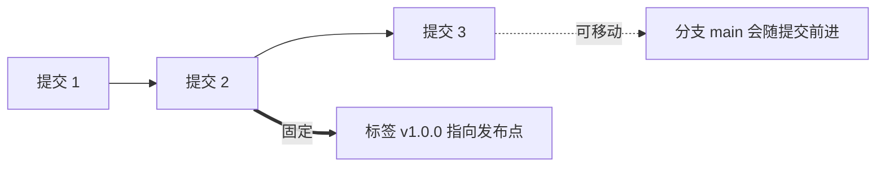

# Git 提交历史与查询

会提交只是第一步。真正进入项目后，你还需要读懂历史：谁改了什么、为什么改、某个 bug 从哪次提交开始出现、某个文件为什么变成现在这样。

本章目标：

1. 用 `git log` 按不同方式查看历史
2. 用 `git show` 查看某次提交内容
3. 理解短哈希和范围查询
4. 用 `git grep` 在当前版本或历史版本里搜索内容
5. 知道 `git cherry-pick` 适合什么场景
6. 用 `git blame` 找到某一行最后是谁改的
7. 用 `git bisect` 定位哪个提交引入了问题

---

## 1. 读历史时先问什么？

不要一上来堆命令。先确定你想回答的问题：

| 问题 | 适合命令 |
|---|---|
| 最近有哪些提交？ | `git log --oneline` |
| 分支怎么分叉和合并的？ | `git log --oneline --graph --all --decorate` |
| 某次提交到底改了什么？ | `git show 提交哈希` |
| 某个关键词现在出现在哪里？ | `git grep -n 关键词` |
| 想把某个提交搬到当前分支 | `git cherry-pick 提交哈希` |
| 某个文件经历了哪些提交？ | `git log -- 文件名` |
| 某一行是谁改的？ | `git blame 文件名` |
| bug 从哪次提交开始出现？ | `git bisect` |

---

## 2. 简洁历史：`git log --oneline`

```bash
git log --oneline
```

示例：

```text
c3d4e5f 修复登录按钮样式
a1b2c3d 添加登录页面
9f8e7d6 初始化项目
```

每行包括：

| 内容 | 含义 |
|---|---|
| `c3d4e5f` | 提交短哈希 |
| `修复登录按钮样式` | 提交说明 |

如果历史很多，可以限制数量：

```bash
git log --oneline -5
```

### 短哈希为什么能用？

Git 提交真正的编号是一串更长的哈希值，`git log --oneline` 只显示前几位，是为了让人更容易读。只要这几位在当前仓库里足够唯一，Git 就能判断你指的是哪次提交。

所以你在教程里看到 `c3d4e5f` 这类短编号时，不要以为它是手写序号。它仍然来自真实提交哈希，只是被 Git 缩短显示。仓库越大，短编号可能需要越长；如果缩写不唯一，Git 会提示你写得不够具体。

---

## 3. 给 log 加筛选条件

真实项目里的提交会很多，`git log --oneline` 只能解决“最近发生了什么”。如果你要回答更具体的问题，就需要给 `log` 加筛选条件。

常用筛选方式：

| 你想找什么 | 命令示例 | 说明 |
|---|---|---|
| 最近 5 次提交 | `git log --oneline -5` | 控制输出数量 |
| 某个作者的提交 | `git log --author="Alice"` | 作者名可以写部分匹配 |
| 某段时间后的提交 | `git log --since="2026-06-01"` | 适合查近期改动 |
| 某段时间前的提交 | `git log --until="2026-06-10"` | 可和 `--since` 搭配 |
| 提交说明里包含关键词 | `git log --grep="login"` | 查提交信息，不查文件内容 |
| 改过某个文件的提交 | `git log -- README.md` | `--` 后面是路径 |
| 每次提交的文件统计 | `git log --stat` | 想先看影响范围时 |

这些条件可以组合。例如：

```bash
git log --oneline --author="Alice" --since="2026-06-01" -- README.md
```

这条命令可以读成：

> 查 Alice 从 2026-06-01 以来，影响过 README.md 的提交，并用一行显示。

如果命令结果为空，不一定是 Git 出错。更常见的原因是：作者名、时间范围、文件路径或关键词限制得太窄。

### 范围查询：`A..B`

读历史时经常需要问：“B 有哪些提交是 A 没有的？”这时可以用两个点：

```bash
git log A..B --oneline
```

可以这样理解：

| 写法 | 读法 | 常见用途 |
|---|---|---|
| `origin/main..HEAD` | 当前分支有、远程 main 没有的提交 | 看自己还有哪些提交没推 |
| `HEAD..origin/main` | 远程 main 有、当前分支没有的提交 | 看自己落后远程多少 |
| `v1.0.0..HEAD` | 从 v1.0.0 到现在新增了什么 | 整理发布说明 |

如果只是想看差异统计，也可以把范围交给 `git diff`：

```bash
git diff --stat v1.0.0..HEAD
```

---

## 4. 分支图：`--graph --all --decorate`

```bash
git log --oneline --graph --all --decorate
```

示例：

```text
*   e5f6a7b (HEAD -> main) Merge branch 'feature-login'
|\
| * c3d4e5f (feature-login) 添加登录按钮
| * b2c3d4e 添加登录页面
* | a1b2c3d 更新首页文案
|/
* 9f8e7d6 初始化项目
```

重点看：

- `HEAD -> main`：你现在在哪个分支
- `feature-login`：功能分支指向哪里
- `|\`、`|/`：哪里分叉、哪里合并

不要试图背图形符号。先看分支名和提交顺序。

---

## 5. 查看某次提交：`git show`

如果你想知道某次提交具体改了什么：

```bash
git show c3d4e5f
```

它通常会显示：

- 提交哈希
- 作者
- 时间
- 提交说明
- diff 内容

如果只想看提交说明和统计：

```bash
git show --stat c3d4e5f
```

如果只想看某个文件在某次提交中的版本：

```bash
git show c3d4e5f:路径/文件名
```

---

## 6. 在版本库里搜索内容：`git grep`

编辑器或系统搜索只能告诉你当前工作目录里有什么；`git grep` 的好处是：它从 Git 认识的文件里搜索，速度快，也能指定某个提交、分支或标签。

在仓库根目录运行：

```bash
git grep -n "login"
```

常用参数：

| 命令 | 作用 |
|---|---|
| `git grep "关键词"` | 搜索当前版本里被 Git 跟踪的文件 |
| `git grep -n "关键词"` | 显示行号 |
| `git grep -i "关键词"` | 忽略大小写 |
| `git grep "关键词" HEAD~3` | 在三次提交之前的版本里搜索 |
| `git grep "关键词" v1.0.0` | 在某个标签对应的版本里搜索 |
| `git grep -n "关键词" v1.0.0 HEAD -- "*.md"` | 同时在多个版本中搜索，并限制路径 |

它适合回答这些问题：

| 问题 | 示例 |
|---|---|
| 某个函数现在还有没有调用点？ | `git grep -n "createUser"` |
| 某个配置项在旧版本里叫什么？ | `git grep -n "API_URL" v1.2.0` |
| 某段错误文案来自哪里？ | `git grep -n "Permission denied"` |

如果你想搜的是提交说明，而不是文件内容，用 `git log --grep="关键词"`；如果你想搜某行是谁改的，用 `git blame`。把这三类问题分开，排查会快很多。

`git grep` 的特别之处在于：你不必真的切到旧版本，也能搜索旧提交或标签里的文件树。排查“这个配置项是在旧版本里改名的吗”这类问题时，它比手动 checkout 来回切换更稳。

---

## 7. 搬运单个提交：`git cherry-pick`

有时你不想合并整个分支，只想把某一个提交带到当前分支。例如：

- bug 修复提交在 `feature-login` 上，但 `main` 也急需这个修复
- 某个文档修正提交应该先进入发布分支
- 你误把一个独立改动提交到了别的分支

这时可以先看清历史：

```bash
git log --oneline --graph --decorate --all -12
```

确认要搬运的提交哈希后，切到目标分支：

```bash
git switch main
git cherry-pick c3d4e5f
```

这条命令的意思是：

> 把 `c3d4e5f` 这个提交所代表的改动，重新应用到当前分支上，并生成一个新提交。

注意，它不是“移动原提交”。cherry-pick 后当前分支上会出现一个新提交，内容来自原提交，但提交哈希通常不同。

如果发生冲突，处理方式和 rebase 更像：

```bash
git status
# 编辑冲突文件
git add 冲突文件
git cherry-pick --continue
```

如果发现选错提交，可以取消：

```bash
git cherry-pick --abort
```

新手阶段要记住边界：cherry-pick 适合少量独立提交；如果你想整合一整条功能分支，通常应该用 merge、rebase 或 PR。

---

## 8. 查看某个文件历史

```bash
git log -- README.md
```

简洁形式：

```bash
git log --oneline -- README.md
```

这会只显示影响过 `README.md` 的提交。

如果文件被重命名过，可以加：

```bash
git log --follow --oneline -- README.md
```

`--follow` 会尝试跨重命名追踪文件历史。

---

## 9. 找某一行是谁改的：`git blame`

```bash
git blame README.md
```

示例：

```text
a1b2c3d4 (Alice 2026-06-01 10:00:00 +0800  12) 本项目使用 Git 管理版本
```

它告诉你：

- 这一行最后一次由哪个提交改动
- 作者是谁
- 时间是什么
- 行内容是什么

注意：`blame` 不是为了“甩锅”。正确用法是找到上下文，再用 `git show` 看那次提交为什么这么改。

---

## 10. 用二分法找 bug：`git bisect`

场景：你知道现在有 bug，也知道以前某个版本没 bug，但不知道中间哪次提交引入了它。

开始：

```bash
git bisect start
```

标记当前版本是坏的：

```bash
git bisect bad
```

标记某个旧提交是好的：

```bash
git bisect good 旧提交哈希
```

Git 会自动切到中间某个提交。你运行测试或手动验证，然后告诉 Git：

```bash
git bisect good
```

或：

```bash
git bisect bad
```

重复几次后，Git 会定位第一个坏提交。

结束二分，回到原状态：

```bash
git bisect reset
```

如果项目有一条能自动判断“好/坏”的命令，可以让 Git 自动跑完整个二分过程。比如测试命令失败就代表坏：

```bash
git bisect start
git bisect bad
git bisect good v1.0.0
git bisect run npm test
git bisect reset
```

`git bisect run` 会反复切换提交并执行命令。命令退出码为 `0` 时表示这个提交是好的，非 `0` 表示坏。它很适合已经有自动化测试的项目；如果没有测试，只能手动验证每个中间提交。

---


## 11. 查看哪些提交未被合并：git cherry

当你在不同分支上工作时，`git cherry` 可以告诉你当前分支的提交是否已经被合并到上游分支。

```bash
# 查看当前分支上有、但 upstream 没有的提交
git cherry upstream

# 只看未 cherry-pick 的提交
git cherry -v upstream

# 示例输出
# + abc1234 添加登录验证
# - def5678 修复拼写错误（已在 upstream 中）
# + 789abcd 更新 README
```

输出中：

- `+` 表示该提交在上游分支中不存在（未合并）
- `-` 表示该提交已经在上游分支中（已合并或已被 cherry-pick）

`git cherry` 适用于：

- 检查在 release 分支上修复的 bug 是否同步回了 main
- 查看某个功能分支还有哪些提交没被合并
- 跨分支追踪 commits 的传播情况

---

## 12. 给历史打标记：`git tag`

发布版本时，你需要一个稳定、不会乱跑的名字，指向“这次发布对应的那次提交”。标签（tag）就是干这个的。

标签和分支的关键区别：分支是可移动指针，每提交一次就往前走；标签指向某个提交后通常不再移动。



Git 有两种标签：

| 类型 | 是什么 | 适合什么 |
|---|---|---|
| 轻量标签 lightweight | 只是一个指向提交的名字 | 临时标记、个人备忘 |
| 附注标签 annotated | 存了打标签者、日期、说明，可被 GPG 签名 | 正式发布版本 |

正式发布优先用附注标签，因为它保留了“谁、什么时候、为什么”打这个标签。

从内部看，轻量标签更像 `refs/tags/` 下面一个直接指向提交的引用；附注标签会额外创建一个 tag 对象，再由这个 tag 对象指向提交。你不需要日常手动操作 tag 对象，但这个区别解释了为什么正式发布更推荐附注标签。

创建标签：

```bash
git tag v1.0.0                 # 轻量标签，指向当前提交
git tag -a v1.0.0 -m "第一个正式版本"   # 附注标签
```

也可以给已经过去的某次提交打标签：

```bash
git tag -a v0.9.0 9f8e7d6 -m "早期里程碑"
```

查看标签：

```bash
git tag                  # 列出所有标签
git tag -l "v1.*"        # 按模式过滤
git show v1.0.0          # 查看标签指向的提交；附注标签还会显示标签信息
```

一个常见坑：**标签默认不会被 `git push` 推送**。你想让别人看到标签，要显式推：

```bash
git push origin v1.0.0          # 推单个标签
git push origin --tags          # 推所有标签
git push --follow-tags          # 推送时一并推带注释的标签（推荐配合发布流程）
```

切到某个标签会进入 detached HEAD 状态（见 [分支管理](./Git教程系列-04-分支管理.md)）。如果你想在旧版本上修 bug，先从标签开一个分支：

```bash
git switch -c hotfix-1.0 v1.0.0
```

### 标签、release 分支和平台 Release 的关系

新手容易把“发布相关”的几个词混在一起：

| 概念 | 会不会移动 | 主要用途 |
|---|---|---|
| `release/1.2.0` 分支 | 会，直到发布前稳定下来 | 发布前集中修 bug、改版本号、整理发布说明 |
| `v1.2.0` 标签 | 通常不移动 | 固定指向真正发布出去的那次提交 |
| GitHub/GitLab Release | 平台页面，不是 Git 对象 | 展示发布说明、二进制包、下载链接和变更记录 |

一个更稳的发布顺序通常是：


标签应该打在“已经通过测试、准备对外宣布”的提交上，而不是一开始创建 release 分支时就打。否则你后面又修了几个发布前 bug，标签指向的就不是最终交付内容。

删除标签：

```bash
git tag -d v1.0.0                       # 删本地标签
git push origin --delete v1.0.0         # 删远程标签
```

新手记住两点：发布用附注标签，打完别忘了推。

---


## 13. 用标签生成版本号：git describe

`git describe` 可以根据最近的一个标签和当前提交之前的提交数，生成一个可读的版本描述。

```bash
# 假设最近的标签是 v1.0.0，之后又提交了 3 次
git describe
# 输出：v1.0.0-3-gabc1234
```

输出解读：

| 部分 | 含义 |
|---|---|
| `v1.0.0` | 距离最近的标签 |
| `3` | 自该标签以来的提交数 |
| `gabc1234` | 当前提交的短哈希（前缀 g 表示 git） |

常见用法：

```bash
# 查看当前 HEAD 的描述
git describe

# 指向更准确的提交
git describe --tags

# 显示包含提交哈希的完整描述（用于构建版本号）
git describe --long
```

在持续集成脚本中，常用 `git describe` 来自动生成构建版本号：

```bash
VERSION=$(git describe --tags --long)
echo "Building version: $VERSION"
```

---

## 14. 谁贡献了多少：`git shortlog`

想知道每个作者提交了多少次，可以用：

```bash
git shortlog -sn
```

`-s` 只显示数量不显示详情，`-n` 按数量排序。它常用于发布前整理贡献者名单。

如果同一个人用了不同邮箱提交，数量会被拆开。想合并，可以用 `.mailmap` 文件把多个邮箱映射到同一个作者，再运行 `git shortlog -sn` 就会归并显示。`.mailmap` 写法示例：

```text
Alice <alice@example.com>
Alice <alice.work@company.com>
```

把它放在仓库根目录并提交即可。`.mailmap` 只影响展示，不改写历史。

---

## 15. 历史查询的安全边界

本章命令大多是只读的，但有两个例外要注意：

| 命令 | 风险 |
|---|---|
| `git bisect` | 会切换工作目录到不同提交；开始前保持工作目录干净 |
| `git bisect run` | 会反复切换提交并执行命令；确认命令不会破坏重要数据 |
| `git cherry-pick` | 会在当前分支创建新提交；开始前确认目标分支正确 |
| `git show 哈希:文件` | 只读，不会改文件 |

运行 `bisect` 前先：

```bash
git status
```

最好看到工作目录干净。

---

## 16. 动手练习

在一个至少有 5 次提交的练习仓库里完成下面任务：

1. 用 `git log --oneline --graph --all --decorate` 画出历史，再用 `git show 提交哈希` 查看其中一次提交的完整改动。
2. 用 `git log -- 文件名` 和 `git blame 文件名` 分别回答“这个文件什么时候改过”和“这一行最后是谁改的”。
3. 故意制造一次“坏提交”，用 `git bisect start`、`git bisect bad`、`git bisect good 哈希` 二分定位，再用 `git bisect reset` 回到正常状态。

---

## 17. 本章检查点

1. 想看分支合并图，用哪条命令？
2. 想看某次提交具体 diff，用哪条命令？
3. 想搜索当前版本里某个关键词，应该用 `git grep` 还是 `git log --grep`？
4. `origin/main..HEAD` 和 `HEAD..origin/main` 分别适合回答什么问题？
5. `cherry-pick` 适合搬运整个分支还是单个独立提交？
6. `git blame` 的正确使用目的是什么？
7. `git bisect reset` 为什么重要？
8. 什么时候可以考虑用 `git bisect run`？
9. 正式发布版本应该用轻量标签还是附注标签？打完标签还要做什么？
10. 标签会随 `git push` 自动推送吗？

---

**下一步**：[团队工作流与分支策略](./Git教程系列-12-团队工作流与分支策略.md)

---

**返回目录**：[README](./README.md)
