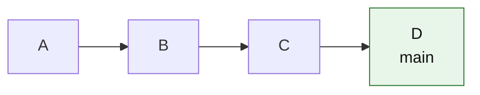
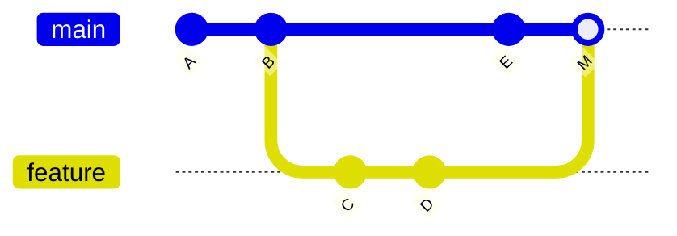
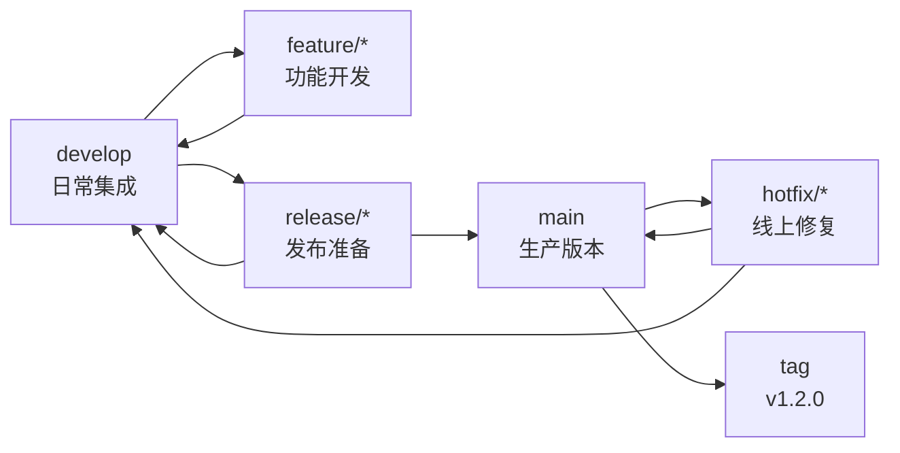
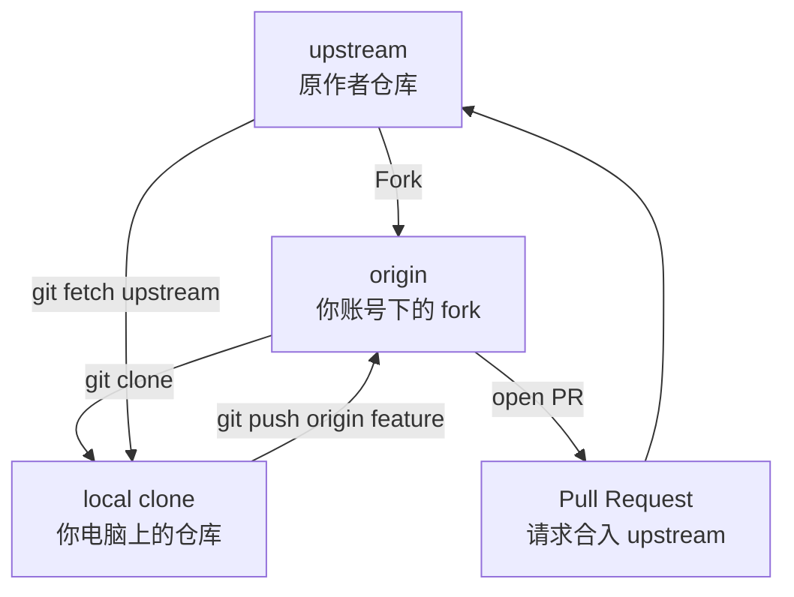
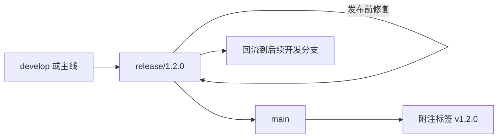

# Git 团队工作流与分支策略

学会命令后，还要回答团队问题：大家到底应该怎么用 Git？是直接往 `main` 提交，还是每个任务开分支？release 和 hotfix 怎么办？一个分支已经推给别人之后，还能不能 rebase？

本章目标：

1. 认识常见团队工作流的真实适用场景。
2. 学会根据团队规模、审查要求和发布节奏选择策略。
3. 理解个人分支、共享分支、公共主线的不同更新方式。
4. 明确 release、hotfix、fork 工作流的安全边界。

先记住一句话：

> 工作流不是为了显得专业，而是为了让团队知道“改动从哪里来、经过谁确认、最后进到哪里”。

---

## 1. 工作流不是命令清单

Git 命令回答的是：

> 怎么提交、合并、推送？

团队工作流回答的是：

> 谁能改哪条分支？什么时候开分支？谁来审查？怎么发布？出问题怎么回滚？

一套好工作流应该满足：

| 目标 | 含义 |
|---|---|
| 主线稳定 | `main` 不应长期处于不可用状态 |
| 改动可审查 | 重要改动合入前有人看过 |
| 发布可追踪 | 知道哪个提交对应哪个版本 |
| 故障可恢复 | 出问题能 revert、hotfix 或回滚 |
| 成本不过高 | 流程不能比问题本身更复杂 |

所以选择工作流时，不要先问“哪个名字更高级”，而要先问：

| 问题 | 会影响什么 |
|---|---|
| 是否必须代码审查？ | 决定能不能直接推 `main` |
| 是否持续部署？ | 决定需不需要独立 release 分支 |
| 是否维护多个已发布版本？ | 决定需不需要 Gitflow 或支持分支 |
| 分支会不会多人共同开发？ | 决定更新时用 merge 还是 rebase |
| 自动化测试是否可靠？ | 决定主线能承受多快的集成频率 |

---

## 2. 集中式工作流

集中式工作流的特点是：大家直接在同一条主分支上工作，分支不是必需品。



适合：

- 个人项目。
- 只有 1-2 人的小项目。
- 刚开始练习 Git 基础。
- 内部原型或短期项目，暂时不需要审查。

不适合：

- 多人同时开发同一片代码。
- 每个改动都需要 review。
- `main` 必须随时可部署的项目。

集中式工作流不是“不能开分支”。如果你有实验性代码、半成品改动，仍然可以开分支。它的区别在于：团队允许你把完成的提交直接推到 `main`，而不是强制通过 PR。

### 直接推 `main` 前的最小流程

在自己的本地 `main` 上提交后，推送前先同步远程：

```bash
git switch main
git fetch origin
git status
git pull --rebase
git push
```

这里使用 `pull --rebase` 的目的，是避免本地 `main` 和远程 `origin/main` 分叉后产生一堆没有教学价值的合并提交。

如果你是新手，先把它理解成：

```text
先把远程 main 的新提交拿下来
再把我本地还没推的提交接到它后面
最后推送
```

注意：这条建议只适合“你的本地 `main` 上有少量自己还没推的提交”的集中式场景。多人共享的长期公共分支不要随便重写远程历史。

---

## 3. Feature Branch Workflow

Feature Branch Workflow 的特点是：每个任务开一个功能分支，完成后通过 PR/MR 合回主分支。



常见流程：

```bash
git switch main
git pull --ff-only
git switch -c feature-login
# 开发、提交
git push -u origin feature-login
# 创建 PR，审查后合并
```

适合：

- 大多数团队。
- 需要代码审查的项目。
- 功能相对独立的开发。
- 希望 `main` 比个人开发分支更稳定的项目。

优点是清晰、通用、容易落地。缺点是如果分支开太久，容易和主线偏离，冲突会变多。

### 个人分支和共享分支的更新方式不同

这是很多团队协作问题的根源。

| 分支类型 | 例子 | 推荐更新方式 | 原因 |
|---|---|---|---|
| 只你一个人使用的功能分支 | `feature-login` | 可以 `rebase main` | 历史更线性，影响范围小 |
| 已经推送且多人共同开发的功能分支 | `feature/billing-v2` | 用 `merge main` | 不改写别人基于的提交 |
| 公共主线 | `main`、`develop` | 按团队规则 merge/revert | 它是团队共同基准 |

例如，你自己的分支还没被别人使用，可以这样更新：

```bash
git switch feature-login
git fetch origin
git rebase origin/main
```

如果这是多人共同开发的共享分支，更稳妥的做法是：

```bash
git switch feature/billing-v2
git fetch origin
git merge origin/main
git push
```

前者会重写当前分支上的提交，后者保留共享分支已经公开的历史。第 7 章讲 rebase 时已经强调过：整洁不应该压过协作安全。

---

## 4. GitHub Flow

GitHub Flow 是 Feature Branch Workflow 的轻量版本：

```text
main 永远可部署
每个改动开短生命周期分支
通过 PR 审查
CI 通过后合并
合并后尽快部署
```

适合：

- Web 服务。
- SaaS 产品。
- 小步快跑团队。
- 持续部署团队。

关键要求：

| 要求 | 为什么重要 |
|---|---|
| `main` 稳定 | 合并后可能很快部署 |
| PR 小 | 审查快，冲突少 |
| CI 可靠 | 人不可能每次手工验证所有路径 |
| 分支生命周期短 | 分支越久，和主线偏离越多 |

如果团队没有自动化测试和部署能力，GitHub Flow 仍然可以用，但合并前要增加人工验证清单，不要把“轻量流程”误解成“少做检查”。

---

## 5. Git Flow

Gitflow 是一种更重的分支模型。它适合有明确版本发布节奏、需要稳定发布分支的项目，不适合作为所有团队的默认答案。

Gitflow 常见分支角色：

| 分支 | 角色 |
|---|---|
| `main` | 已发布或即将发布到生产的代码 |
| `develop` | 日常集成分支 |
| `feature/*` | 新功能开发，从 `develop` 创建，合回 `develop` |
| `release/*` | 发布准备，从 `develop` 创建，合回 `main` 和 `develop` |
| `hotfix/*` | 线上紧急修复，从 `main` 创建，合回 `main` 和 `develop` |



适合：

- 桌面软件、移动 App、嵌入式或企业软件。
- 有明确版本号和发布窗口。
- 发布前需要集中测试、冻结功能。
- 需要维护多个已发布版本。

不适合：

- 持续部署的 Web 项目。
- 团队很小但流程执行成本很高的项目。
- 没有清晰发布节奏，却想靠复杂分支“显得规范”的项目。

Gitflow 的关键不是 `git-flow` 工具，而是代码流向规则：feature 不能直接进 `main`，release 和 hotfix 的修复要回流到日常开发分支。工具可以帮你少敲命令，但不能替团队做发布判断。

---

## 6. Trunk-based Development

Trunk-based Development 的特点是：大家围绕一条主干快速集成，功能分支很短，甚至直接在主干附近工作。

适合：

- 工程能力强的团队。
- CI/CD 完善。
- 自动化测试可靠。
- 功能开关或灰度机制成熟。

优点：

- 集成频繁，长期冲突少。
- 反馈快。
- 历史简单。

风险：如果没有测试、代码审查和发布保护，主干很容易被破坏。Trunk-based 不是“大家随便往主干推”，而是把质量保障前移到自动化检查、小步提交和快速回滚能力上。

---

## 7. Forking Workflow

Forking Workflow 常见于开源项目，也适合“贡献者没有原仓库写权限”的私有项目。

它的核心结构是：



关键点：

- fork 不是 Git 命令，而是 GitHub/GitLab/Gitee 这类平台提供的服务端复制能力。
- 对 Git 来说，`upstream`、`origin`、本地 clone 都只是仓库和远程地址。
- 你的 `origin/main` 最好尽量镜像 `upstream/main`，个人改动放在功能分支上。

日常同步通常是：

```bash
git fetch upstream
git switch main
git merge upstream/main
git push origin main
```

然后从最新 `main` 开分支贡献：

```bash
git switch -c fix-doc-typo
# 修改、提交
git push -u origin fix-doc-typo
```

第 14 章会完整讲开源贡献流程。

---

## 8. release 与 hotfix 分支

### release 分支

当一个版本准备发布，但日常开发还要继续时，可以从集成分支切出 release 分支：

```bash
git switch develop
git switch -c release/1.2.0
```

release 分支通常只接受：

- 发布前 bug 修复。
- 版本号调整。
- 发布说明、文档或配置修正。

发布后，release 的改动需要进入生产分支，也要回到日常开发分支：

```text
release/1.2.0 → main
release/1.2.0 → develop
```

否则你在发布分支修过的 bug，可能在下个版本又回来。

发布分支和标签通常这样配合：



release 分支是“发布前的临时稳定区”，标签才是“这个版本最终交付点”。不要把 release 分支长期当作第二条主线；它停留越久，越容易和日常开发分叉，回流成本也越高。

### hotfix 分支

线上版本出紧急问题时，从稳定发布点或 `main` 创建 hotfix：

```bash
git switch main
git switch -c hotfix/payment-timeout
```

修复后通常需要合回：

- 当前发布分支或 `main`。
- 仍在开发的 `develop` 或主线分支。

不要从 `develop` 创建生产 hotfix。`develop` 里可能包含尚未发布的新功能，把它拿去修线上问题，可能顺手把未发布功能也带出去。

---

## 9. 怎么选择工作流？

| 团队/项目 | 推荐 |
|---|---|
| 个人学习项目 | 集中式或简单 feature 分支 |
| 2-5 人小团队，无强制 review | 集中式加少量临时分支，或 Feature Branch |
| 需要 review 的团队 | Feature Branch Workflow |
| Web/SaaS 持续迭代 | GitHub Flow 或 Trunk-based |
| 有版本发布节奏的 App/软件 | Gitflow 的简化版 |
| 开源项目 | Forking Workflow + PR + protected main |
| 大型企业团队 | 根据发布、权限、CI 能力组合设计 |

最重要的不是名字，而是团队能否稳定执行。一个执行得好的简单流程，通常比执行不稳的复杂流程更可靠。

---

## 10. 公共分支规则

公共分支包括：

- `main`
- `master`
- `develop`
- `release/*`
- 多人共同基于其工作的任何分支

规则：

1. 不随便 `rebase` 公共分支。
2. 不随便 `push --force` 公共分支。
3. 合并前先看状态和目标分支。
4. 重要分支开启 branch protection。
5. 通过 PR/MR 合并，而不是直接推送。
6. release 和 hotfix 修复要回流到后续开发分支。

如果确实需要重写公共历史，必须提前通知团队，并说明恢复方案。不要在别人下班后悄悄强推公共分支。

---

## 11. 本章检查点

1. 集中式工作流为什么适合小项目，但不适合强 review 团队？
2. 个人功能分支和多人共享功能分支，更新主线时为什么策略不同？
3. Gitflow 里的 `main` 和 `develop` 分别承担什么角色？
4. Forking Workflow 里，`origin` 和 `upstream` 分别是什么？
5. 为什么 hotfix 通常从 `main` 创建，而不是从 `develop` 创建？

---

**下一步**：[代码评审与 PR 质量](./Git教程系列-13-代码评审与PR质量.md)

---

**返回目录**：[README](./README.md)
