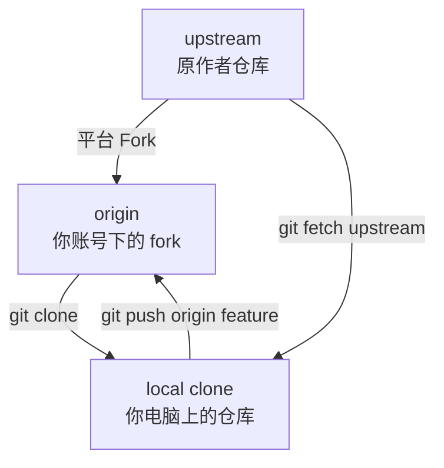

# GitHub 实战与开源贡献

Git 是版本控制工具，GitHub/GitLab/Gitee 是代码托管平台。很多新手把它们混在一起：以为 PR 是 Git 命令，以为远程仓库就是 GitHub。本章把平台协作讲清楚。

本章目标：

1. 理解 Git、GitHub、GitLab、Gitee 的关系
2. 学会 HTTPS 与 SSH 的选择
3. 理解 fork、origin、upstream
4. 跑通开源贡献的标准流程

---

## 1. Git 和 GitHub 不是一回事

| 名称 | 它是什么 | 你用它做什么 |
|---|---|---|
| Git | 本地版本控制工具 | commit、branch、merge、rebase |
| GitHub | 代码托管平台 | 远程仓库、PR、issue、review、Actions |
| GitLab | 代码托管和 DevOps 平台 | MR、CI/CD、权限、项目管理 |
| Gitee | 中文代码托管平台 | 仓库、Pull Request、企业协作 |

即使没有 GitHub，你仍然可以在本地使用 Git。即使会用 GitHub 网页，也不代表理解 Git 命令。

---

## 2. HTTPS 和 SSH 怎么选？

克隆仓库时常见两种地址。

HTTPS：

```text
https://github.com/user/project.git
```

SSH：

```text
git@github.com:user/project.git
```

| 方式 | 优点 | 注意 |
|---|---|---|
| HTTPS | 容易开始，适合新手 | 推送时通常需要 token 或凭据管理器 |
| SSH | 日常推送方便，适合长期开发 | 需要生成 SSH key 并添加到平台 |

如果你只是 clone 公共仓库学习，HTTPS 很简单。如果你要长期推送自己的项目，SSH 更顺手。

---

## 3. SSH key 基本流程

生成 key：

```bash
ssh-keygen -t ed25519 -C "you@example.com"
```

一路确认后，会生成公钥和私钥。公钥通常在：

```text
~/.ssh/id_ed25519.pub
```

把公钥内容添加到 GitHub/GitLab/Gitee 的 SSH keys 页面。

测试 GitHub 连接：

```bash
ssh -T git@github.com
```

如果提示认证成功，就可以使用 SSH 地址 clone/push。

不要把私钥 `id_ed25519` 发给别人，也不要提交进仓库。

---

## 4. fork、origin 和 upstream

fork 不是 Git 命令，而是代码托管平台提供的“在你账号下复制一份仓库”的能力。Git 本身只认识仓库、提交、分支和远程地址，并不知道“fork”这个动作有什么特殊魔法。

在 fork 工作流里，经常有三个位置：



| 名称 | 在哪里 | 你通常对它做什么 |
|---|---|---|
| `upstream` | 原作者或组织的仓库 | 拉取最新主线、提交 PR 的目标 |
| `origin` | 你 fork 后自己账号下的仓库 | 推送自己的功能分支 |
| 本地仓库 | 你电脑上的 clone | 开分支、提交、合并、rebase |

查看远程地址：

```bash
git remote -v
```

添加 upstream：

```bash
git remote add upstream 原项目URL
```

如果你 clone 的是自己的 fork，`origin` 通常已经自动指向你的 fork；`upstream` 需要你手动添加。

### 为什么 fork 看起来像“另一套仓库”？

因为它本来就是另一套服务端仓库。对 Git 来说，原项目、你的 fork、本地 clone 没有等级差异，区别只是远程地址不同。

这也是为什么开源贡献通常不建议直接在自己的 `main` 上开发：你的 `main` 最好尽量镜像 `upstream/main`，个人改动放到功能分支里。这样同步原项目时更清爽，PR 也更容易审查。

同步原项目更新：

```bash
git fetch upstream
git switch main
git merge upstream/main
```

然后推到自己的 fork：

```bash
git push origin main
```

如果平台页面提供 “Fetch upstream” 或类似按钮，也可以用网页同步 fork。但作为学习 Git 的读者，建议你至少手动跑通过一次上面的命令，知道本地到底发生了什么。

---

## 5. 开源贡献标准流程

```text
fork 原项目
  → clone 自己的 fork
  → 添加 upstream
  → 同步 upstream/main
  → 创建功能分支
  → 修改并提交
  → 推送到 origin
  → 创建 PR 到 upstream
  → 根据 review 修改
  → 合并后同步本地
```

命令示例：

```bash
git clone git@github.com:your-name/project.git
cd project
git remote add upstream git@github.com:original-owner/project.git
git fetch upstream
git switch main
git merge upstream/main
git switch -c fix-doc-typo
# 修改文件
git add README.md
git commit -m "修正文档拼写错误"
git push -u origin fix-doc-typo
```

然后在平台网页上创建 PR：

```text
your-name:fix-doc-typo → original-owner:main
```

这个箭头要读成：

```text
把我 fork 里的 fix-doc-typo 分支，请求合入原项目的 main 分支
```

PR 创建后，后续修改仍然提交到同一个本地分支，再 push 到自己的 fork：

```bash
git switch fix-doc-typo
# 继续修改
git add README.md
git commit -m "根据 review 调整文档说明"
git push
```

不要为了每条 review 意见重新开一个 PR。除非维护者要求拆分，否则同一个主题的修改留在同一个 PR 里，审查上下文更完整。

### 贡献前的同步检查

在准备开新分支前，先确认自己的 `main` 跟上游一致：

```bash
git fetch upstream
git switch main
git status
git merge upstream/main
git push origin main
```

预期结果是：

- `git status` 显示当前在 `main`。
- 合并后没有冲突。
- `origin/main` 推到了和本地 `main` 相同的位置。

如果你的 `main` 上混入了自己的提交，不要急着强推。更稳妥的做法是先把个人提交移到新分支，再让 `main` 回到 `upstream/main`。这已经属于撤销恢复场景，可以回看第 9 章和第 11 章。

---

## 6. issue、PR 和 review 的关系

| 平台功能 | 用途 |
|---|---|
| issue | 记录问题、需求、讨论 |
| PR/MR | 请求把代码改动合入目标分支 |
| review | 对 PR 进行审查和反馈 |
| CI | 自动运行测试、构建、检查 |
| branch protection | 限制谁能合并、要求检查通过 |

开源项目通常希望你先看贡献指南，再提交 PR。常见文件名：

```text
CONTRIBUTING.md
CODE_OF_CONDUCT.md
README.md
```

---

## 7. GitHub、GitLab、Gitee 的差异

| 平台 | 合并请求名称 | 常见特点 |
|---|---|---|
| GitHub | Pull Request | 开源生态强，Actions 常用于 CI |
| GitLab | Merge Request | CI/CD 与权限体系集成较深 |
| Gitee | Pull Request | 中文用户友好，国内访问更方便 |

命令层面几乎一样：clone、push、fetch、pull 仍然是 Git 命令。差异主要在网页、权限、CI 和审查流程。

---

## 8. 开源贡献礼仪

1. 先读 README 和贡献指南。
2. 小改动可以直接 PR，大改动先开 issue 讨论。
3. PR 描述写清楚背景和验证。
4. 不要催维护者立刻合并。
5. review 要求修改时，继续在同一分支提交并 push。
6. 不要把 unrelated changes 混进 PR。
7. 保持自己的 fork 主分支接近 upstream 主分支，功能改动放在短生命周期分支里。

开源贡献不是“我提交了你必须收”。维护者要对项目长期质量负责。

---

## 9. 本章检查点

1. Git 和 GitHub 的区别是什么？
2. fork 工作流里 origin 和 upstream 分别是什么？
3. 为什么私钥不能提交到仓库？
4. 为什么不建议直接在 fork 的 main 上做功能开发？
5. 开源 PR 前应该先看哪些文件？

---

**下一步**：[Git 配置与效率工具](./Git教程系列-15-Git配置与效率工具.md)

---

**返回目录**：[README](./README.md)
