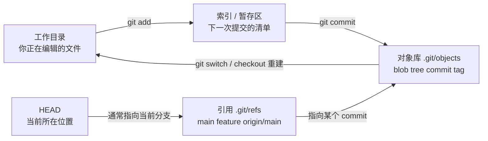
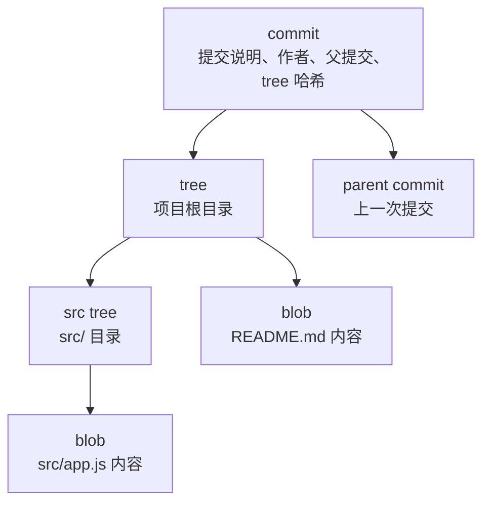
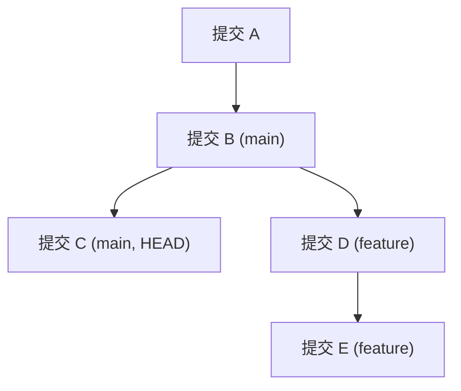

# Git 内部原理与仓库维护

前面章节已经能支撑日常使用：提交、分支、合并、远程、PR、撤销和排障。这一章面向想进一步吃透 Git 的读者：你不需要每天手动操作 `.git`，但理解它，会让你在遇到奇怪状态、误提交大文件、`.gitignore` 不生效、rebase 后找回提交时更稳。

本章目标：

1. 理解 Git 如何用对象和引用保存一次提交
2. 分清工作目录、索引、对象库和引用
3. 能用 `rev-parse`、`cat-file`、`ls-tree`、`ls-files --stage` 观察仓库内部
4. 知道 `.gitignore` 为什么不影响已经被跟踪的文件
5. 理解 reflog、stash、FETCH_HEAD、ORIG_HEAD 这些“救援线索”
6. 区分 bare 仓库、archive、bundle 和历史清理的边界

如果你是完全新手，可以先跳过本章，学完综合实战后再回来读。

本章会出现一些偏底层的命令。你不需要把它们当成日常操作入口；它们更像显微镜，用来验证“Git 到底把什么存在哪里”。

---

## 1. 先看整体地图

Git 日常命令背后，大致有这几层：



一句话版：

- 工作目录保存你正在改的文件
- 索引决定下一次提交包含什么
- 对象库存放 Git 真正记录下来的内容
- 引用给提交起名字，比如 `main`、`feature-login`、`origin/main`
- `HEAD` 告诉 Git 你当前站在哪里

这也是很多问题的根源：你以为自己在改“一个文件”，Git 实际在比较“工作目录、索引、HEAD 指向的提交”三者。

还有一组术语可以先认识：

| 类型 | 含义 | 例子 |
|---|---|---|
| porcelain（瓷器命令） | 面向人日常使用的高层命令 | `git status`、`git add`、`git commit`、`git switch` |
| plumbing（管道命令） | 面向脚本和内部观察的底层命令 | `git cat-file`、`git ls-tree`、`git rev-parse` |

教程主线仍然教 porcelain；本章用少量 plumbing 命令帮你把心智模型坐实。

---

## 2. Git 对象：blob、tree、commit、tag

Git 保存历史时，不是把文件夹简单压缩成 zip。它把内容拆成对象。

| 对象 | 保存什么 | 类比 |
|---|---|---|
| blob | 文件内容 | 一份文件正文 |
| tree | 文件名、目录结构、权限，以及指向 blob/tree 的引用 | 一个目录清单 |
| commit | 作者、时间、提交说明、父提交、指向根 tree 的引用 | 一次版本记录 |
| tag | 指向某个对象的固定标签，常用于版本发布 | `v1.0.0` 标签 |

这里最容易误解的是 blob：blob 保存的是**文件内容**，不是文件名。文件名、路径和权限在 tree 里。两个路径里的文件内容如果完全一样，可以指向同一个 blob；Git 不需要为相同内容重复保存两份正文。

一次提交可以这样理解：



提交哈希不是随机编号。默认情况下，Git 会根据对象内容和元数据计算哈希。内容不同，哈希通常就不同；父提交不同，提交对象的哈希也会不同。这就是为什么 rebase、amend、squash 会“改写历史”：它们不是把旧提交挪一挪，而是创建了新的提交对象。

对象之间组成的是一张有方向、不会绕回来的图：commit 指向 tree，tree 指向 blob 或子 tree，commit 还会指向父 commit。Git 读历史时就是从某个引用（例如 `HEAD`、`main`、`v1.0.0`）出发，一路沿着这些指针找到需要的对象。

可以用下面命令观察对象：

```bash
git rev-parse HEAD
git cat-file -p HEAD
git cat-file -p HEAD^{tree}
git ls-tree -r HEAD
```

解释：

| 命令 | 用途 |
|---|---|
| `git rev-parse HEAD` | 把 `HEAD` 解析成完整提交哈希 |
| `git cat-file -p HEAD` | 查看当前提交对象内容 |
| `git cat-file -p HEAD^{tree}` | 查看当前提交指向的根目录 tree |
| `git ls-tree -r HEAD` | 递归列出当前提交的目录树、文件模式和 blob 哈希 |

这些命令适合学习和诊断，不是日常开发必需品。

如果你想继续追某个文件内容，可以从 `git ls-tree -r HEAD` 的输出里复制对应 blob 哈希，再运行：

```bash
git cat-file -t 哈希      # 看对象类型
git cat-file -s 哈希      # 看对象大小
git cat-file -p 哈希      # 打印对象内容；二进制文件不要随便 -p
```

这条观察链很重要：

```text
HEAD → 当前分支 → commit → tree → blob
```

你平时运行的 `git show`、`git diff`、`git checkout`/`switch`，背后都离不开这条链路，只是高层命令替你把细节藏起来了。

---

## 3. `.git/objects` 不适合手动编辑

如果打开 `.git/objects`，你可能会看到很多以两位字符命名的目录。Git 会把对象哈希拆开：前两位作为目录名，剩余部分作为文件名。这样可以避免一个目录里塞进过多文件。

刚创建的小仓库里，这些对象可能是一个个 loose object。仓库使用久了以后，Git 会把很多对象压缩进 packfile，以节省空间并加快传输。你不需要手动解包或编辑它们；知道“对象可能散放，也可能打包”就够了。

你不需要手动管理这些文件。更重要的是：不要手动删除 `.git/objects` 里的对象来“清理空间”。对象之间互相引用，乱删可能让仓库损坏。

正确的维护方式是使用 Git 命令：

```bash
git count-objects -vH
git gc
git fsck
```

| 命令 | 作用 | 什么时候用 |
|---|---|---|
| `git count-objects -vH` | 查看对象数量和空间占用 | 怀疑仓库过大时 |
| `git gc` | 打包和清理可安全回收的对象 | 仓库长期使用后维护 |
| `git fsck` | 检查对象连通性和仓库完整性 | 怀疑仓库损坏时 |

一般项目不需要频繁手动运行 `git gc`，Git 会在合适时机自动维护。手动运行前，先确认没有正在进行的 rebase、merge 或其他操作。

`git fsck` 有时会报告 dangling commit/blob/tree。dangling 的意思通常是“这个对象暂时没有被任何可达引用指向”，不一定代表仓库损坏。例如刚做过 rebase、reset、amend 后，旧提交对象可能还留在本地一段时间。先看上下文，不要一看到 dangling 就急着 `git prune`。

---

## 4. 引用：分支名只是提交的名字

分支不是一整套复制出来的文件。分支名本质上是一个指向提交的引用。

常见引用位置：

| 引用 | 含义 |
|---|---|
| `refs/heads/main` | 本地 `main` 分支 |
| `refs/heads/feature-login` | 本地功能分支 |
| `refs/remotes/origin/main` | 远程跟踪分支 `origin/main` |
| `refs/tags/v1.0.0` | 标签 |
| `HEAD` | 当前所在分支或当前提交 |

正常在分支上时，`HEAD` 通常不是直接指向提交，而是指向分支：

```text
HEAD -> refs/heads/main -> 某个 commit
```

detached HEAD 时，`HEAD` 才直接指向某个提交：

```text
HEAD -> 某个 commit
```

所以“创建分支救回提交”的本质是：给某个提交重新挂一个名字。

```bash
git switch -c rescue-work 提交哈希
```

远程跟踪分支也是引用，只是命名空间不同。`refs/remotes/origin/main` 记录的是“上次 fetch 时，远程 origin 的 main 在哪里”。运行 `git fetch origin` 会更新这类引用；它不会自动移动你的本地 `main`。这就是第 6 章反复强调 `fetch` 比 `pull` 更适合观察的原因。

---

## 5. 索引：暂存区也是 Git 的内部状态

很多人把暂存区理解成“临时篮子”，这对入门有帮助。但更准确地说，暂存区对应 Git 的 index：它记录下一次提交准备采用的文件版本。

当你运行：

```bash
git add app.js
```

Git 不是只记住“app.js 被选中了”，而是把当时的 `app.js` 内容写入对象库，并在索引里记录：下一次提交要使用这个版本。

这解释了一个常见现象：

```bash
git add app.js
# 又继续修改 app.js
git diff
git diff --staged
```

此时可能同时存在两份差异：

| 命令 | 比较对象 |
|---|---|
| `git diff` | 工作目录 vs 索引 |
| `git diff --staged` | 索引 vs HEAD |

也就是说，`git add` 不是给文件贴永久标签，而是把“这一刻的内容”放进下一次提交。

想直接看索引里记录了什么，可以运行：

```bash
git ls-files --stage
```

输出大致像这样：

```text
100644 a1b2c3d4... 0    README.md
100644 e5f6a7b8... 0    src/app.js
```

这里能看到文件模式、对象哈希、stage 编号和路径。普通状态下 stage 编号通常是 `0`；合并冲突时，同一个路径可能出现多个 stage，分别代表共同祖先、当前分支和被合并分支的版本。这就是为什么冲突解决后必须 `git add`：你是在告诉索引“这个路径的最终版本已经确定”。

---

## 6. 为什么 `.gitignore` 对已提交文件无效？

`.gitignore` 只过滤“还没有进入索引的未跟踪文件”。如果一个文件已经被 Git 跟踪，后来再把它写进 `.gitignore`，Git 仍会继续比较它在工作目录、索引和提交里的版本。

典型场景：

```bash
echo ".env" >> .gitignore
git status
```

如果 `.env` 早就提交过，`git status` 仍可能显示它被修改。这不是 `.gitignore` 失效，而是文件已经在索引里。

想让 Git 停止跟踪，但保留本地文件：

```bash
git rm --cached .env
git add .gitignore
git commit -m "停止跟踪本地环境配置"
```

之后 `.env` 仍在你的磁盘上，但不再进入后续提交。

检查 Git 当前忽略了什么：

```bash
git status --ignored
git check-ignore -v .env
```

| 命令 | 用途 |
|---|---|
| `git status --ignored` | 顺便显示被忽略文件 |
| `git check-ignore -v 文件` | 看哪个忽略规则命中了该文件 |

如果误提交的是密钥、token、密码，`git rm --cached` 只会阻止以后继续跟踪，不会抹掉历史里的秘密。此时要立即撤销或轮换密钥，再考虑历史清理。

还有一个容易忽略的点：`.gitignore` 本身也是普通文件，它在不同分支上也可能不同。你从一个分支切到另一个分支时，可能会看到“这个分支忽略它，那个分支还在跟踪它”的情况。判断时不要只看当前工作目录里有没有文件，要看它是否已经在索引里：

```bash
git ls-files .env
```

如果命令输出了 `.env`，说明它仍被 Git 跟踪；如果没有输出，再结合 `git check-ignore -v .env` 判断是哪条忽略规则生效。

---

## 7. `assume-unchanged` 和 `skip-worktree` 不要乱用

你可能见过这两个命令：

```bash
git update-index --assume-unchanged config.local
git update-index --skip-worktree config.local
```

它们都不是 `.gitignore` 的替代品。

| 方式 | 大致用途 | 风险 |
|---|---|---|
| `--assume-unchanged` | 本地性能优化或临时不检查某个已跟踪文件 | 容易忘记，导致改动不被发现 |
| `--skip-worktree` | 本地希望保留自己的工作树版本 | 分支切换或合并时可能制造困惑 |
| `.gitignore` + `git rm --cached` | 让文件从版本控制中退出 | 需要团队共同提交规则 |

如果只是误把本地配置提交进仓库，优先使用：

```bash
git rm --cached config.local
```

只有你非常清楚后果时，再考虑 `update-index` 这类本地标记。

取消标记：

```bash
git update-index --no-assume-unchanged config.local
git update-index --no-skip-worktree config.local
```

可以用下面命令查看哪些文件带了这类本地标记：

```bash
git ls-files -v
```

输出里以小写标记显示的文件，往往就是被本地标记影响的文件。看到这种状态时，先问自己：这是临时性能优化、本地环境差异，还是应该真正从版本控制里退出？不要把本地标记提交给团队，因为这些标记不会像 `.gitignore` 一样成为团队共享规则。

---

## 8. reflog、stash、FETCH_HEAD 和 ORIG_HEAD

Git 除了提交历史，还会保存一些本地线索。它们经常是救援关键。

| 名称 | 保存什么 | 常见用途 |
|---|---|---|
| `reflog` | `HEAD` 和分支指针最近移动记录 | 找回 reset、rebase、detached HEAD 后的提交 |
| `stash` | 临时保存的工作目录和索引快照 | 切分支前保存半成品 |
| `FETCH_HEAD` | 最近一次 fetch 得到的提交信息 | 临时查看或合并刚 fetch 的内容 |
| `ORIG_HEAD` | 危险操作前的旧位置 | merge/rebase/reset 后快速回头 |

`stash` 可以理解成 Git 用内部提交对象保存的一组临时快照，但它不是团队共享的长期分支。长期有价值的工作，应该提交到分支。

查看这些线索：

```bash
git reflog
git stash list
git show FETCH_HEAD
git show ORIG_HEAD
```

注意：这些多是本地记录。换一台电脑、重新 clone 仓库，不一定有同样的 reflog 或 stash。

有些老资料会用 `git reset --hard ORIG_HEAD` 撤销刚才的 merge 或 rebase。这个思路没错，但命令很重：`--hard` 会让工作目录和索引都回到目标提交。真正执行前，先运行 `git status`，确认没有要保留的未提交改动；不确定时，先从 `ORIG_HEAD` 创建救援分支更稳：

```bash
git switch -c before-risky-operation ORIG_HEAD
```

---

## 9. 清理历史：大文件和密钥要谨慎处理

误提交大文件或密钥时，先判断目标：

| 问题 | 只影响未来提交 | 必须清理历史 |
|---|---|---|
| 普通本地配置被跟踪 | `git rm --cached` + `.gitignore` | 通常不必 |
| 大文件导致仓库膨胀 | 可能不够 | 经常需要 |
| 密钥、token、密码泄露 | 不够 | 需要，并且必须轮换密钥 |

现代项目清理历史时，优先考虑专门工具：

- `git filter-repo`
- BFG Repo-Cleaner

老资料里常见 `git filter-branch`，但它现在通常不再作为首选方案。它慢、容易误用，而且 Git 官方文档也更推荐使用替代工具。你需要知道它存在，但不要把它当成新项目默认方案。

也不要用交互式 rebase 去处理已经公开很久的大文件或密钥历史。rebase 适合整理自己分支上有限的一段提交；清理整个仓库历史是团队级迁移，应该使用专门工具，并提前安排所有协作者的同步方式。

清理历史前的原则：

1. 先备份仓库。
2. 先通知团队暂停基于旧历史继续开发。
3. 先轮换已经泄露的密钥。
4. 在副本里验证清理结果。
5. 推送时使用明确分支名，必要时用 `--force-with-lease`。
6. 让团队按统一步骤重新同步，严重时重新 clone。

清理历史不是“更高级的撤销”，而是一次仓库迁移。

如果项目长期需要存放大体积二进制文件（视频、设计稿、数据集、模型权重），反复清理历史治标不治本。更稳妥的做法是用 [Git LFS](https://git-lfs.com) 把大文件存到外部存储，仓库本身只保留指针。这样克隆、fetch 仍然轻快，历史也不会被大文件撑爆。Git LFS 需要服务端支持，GitHub、GitLab、Gitee 都提供，但要注意其存储和流量通常有配额。


---

## 10. 导出、备份和 bare 仓库

Git 仓库有三种很容易混淆的“带走项目”方式：

| 方式 | 带走什么 | 常见用途 | 不适合什么 |
|---|---|---|---|
| `git archive` | 某个提交里的项目文件，不包含 Git 历史 | 发源码包给没有 Git 的人 | 备份完整仓库历史 |
| `git bundle` | 提交历史和引用，可离线 clone/fetch | 没网络时搬运仓库或做一次性备份 | 替代长期远程仓库 |
| bare 仓库 | 只有仓库数据，没有工作目录 | 自建远程仓库、中转仓库、迁移验证 | 日常编辑文件 |

### `git archive`：只导出文件

如果你只想把当前版本打包给别人，不希望对方看到 Git 历史，可以在仓库根目录运行：

```bash
git archive HEAD --format=zip --output=../project-source.zip
```

这个 zip 包里是 `HEAD` 对应的项目文件，没有 `.git/`。它适合交付源码快照，不适合备份仓库。

### `git bundle`：把历史打成一个文件

如果你要在没有网络的机器之间搬运仓库历史，可以用 bundle：

```bash
git bundle create ../project.bundle --all
```

在另一台机器上可以验证并克隆：

```bash
git bundle verify ../project.bundle
git clone ../project.bundle project-copy
```

bundle 是一个很实用的离线传输方式，但它只是某个时刻导出的文件。团队协作仍然需要正常远程仓库、权限控制和备份策略。

### bare 仓库：远程仓库常见形态

bare 仓库没有工作目录，通常以 `.git` 结尾：

```bash
git init --bare project.git
```

也可以把现有仓库克隆成 bare 版本：

```bash
git clone --bare my-project my-project.git
```

它适合放在服务器上供别人 `push` 和 `fetch`，不适合直接进去编辑文件。你在 GitHub、GitLab、Gitee 上看到的远程仓库，从 Git 的角度看也更接近这种“只负责存储和交换历史”的角色。

---

## 11. 从 SVN 或旧系统迁移到 Git 的原则

如果团队从 Subversion、TFS 或其他集中式版本控制迁移到 Git，不要只做“命令对照表”。Git 的核心差异是：每个克隆都有完整历史，分支和标签是引用，协作通过 fetch/push/PR/MR 交换提交。

迁移时优先关注这些问题：

| 问题 | 为什么重要 |
|---|---|
| 作者信息如何映射？ | 旧系统里的用户名需要对应到 Git 的姓名和邮箱 |
| trunk/branches/tags 如何转换？ | SVN 里标签常像目录拷贝，Git 里标签是引用 |
| 忽略规则如何迁移？ | 旧系统的忽略规则需要落到 `.gitignore` 或平台规则 |
| 是否保留全部历史？ | 大仓库可能需要分阶段验证，不能一次性冒进 |
| 什么时候冻结旧仓库？ | 迁移期间两边同时写入会制造混乱 |
| 团队怎么重新同步？ | 历史迁移后，旧 clone 往往不能继续当作普通更新处理 |

如果来源是 SVN，`git svn` 可以作为过渡或迁移工具。但对中文 Git 新手来说，先理解迁移原则比背 `git svn clone` 参数更重要。真实迁移建议在副本里反复演练：先生成作者映射，转换忽略规则，推到临时 bare 仓库，检查分支、标签和关键历史，再安排正式切换。

迁移不是一次“高级 pull”，而是团队级流程变更。越是历史久、仓库大、权限复杂的项目，越要先备份、先演练、先写清楚回退方案。

---

## 12. 修订号语法：怎么指向某个提交

很多命令都要你给一个“提交”，但你不必每次都复制完整哈希。Git 有一套修订号（revision）写法。下面用一个示例历史说明：



常用写法：

| 写法 | 含义 |
|---|---|
| `HEAD` | 当前提交 |
| `HEAD~1` | 当前提交的父提交（往回走一代） |
| `HEAD~2` | 往回走两代 |
| `HEAD^` | 当前提交的第一个父提交（和 `~1` 类似） |
| `HEAD^2` | 当前提交的第二个父提交，即合并提交的另一条父线 |
| `分支名` | 该分支最新提交，如 `main`、`feature` |
| `标签名` | 标签指向的提交，如 `v1.0.0` |
| `origin/main` | 远程跟踪分支指向的提交 |
| `哈希前缀` | 只要唯一，`c3d4e5f` 就够，不必写全 |
| `refname@{n}` | reflog 里该引用的第 n 次旧值，救援时有用 |
| `HEAD@{1}` | reflog 里 HEAD 的上一次位置 |
| `HEAD^{tree}` | 当前提交指向的根目录 tree |
| `HEAD:README.md` | 当前提交里 `README.md` 这个路径对应的 blob 内容 |

`~` 和 `^` 的区别主要在合并提交上：合并提交有两个父提交，`^1` 是第一父线（通常是目标分支），`^2` 是第二父线（被合并的分支）；`~n` 则只是“沿第一父线回退 n 代”。

例子：

```bash
git diff HEAD~2 HEAD          # 比较两代前的提交和现在
git reset --soft HEAD~1       # 撤销最后一次提交，保留改动在暂存区
git show HEAD^2               # 看合并提交的另一条父线
git log feature..main         # main 上有、feature 上没有的提交
git show HEAD:README.md       # 只查看 HEAD 里某个文件的内容
```

`A..B` 表示“在 B 但不在 A 的提交”，是查看分支差异的常用写法。

---

## 13. `git worktree`：一个仓库多个工作目录

平时一个仓库只有一个工作目录，切分支会切换当前目录的文件。但有时你想同时打开两个分支：比如一边在 `feature` 上开发，一边在 `main` 上紧急修 bug，又不想来回 stash。

`git worktree` 让你为同一个仓库创建额外的工作目录，每个目录检出一个分支，互不干扰，且共享同一份 `.git` 历史。

```bash
git worktree add ../project-hotfix main   # 在隔壁目录再开一个 main 的工作树
```

之后你在 `../project-hotfix` 里就像在普通仓库里工作，但它和原来的目录共享提交历史。常用命令：

| 命令 | 作用 |
|---|---|
| `git worktree add 路径 分支` | 在指定路径开一个工作树，检出该分支 |
| `git worktree list` | 列出所有工作树 |
| `git worktree remove 路径` | 删除某个工作树 |
| `git worktree prune` | 清理已删除目录的残留记录 |

注意：同一个分支不能同时被两个工作树检出。worktree 适合临时并行任务，不是用来长期维护多份代码副本。

---

## 14. 子仓库和补丁工作流：什么时候才需要

有些 Git 能力很强，但不适合放进日常主线。你不需要在入门阶段掌握它们，但应该知道它们解决哪类问题，免得遇到时把普通分支、复制目录和压缩包混用。

### submodule 和 subtree

当一个项目需要把另一个 Git 仓库嵌进子目录时，常见选择是 submodule 或 subtree。

| 方案 | 仓库里保存什么 | 优点 | 代价 |
|---|---|---|---|
| submodule | 保存子仓库的 URL 和一个具体提交指针 | 依赖边界清楚，适合严格锁定外部库版本 | clone 后要初始化/更新，团队容易忘；子仓库冲突需要单独处理 |
| subtree | 把子项目内容合进当前仓库目录 | clone 后内容就在本仓库里，轻量团队更容易使用 | 历史会更重，和上游同步需要约定命令 |

submodule 的典型操作：

```bash
git submodule add https://example.com/lib.git vendor/lib
git submodule update --init --recursive
```

subtree 的典型操作：

```bash
git remote add lib https://example.com/lib.git
git subtree add --prefix vendor/lib lib main --squash
```

选择时先问一个问题：这个子项目是否需要保持独立仓库身份，并且团队愿意承受额外操作？如果答案是“是”，submodule 可以考虑；如果只是想把一份外部代码嵌进来并偶尔同步，subtree 或包管理器往往更省心。对多数应用项目，优先使用语言生态的包管理工具，不要把 Git 子仓库当成通用依赖管理器。

### format-patch 和 am

在 GitHub/GitLab/Gitee 时代，大多数协作用 PR/MR 就够了。但有些项目仍使用邮件列表或补丁文件贡献，例如内核类项目、老牌开源项目或没有平台写权限的协作场景。

`git format-patch` 会把提交变成可发送的补丁文件，保留作者、提交说明和 diff；`git am` 则把补丁重新应用成提交。

```bash
git format-patch main
git apply --check 0001-fix-title.patch
git am --signoff < 0001-fix-title.patch
```

这里有三个边界：

| 命令 | 作用 | 注意 |
|---|---|---|
| `git diff > fix.patch` | 只保存文件差异 | 不包含完整提交元数据 |
| `git format-patch` | 把一个或多个提交导出成邮件补丁 | 适合需要保留作者和提交说明的贡献 |
| `git am` | 把邮件补丁应用为提交 | 应先在临时分支验证，冲突时按提示继续或中止 |

如果你只是给同事发一次临时改动，PR/MR、分支或压缩包可能更直接；如果项目维护者明确要求补丁邮件，再学习 `format-patch`、`send-email` 和 `am`。

---

## 15. 什么内容不应该过早深入？

理解内部原理有用，但新手不需要一开始就掌握所有底层细节。

| 内容 | 建议学习时机 |
|---|---|
| blob/tree/commit | 学完提交、分支、合并后 |
| `git cat-file`、`rev-parse`、`ls-tree`、`ls-files --stage` | 想理解对象模型、目录树和索引时 |
| bare 仓库、archive、bundle | 需要导出、离线搬运或自建远程仓库时 |
| packfile、gc、fsck | 仓库过大或怀疑损坏时 |
| `filter-repo` / BFG | 误提交大文件或秘密时 |
| 手动查看 `.git/refs` | 理解 HEAD、分支、远程跟踪分支时 |
| `git worktree` | 需要同时开多个分支工作目录时 |
| Git LFS | 项目有大体积二进制文件时 |
| submodule / subtree | 需要把另一个仓库作为子目录嵌入时 |
| `git send-email` / patch 工作流 | 给邮件列表驱动的项目（如内核）贡献时 |
| `git daemon`、静态 HTTP 仓库、`git instaweb` | 了解老式共享和浏览方式即可，现代团队通常用 GitHub/GitLab/Gitee 或自建平台 |

不要为了“懂底层”而绕开高层命令。日常操作仍然优先使用 `status`、`add`、`commit`、`switch`、`merge`、`rebase`、`fetch`、`pull`、`push` 这些稳定入口。

---

## 16. 本章命令速查表

| 命令 | 作用 | 注意 |
|---|---|---|
| `git rev-parse HEAD` | 查看当前提交完整哈希 | 常用于脚本和诊断 |
| `git cat-file -p HEAD` | 查看对象内容 | 学习内部结构时用 |
| `git cat-file -t 哈希` | 查看对象类型 | 分不清 blob/tree/commit/tag 时 |
| `git cat-file -s 哈希` | 查看对象大小 | 排查异常大对象时有用 |
| `git cat-file -p HEAD^{tree}` | 查看当前提交的根 tree | 可继续追 blob |
| `git ls-tree -r HEAD` | 递归列出提交里的 tree/blob | 从提交追到具体文件对象 |
| `git ls-files --stage` | 查看索引里的对象记录 | 理解暂存区和冲突 stage |
| `git status --ignored` | 显示被忽略文件 | 排查 `.gitignore` |
| `git check-ignore -v 文件` | 查看忽略规则来源 | 比猜规则可靠 |
| `git ls-files 文件` | 判断文件是否仍在索引里 | 排查 `.gitignore` 事后无效 |
| `git ls-files -v` | 查看本地 index 标记 | 排查 assume-unchanged/skip-worktree |
| `git rm --cached 文件` | 从索引移除但保留工作目录文件 | 常用于停止跟踪配置文件 |
| `git count-objects -vH` | 查看对象占用 | 仓库过大时 |
| `git gc` | Git 仓库维护 | 一般不必频繁手动运行 |
| `git fsck` | 检查仓库完整性 | 怀疑对象损坏时 |
| `git archive HEAD --format=zip --output=../project.zip` | 导出某个提交的文件快照 | 不包含 Git 历史 |
| `git bundle create ../project.bundle --all` | 把仓库历史打成离线 bundle | 适合搬运或一次性备份 |
| `git bundle verify ../project.bundle` | 检查 bundle 是否可用 | 克隆或传给别人前 |
| `git clone --bare 仓库目录 仓库.git` | 克隆成 bare 仓库 | 自建远程或迁移中转 |
| `git reflog` | 查看本地指针移动记录 | 救援常用 |
| `git stash list` | 查看 stash 栈 | stash 不是长期分支 |
| `git submodule add URL 路径` | 添加子仓库指针 | clone 后还需要初始化/更新 |
| `git submodule update --init --recursive` | 拉取并检出子模块内容 | 接手含 submodule 项目时常用 |
| `git subtree add --prefix 路径 远程 分支 --squash` | 把外部仓库内容合进子目录 | 适合轻量嵌入，但要约定同步方式 |
| `git format-patch main` | 导出当前分支相对 main 的补丁文件 | 适合邮件/补丁工作流 |
| `git apply --check 补丁文件` | 检查补丁能否应用 | 应用前先预检 |
| `git am --signoff < 补丁文件` | 把补丁应用成提交 | 建议在临时分支验证 |

---

## 17. 本章总结

1. Git 的核心不是文件夹复制，而是对象、索引和引用。
2. commit 指向 tree，tree 指向 blob；分支名、远程跟踪分支和标签都是给对象图提供入口的引用。
3. `cat-file`、`ls-tree`、`ls-files --stage` 能把对象库、目录树和索引直接显示出来。
4. `.gitignore` 只影响未跟踪文件，已跟踪文件要用 `git rm --cached` 退出索引。
5. reflog、stash、FETCH_HEAD、ORIG_HEAD 都是本地排障线索。
6. `archive`、`bundle` 和 bare 仓库解决的是不同的导出/交换问题，不能混用。
7. 清理历史和旧系统迁移都要当成团队级迁移处理，尤其是密钥泄露、大文件清理和 SVN 迁移。
8. submodule、subtree、patch 工作流和老式共享协议都属于特定场景工具；先理解边界，再决定是否引入。

---


---

**返回目录**：[README](./README.md)
