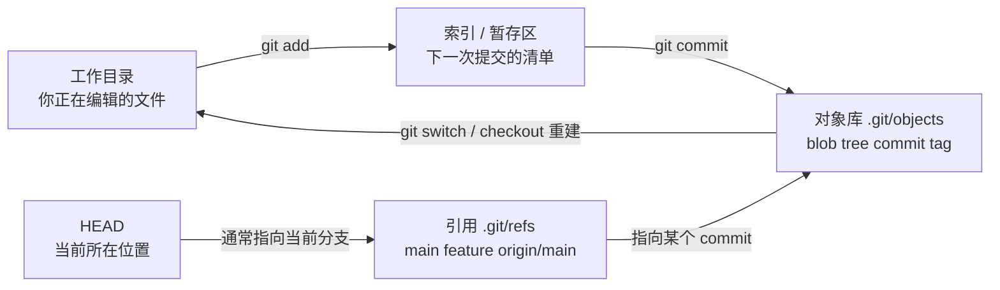
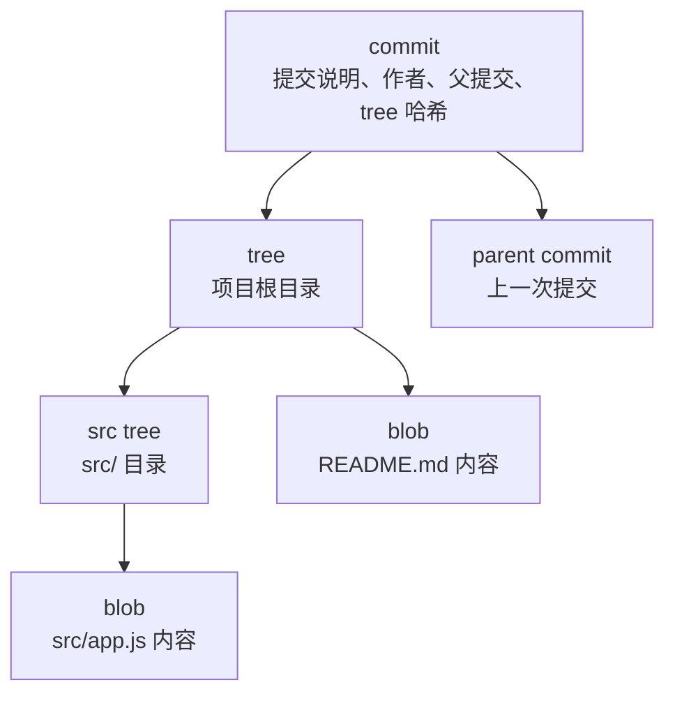

# Git 内部原理与仓库维护

前面章节已经能支撑日常使用：提交、分支、合并、远程、PR、撤销和排障。这一章面向想进一步吃透 Git 的读者：你不需要每天手动操作 `.git`，但理解它，会让你在遇到奇怪状态、误提交大文件、`.gitignore` 不生效、rebase 后找回提交时更稳。

本章目标：

1. 理解 Git 如何用对象保存一次提交
2. 分清工作目录、索引、对象库和引用
3. 知道 `.gitignore` 为什么不影响已经被跟踪的文件
4. 理解 reflog、stash、FETCH_HEAD、ORIG_HEAD 这些“救援线索”
5. 知道仓库维护和清理历史的安全边界

如果你是完全新手，可以先跳过本章，学完综合实战后再回来读。

---

## 1. 先看整体地图

Git 日常命令背后，大致有这几层：



一句话版：

- 工作目录保存你正在改的文件
- 索引决定下一次提交包含什么
- 对象库存放 Git 真正记录下来的内容
- 引用给提交起名字，比如 `main`、`feature-login`、`origin/main`
- `HEAD` 告诉 Git 你当前站在哪里

这也是很多问题的根源：你以为自己在改“一个文件”，Git 实际在比较“工作目录、索引、HEAD 指向的提交”三者。

---

## 2. Git 对象：blob、tree、commit、tag

Git 保存历史时，不是把文件夹简单压缩成 zip。它把内容拆成对象。

| 对象 | 保存什么 | 类比 |
|---|---|---|
| blob | 文件内容 | 一份文件正文 |
| tree | 文件名、目录结构、权限，以及指向 blob/tree 的引用 | 一个目录清单 |
| commit | 作者、时间、提交说明、父提交、指向根 tree 的引用 | 一次版本记录 |
| tag | 指向某个对象的固定标签，常用于版本发布 | `v1.0.0` 标签 |

一次提交可以这样理解：



提交哈希不是随机编号。默认情况下，Git 会根据对象内容和元数据计算哈希。内容不同，哈希通常就不同；父提交不同，提交对象的哈希也会不同。这就是为什么 rebase、amend、squash 会“改写历史”：它们不是把旧提交挪一挪，而是创建了新的提交对象。

可以用下面命令观察对象：

```bash
git rev-parse HEAD
git cat-file -p HEAD
git cat-file -p HEAD^{tree}
```

解释：

| 命令 | 用途 |
|---|---|
| `git rev-parse HEAD` | 把 `HEAD` 解析成完整提交哈希 |
| `git cat-file -p HEAD` | 查看当前提交对象内容 |
| `git cat-file -p HEAD^{tree}` | 查看当前提交指向的根目录 tree |

这些命令适合学习和诊断，不是日常开发必需品。

---

## 3. `.git/objects` 不适合手动编辑

如果打开 `.git/objects`，你可能会看到很多以两位字符命名的目录。Git 会把对象哈希拆开：前两位作为目录名，剩余部分作为文件名。这样可以避免一个目录里塞进过多文件。

你不需要手动管理这些文件。更重要的是：不要手动删除 `.git/objects` 里的对象来“清理空间”。对象之间互相引用，乱删可能让仓库损坏。

正确的维护方式是使用 Git 命令：

```bash
git count-objects -vH
git gc
git fsck
```

| 命令 | 作用 | 什么时候用 |
|---|---|---|
| `git count-objects -vH` | 查看对象数量和空间占用 | 怀疑仓库过大时 |
| `git gc` | 打包和清理可安全回收的对象 | 仓库长期使用后维护 |
| `git fsck` | 检查对象连通性和仓库完整性 | 怀疑仓库损坏时 |

一般项目不需要频繁手动运行 `git gc`，Git 会在合适时机自动维护。手动运行前，先确认没有正在进行的 rebase、merge 或其他操作。

---

## 4. 引用：分支名只是提交的名字

分支不是一整套复制出来的文件。分支名本质上是一个指向提交的引用。

常见引用位置：

| 引用 | 含义 |
|---|---|
| `refs/heads/main` | 本地 `main` 分支 |
| `refs/heads/feature-login` | 本地功能分支 |
| `refs/remotes/origin/main` | 远程跟踪分支 `origin/main` |
| `refs/tags/v1.0.0` | 标签 |
| `HEAD` | 当前所在分支或当前提交 |

正常在分支上时，`HEAD` 通常不是直接指向提交，而是指向分支：

```text
HEAD -> refs/heads/main -> 某个 commit
```

detached HEAD 时，`HEAD` 才直接指向某个提交：

```text
HEAD -> 某个 commit
```

所以“创建分支救回提交”的本质是：给某个提交重新挂一个名字。

```bash
git switch -c rescue-work 提交哈希
```

---

## 5. 索引：暂存区也是 Git 的内部状态

很多人把暂存区理解成“临时篮子”，这对入门有帮助。但更准确地说，暂存区对应 Git 的 index：它记录下一次提交准备采用的文件版本。

当你运行：

```bash
git add app.js
```

Git 不是只记住“app.js 被选中了”，而是把当时的 `app.js` 内容写入对象库，并在索引里记录：下一次提交要使用这个版本。

这解释了一个常见现象：

```bash
git add app.js
# 又继续修改 app.js
git diff
git diff --staged
```

此时可能同时存在两份差异：

| 命令 | 比较对象 |
|---|---|
| `git diff` | 工作目录 vs 索引 |
| `git diff --staged` | 索引 vs HEAD |

也就是说，`git add` 不是给文件贴永久标签，而是把“这一刻的内容”放进下一次提交。

---

## 6. 为什么 `.gitignore` 对已提交文件无效？

`.gitignore` 只过滤“还没有进入索引的未跟踪文件”。如果一个文件已经被 Git 跟踪，后来再把它写进 `.gitignore`，Git 仍会继续比较它在工作目录、索引和提交里的版本。

典型场景：

```bash
echo ".env" >> .gitignore
git status
```

如果 `.env` 早就提交过，`git status` 仍可能显示它被修改。这不是 `.gitignore` 失效，而是文件已经在索引里。

想让 Git 停止跟踪，但保留本地文件：

```bash
git rm --cached .env
git add .gitignore
git commit -m "停止跟踪本地环境配置"
```

之后 `.env` 仍在你的磁盘上，但不再进入后续提交。

检查 Git 当前忽略了什么：

```bash
git status --ignored
git check-ignore -v .env
```

| 命令 | 用途 |
|---|---|
| `git status --ignored` | 顺便显示被忽略文件 |
| `git check-ignore -v 文件` | 看哪个忽略规则命中了该文件 |

如果误提交的是密钥、token、密码，`git rm --cached` 只会阻止以后继续跟踪，不会抹掉历史里的秘密。此时要立即撤销或轮换密钥，再考虑历史清理。

---

## 7. `assume-unchanged` 和 `skip-worktree` 不要乱用

你可能见过这两个命令：

```bash
git update-index --assume-unchanged config.local
git update-index --skip-worktree config.local
```

它们都不是 `.gitignore` 的替代品。

| 方式 | 大致用途 | 风险 |
|---|---|---|
| `--assume-unchanged` | 本地性能优化或临时不检查某个已跟踪文件 | 容易忘记，导致改动不被发现 |
| `--skip-worktree` | 本地希望保留自己的工作树版本 | 分支切换或合并时可能制造困惑 |
| `.gitignore` + `git rm --cached` | 让文件从版本控制中退出 | 需要团队共同提交规则 |

如果只是误把本地配置提交进仓库，优先使用：

```bash
git rm --cached config.local
```

只有你非常清楚后果时，再考虑 `update-index` 这类本地标记。

取消标记：

```bash
git update-index --no-assume-unchanged config.local
git update-index --no-skip-worktree config.local
```

---

## 8. reflog、stash、FETCH_HEAD 和 ORIG_HEAD

Git 除了提交历史，还会保存一些本地线索。它们经常是救援关键。

| 名称 | 保存什么 | 常见用途 |
|---|---|---|
| `reflog` | `HEAD` 和分支指针最近移动记录 | 找回 reset、rebase、detached HEAD 后的提交 |
| `stash` | 临时保存的工作目录和索引快照 | 切分支前保存半成品 |
| `FETCH_HEAD` | 最近一次 fetch 得到的提交信息 | 临时查看或合并刚 fetch 的内容 |
| `ORIG_HEAD` | 危险操作前的旧位置 | merge/rebase/reset 后快速回头 |

`stash` 可以理解成 Git 用内部提交对象保存的一组临时快照，但它不是团队共享的长期分支。长期有价值的工作，应该提交到分支。

查看这些线索：

```bash
git reflog
git stash list
git show FETCH_HEAD
git show ORIG_HEAD
```

注意：这些多是本地记录。换一台电脑、重新 clone 仓库，不一定有同样的 reflog 或 stash。

---

## 9. 清理历史：大文件和密钥要谨慎处理

误提交大文件或密钥时，先判断目标：

| 问题 | 只影响未来提交 | 必须清理历史 |
|---|---|---|
| 普通本地配置被跟踪 | `git rm --cached` + `.gitignore` | 通常不必 |
| 大文件导致仓库膨胀 | 可能不够 | 经常需要 |
| 密钥、token、密码泄露 | 不够 | 需要，并且必须轮换密钥 |

现代项目清理历史时，优先考虑专门工具：

- `git filter-repo`
- BFG Repo-Cleaner

老资料里常见 `git filter-branch`，但它现在通常不再作为首选方案。它慢、容易误用，而且 Git 官方文档也更推荐使用替代工具。你需要知道它存在，但不要把它当成新项目默认方案。

清理历史前的原则：

1. 先备份仓库。
2. 先通知团队暂停基于旧历史继续开发。
3. 先轮换已经泄露的密钥。
4. 在副本里验证清理结果。
5. 推送时使用明确分支名，必要时用 `--force-with-lease`。
6. 让团队按统一步骤重新同步，严重时重新 clone。

清理历史不是“更高级的撤销”，而是一次仓库迁移。

---

## 10. 什么内容不应该过早深入？

理解内部原理有用，但新手不需要一开始就掌握所有底层细节。

| 内容 | 建议学习时机 |
|---|---|
| blob/tree/commit | 学完提交、分支、合并后 |
| `git cat-file`、`rev-parse` | 想理解对象模型时 |
| packfile、gc、fsck | 仓库过大或怀疑损坏时 |
| `filter-repo` / BFG | 误提交大文件或秘密时 |
| 手动查看 `.git/refs` | 理解 HEAD、分支、远程跟踪分支时 |

不要为了“懂底层”而绕开高层命令。日常操作仍然优先使用 `status`、`add`、`commit`、`switch`、`merge`、`rebase`、`fetch`、`pull`、`push` 这些稳定入口。

---

## 11. 本章命令速查表

| 命令 | 作用 | 注意 |
|---|---|---|
| `git rev-parse HEAD` | 查看当前提交完整哈希 | 常用于脚本和诊断 |
| `git cat-file -p HEAD` | 查看对象内容 | 学习内部结构时用 |
| `git cat-file -p HEAD^{tree}` | 查看当前提交的根 tree | 可继续追 blob |
| `git status --ignored` | 显示被忽略文件 | 排查 `.gitignore` |
| `git check-ignore -v 文件` | 查看忽略规则来源 | 比猜规则可靠 |
| `git rm --cached 文件` | 从索引移除但保留工作目录文件 | 常用于停止跟踪配置文件 |
| `git count-objects -vH` | 查看对象占用 | 仓库过大时 |
| `git gc` | Git 仓库维护 | 一般不必频繁手动运行 |
| `git fsck` | 检查仓库完整性 | 怀疑对象损坏时 |
| `git reflog` | 查看本地指针移动记录 | 救援常用 |
| `git stash list` | 查看 stash 栈 | stash 不是长期分支 |

---

## 12. 本章总结

1. Git 的核心不是文件夹复制，而是对象、索引和引用。
2. commit 指向 tree，tree 指向 blob；分支名指向 commit。
3. `.gitignore` 只影响未跟踪文件，已跟踪文件要用 `git rm --cached` 退出索引。
4. reflog、stash、FETCH_HEAD、ORIG_HEAD 都是本地排障线索。
5. 清理历史要当成团队级迁移处理，尤其是密钥泄露和大文件清理。

---

**下一步**：[综合实战项目](./Git教程系列-17-综合实战项目.md)

---

**返回目录**：[README](./README.md)
