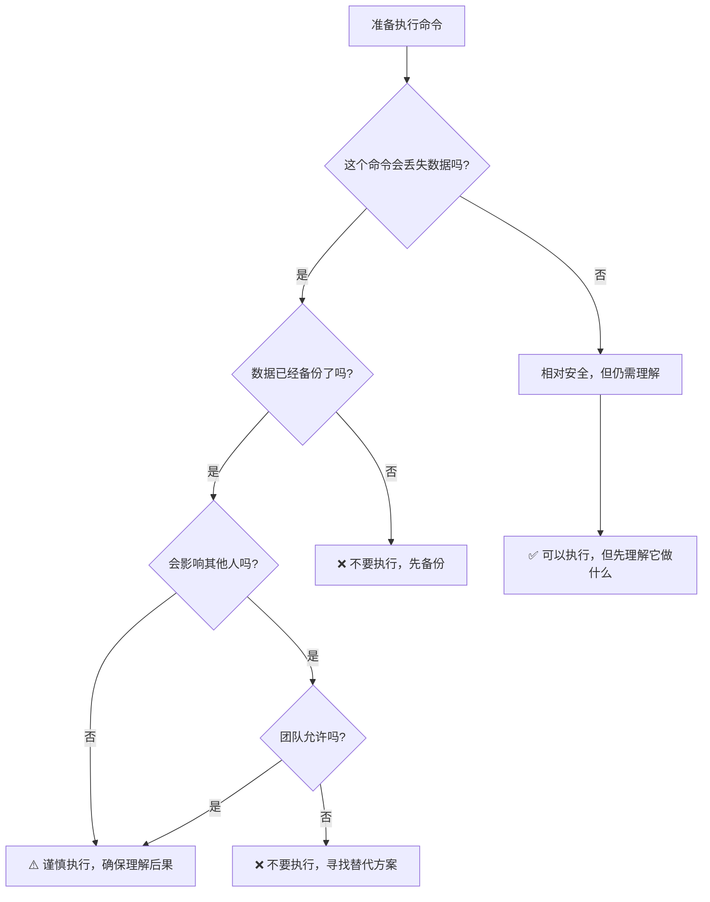

# Git 危险命令参考

本文档列出了 Git 中需要谨慎使用的命令及其安全使用指南。

---

## 危险等级说明

- 🔴 **高危**：可能造成数据永久丢失
- 🟡 **中危**：可能影响团队协作或需要额外操作恢复
- 🟢 **低危**：通常可以安全撤销

---

## 🔴 高危命令

### `git branch -D`

**风险：** 会强制删除未合并的分支

**使用前检查：**
- 确认分支的提交已经合并或不再需要

- 如果不确定，先用 `git branch -d` 试试（安全删除）

- 记住可以用 `git reflog` 找回90天内的提交


**更安全的替代方案：**
- 用 `git branch -d` 安全删除（只删除已合并的）
- 用 `git tag` 标记分支再删除
- 先确认提交已经合并到其他分支

---

### `git push --force`

**风险：** 会覆盖远程仓库历史，可能破坏团队协作

**使用前检查：**
- 确认这是你的个人分支

- 使用 `--force-with-lease` 更安全

- 和团队确认是否允许强推


**更安全的替代方案：**
- 用 `git push --force-with-lease` 更安全
- 创建新分支代替覆盖旧分支
- 用 `git revert` 而不是强推

---

### `git reset --hard`

**风险：** 会永久丢弃工作目录和暂存区的所有改动

**使用前检查：**
- 运行 `git status` 确认你不需要这些改动

- 考虑先用 `git stash` 保存现场

- 在练习目录测试，不要在重要项目中直接使用


**更安全的替代方案：**
- 用 `git reset --soft` 或 `--mixed` 保留改动
- 用 `git stash` 临时保存改动
- 用 `git restore` 只恢复特定文件

---

### `git clean -fd`

**风险：** 会删除所有未跟踪的文件和目录，无法恢复

**使用前检查：**
- 先运行 `git clean -nd` 预览将被删除的内容

- 确认这些文件真的不需要了

- 重要文件应该先备份


**更安全的替代方案：**
- 用 `git clean -nd` 先预览
- 手动删除确认不需要的文件
- 用 `.gitignore` 忽略而不是删除

---

## 🟡 中危命令

### `git rebase`

**风险：** 重写提交历史，可能导致团队协作混乱

**黄金法则：** 永远不要 rebase 已推送到公共分支的提交

**安全场景：**
- 个人功能分支（只有你在用）
- 本地整理提交（还没推送）
- 使用 `--force-with-lease` 推送

**危险场景：**
- Rebase `main`/`master` 主分支
- Rebase 团队共同开发的分支
- Rebase 已发布的版本

---

### `git commit --amend`

**风险：** 修改最后一次提交，改变提交哈希

**安全使用：**
- ✅ 提交还没推送时
- ✅ 只是修改提交信息
- ✅ 补充忘记的文件

**不要使用：**
- ❌ 已经推送的提交
- ❌ 别人可能已经基于它开发

**替代方案：**
- 创建新提交修正错误
- 用 `git revert` 反做提交

---

## 🟢 低危命令（相对安全但需了解）

### `git reset --mixed` (默认)

**作用：** 移动 HEAD，保留改动在工作目录

**恢复：** 改动还在，可以重新提交或撤销

---

### `git reset --soft`

**作用：** 移动 HEAD，保留改动在暂存区

**恢复：** 改动还在暂存区，可以重新提交

---

### `git restore`

**作用：** 恢复文件到指定状态

**注意：** 未提交的改动会丢失，但这是它的本意

---

## 救援指南

如果不小心执行了危险操作：

### 1. 立即停止

不要继续敲命令，不要慌乱中执行更多操作。

### 2. 查看 reflog

```bash
git reflog -20
```

这会显示最近的 HEAD 移动记录。

### 3. 创建救援分支

```bash
# 找到可疑的提交哈希，例如 abc1234
git switch -c emergency-rescue abc1234
```

### 4. 检查内容

```bash
git log --oneline -10
git status
```

确认这个分支是否包含你需要的内容。

### 5. 决定下一步

- 如果找到了：合并回原分支或继续在这个分支工作
- 如果没找到：继续查看 reflog 的其他记录
- 如果超过90天：可能无法恢复（除非有远程备份）

---

## 预防措施

### 1. 养成好习惯

- 重要操作前先 `git status`
- 危险命令前先在测试目录试验
- 定期 `git push` 备份到远程

### 2. 使用别名简化安全命令

```bash
# 安全的日志查看
git config --global alias.lg "log --oneline --graph --all --decorate"

# 安全的状态检查
git config --global alias.st "status -sb"

# 预览清理（不执行）
git config --global alias.clean-preview "clean -nd"
```

### 3. 团队规范

- 约定主分支保护规则
- 明确哪些分支可以 rebase
- 建立 code review 流程
- 使用 CI/CD 自动检查

---

## 记住这些原则

1. **可逆性优先**：优先使用可以撤销的命令
2. **影响范围**：考虑操作会影响谁
3. **备份意识**：重要改动先推送或创建分支
4. **团队约定**：不确定时询问团队规范
5. **测试环境**：新命令先在测试目录试验

---

## 决策流程图



---

**最后提醒：当不确定时，停下来，查文档，问团队，不要猜。**

危险命令不是不能用，而是必须知道边界。理解它们的风险，才能安全地发挥它们的威力。
